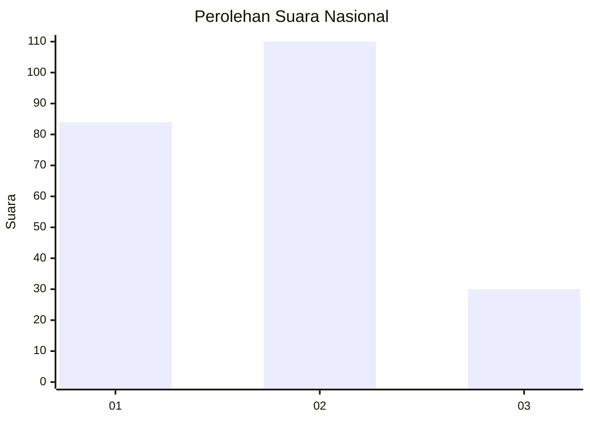
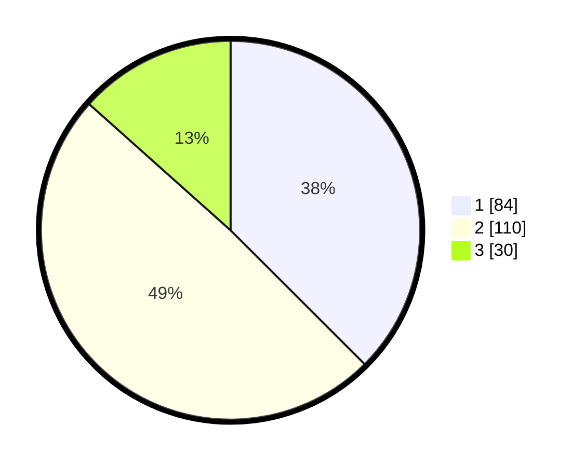

# Hasil

## Grafik

## Tabel

| No.    | Nama Paslon    | Suara | Suara (raw) | Persentase |
|:------ |:-------------- | -----:| -----------:| ----------:|
| 100025 | ANIES MUHAIMIN | 84    | [84][p-1]   | 37,50      |
| 100026 | PRABOWO GIBRAN | 110   | [110][p-2]  | 49,11      |
| 100027 | GANJAR MAHFUD  | 30    | [30][p-3]   | 13,39      |

[p-1]: https://github.com/gigit-pemilu/pemilu-2024/blob/main/pilpres/hitung-suara/sub/31-dki-jakarta/sub/75-jakarta-timur/sub/05-pasar-rebo/sub/1003-cijantung/sub/037-tps/sub/paslon-1.txt
[p-2]: https://github.com/gigit-pemilu/pemilu-2024/blob/main/pilpres/hitung-suara/sub/31-dki-jakarta/sub/75-jakarta-timur/sub/05-pasar-rebo/sub/1003-cijantung/sub/037-tps/sub/paslon-2.txt
[p-3]: https://github.com/gigit-pemilu/pemilu-2024/blob/main/pilpres/hitung-suara/sub/31-dki-jakarta/sub/75-jakarta-timur/sub/05-pasar-rebo/sub/1003-cijantung/sub/037-tps/sub/paslon-3.txt

## Foto C Plano

https://sirekap-obj-formc.kpu.go.id/c53f/pemilu/ppwp/31/75/05/10/03/3175051003037-20240214-233759--0dbeeb2f-6844-41bd-9a0d-ad269dfc5b7a.jpg

https://sirekap-obj-formc.kpu.go.id/c53f/pemilu/ppwp/31/75/05/10/03/3175051003037-20240214-233820--405614b7-d6a0-4fce-a72c-bc77b4b4b499.jpg

https://sirekap-obj-formc.kpu.go.id/c53f/pemilu/ppwp/31/75/05/10/03/3175051003037-20240214-233844--34326041-07b8-475f-b1c9-aab89fca3dc4.jpg

## Metadata

| Key        | Value               |
| ---------- | ------------------- |
| Time Stamp | 2024-02-16 01:00:27 |

