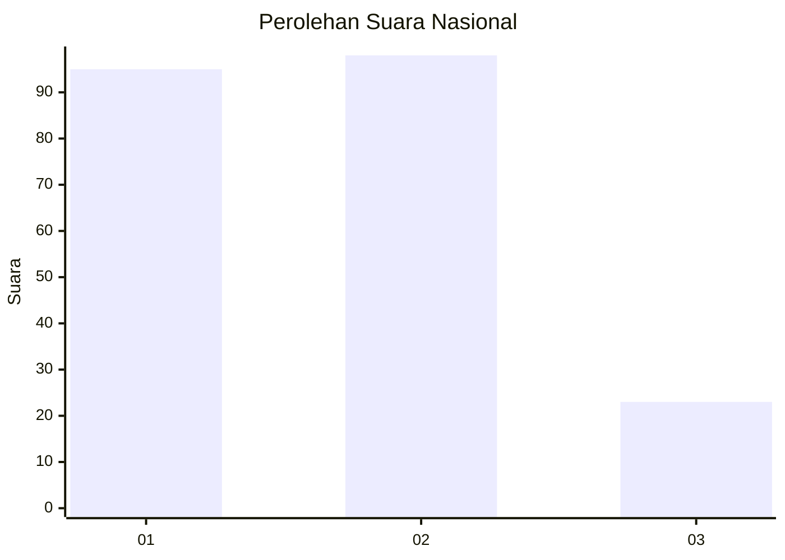
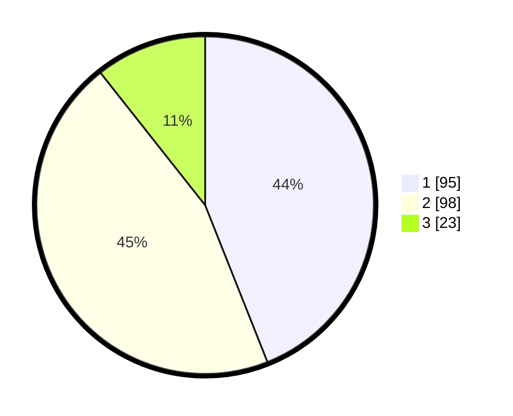

# Hasil

## Grafik

## Tabel

| No.    | Nama Paslon    | Suara | Suara (raw) | Persentase |
|:------ |:-------------- | -----:| -----------:| ----------:|
| 100025 | ANIES MUHAIMIN | 95    | [95][p-1]   | 43,98      |
| 100026 | PRABOWO GIBRAN | 98    | [98][p-2]   | 45,37      |
| 100027 | GANJAR MAHFUD  | 23    | [23][p-3]   | 10,65      |

[p-1]: https://github.com/gigit-pemilu/pemilu-2024/blob/main/pilpres/hitung-suara/sub/31-dki-jakarta/sub/75-jakarta-timur/sub/05-pasar-rebo/sub/1003-cijantung/sub/054-tps/sub/paslon-1.txt
[p-2]: https://github.com/gigit-pemilu/pemilu-2024/blob/main/pilpres/hitung-suara/sub/31-dki-jakarta/sub/75-jakarta-timur/sub/05-pasar-rebo/sub/1003-cijantung/sub/054-tps/sub/paslon-2.txt
[p-3]: https://github.com/gigit-pemilu/pemilu-2024/blob/main/pilpres/hitung-suara/sub/31-dki-jakarta/sub/75-jakarta-timur/sub/05-pasar-rebo/sub/1003-cijantung/sub/054-tps/sub/paslon-3.txt

## Foto C Plano

https://sirekap-obj-formc.kpu.go.id/9441/pemilu/ppwp/31/75/05/10/03/3175051003054-20240214-235438--1b677845-0e7e-4d41-8abf-6abd9f3684cd.jpg

https://sirekap-obj-formc.kpu.go.id/9441/pemilu/ppwp/31/75/05/10/03/3175051003054-20240214-235541--1150803c-af6d-466a-8733-08faa11b98b4.jpg

https://sirekap-obj-formc.kpu.go.id/9441/pemilu/ppwp/31/75/05/10/03/3175051003054-20240214-235635--ccdd8838-2c28-4ac6-aae6-5c4bcf5be0e1.jpg

## Metadata

| Key        | Value               |
| ---------- | ------------------- |
| Time Stamp | 2024-02-16 01:30:27 |

