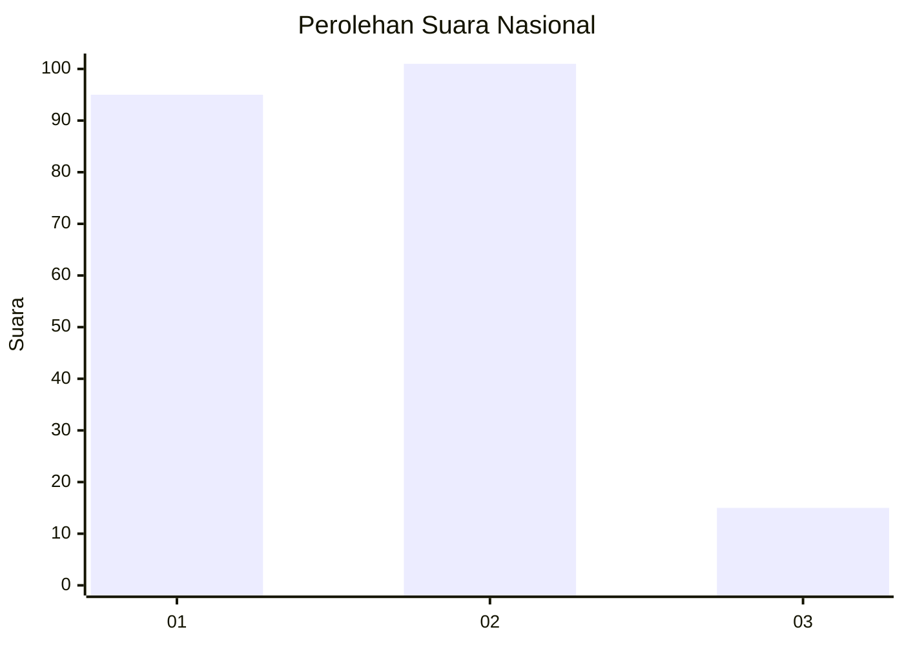
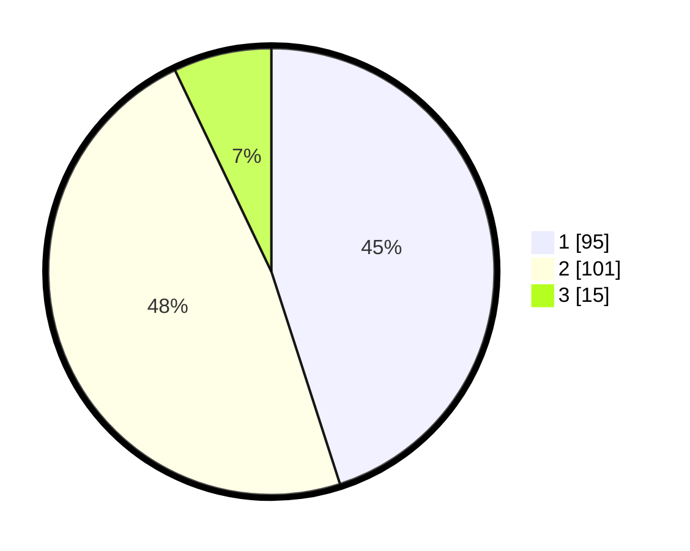

# Hasil

## Grafik

## Tabel

| No.    | Nama Paslon    | Suara | Suara (raw) | Persentase |
|:------ |:-------------- | -----:| -----------:| ----------:|
| 100025 | ANIES MUHAIMIN | 95    | [95][p-1]   | 45,02      |
| 100026 | PRABOWO GIBRAN | 101   | [101][p-2]  | 47,87      |
| 100027 | GANJAR MAHFUD  | 15    | [15][p-3]   | 7,11       |

[p-1]: https://github.com/gigit-pemilu/pemilu-2024/blob/main/pilpres/hitung-suara/sub/31-dki-jakarta/sub/75-jakarta-timur/sub/05-pasar-rebo/sub/1003-cijantung/sub/059-tps/sub/paslon-1.txt
[p-2]: https://github.com/gigit-pemilu/pemilu-2024/blob/main/pilpres/hitung-suara/sub/31-dki-jakarta/sub/75-jakarta-timur/sub/05-pasar-rebo/sub/1003-cijantung/sub/059-tps/sub/paslon-2.txt
[p-3]: https://github.com/gigit-pemilu/pemilu-2024/blob/main/pilpres/hitung-suara/sub/31-dki-jakarta/sub/75-jakarta-timur/sub/05-pasar-rebo/sub/1003-cijantung/sub/059-tps/sub/paslon-3.txt

## Foto C Plano

https://sirekap-obj-formc.kpu.go.id/a888/pemilu/ppwp/31/75/05/10/03/3175051003059-20240215-021011--b90af602-fbb0-4c9a-b06d-5c883d43611c.jpg

https://sirekap-obj-formc.kpu.go.id/a888/pemilu/ppwp/31/75/05/10/03/3175051003059-20240215-004030--50b5c3c4-4b00-4556-9cc6-79f0622faeed.jpg

https://sirekap-obj-formc.kpu.go.id/a888/pemilu/ppwp/31/75/05/10/03/3175051003059-20240215-021210--84427610-94bc-465f-9b4b-d2996b47d172.jpg

## Metadata

| Key        | Value               |
| ---------- | ------------------- |
| Time Stamp | 2024-02-16 01:30:27 |

