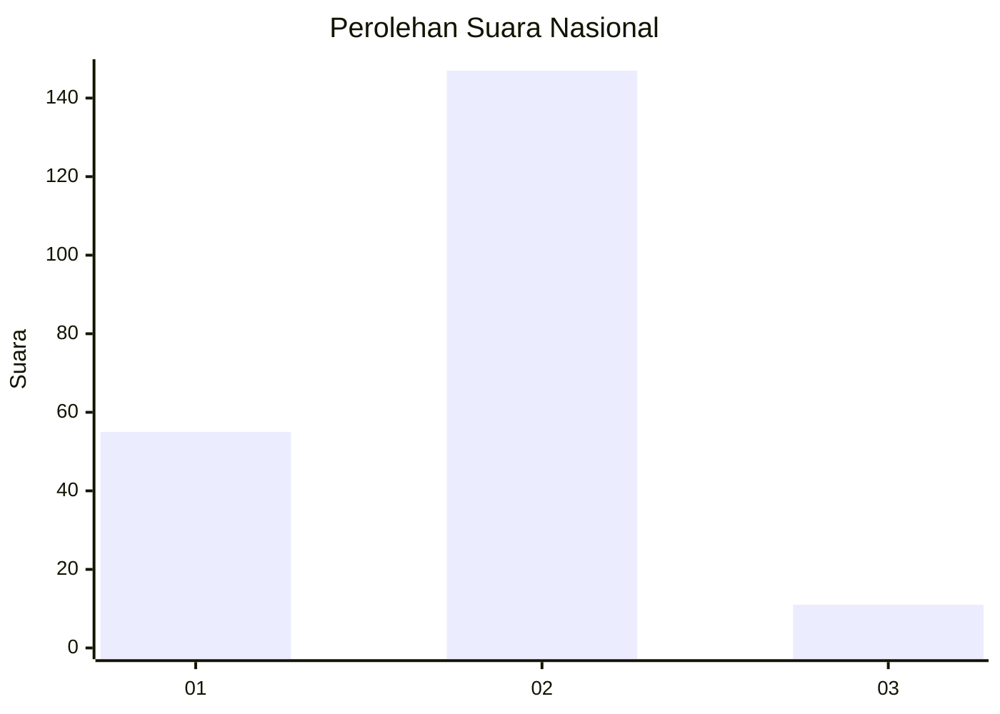
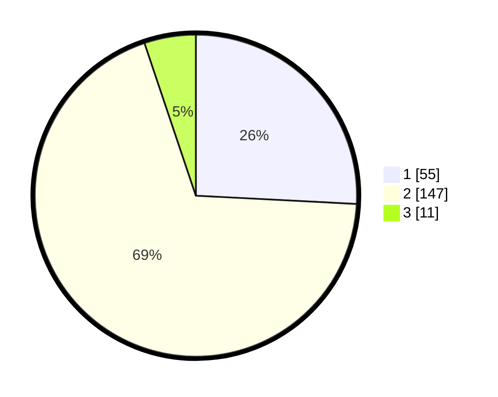

# Hasil

## Grafik

## Tabel

| No.    | Nama Paslon    | Suara | Suara (raw) | Persentase |
|:------ |:-------------- | -----:| -----------:| ----------:|
| 100025 | ANIES MUHAIMIN | 55    | [55][p-1]   | 25,82      |
| 100026 | PRABOWO GIBRAN | 147   | [147][p-2]  | 69,01      |
| 100027 | GANJAR MAHFUD  | 11    | [11][p-3]   | 5,16       |

[p-1]: https://github.com/gigit-pemilu/pemilu-2024/blob/main/pilpres/hitung-suara/sub/31-dki-jakarta/sub/75-jakarta-timur/sub/05-pasar-rebo/sub/1003-cijantung/sub/066-tps/sub/paslon-1.txt
[p-2]: https://github.com/gigit-pemilu/pemilu-2024/blob/main/pilpres/hitung-suara/sub/31-dki-jakarta/sub/75-jakarta-timur/sub/05-pasar-rebo/sub/1003-cijantung/sub/066-tps/sub/paslon-2.txt
[p-3]: https://github.com/gigit-pemilu/pemilu-2024/blob/main/pilpres/hitung-suara/sub/31-dki-jakarta/sub/75-jakarta-timur/sub/05-pasar-rebo/sub/1003-cijantung/sub/066-tps/sub/paslon-3.txt

## Foto C Plano

https://sirekap-obj-formc.kpu.go.id/5ab7/pemilu/ppwp/31/75/05/10/03/3175051003066-20240214-230638--a6b62bce-b1c7-468c-9550-1111c38bd7af.jpg

https://sirekap-obj-formc.kpu.go.id/5ab7/pemilu/ppwp/31/75/05/10/03/3175051003066-20240214-230630--90687f9e-b85f-45da-b94f-0c9a15354701.jpg

https://sirekap-obj-formc.kpu.go.id/5ab7/pemilu/ppwp/31/75/05/10/03/3175051003066-20240214-233357--e37710e6-fcae-40c0-8425-d940bfb8d3da.jpg

## Metadata

| Key        | Value               |
| ---------- | ------------------- |
| Time Stamp | 2024-02-16 01:30:27 |

