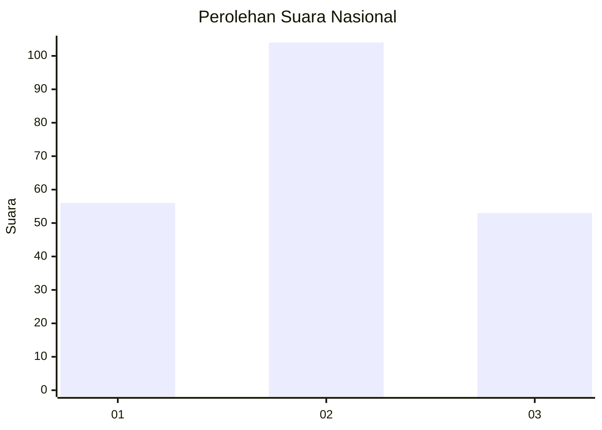
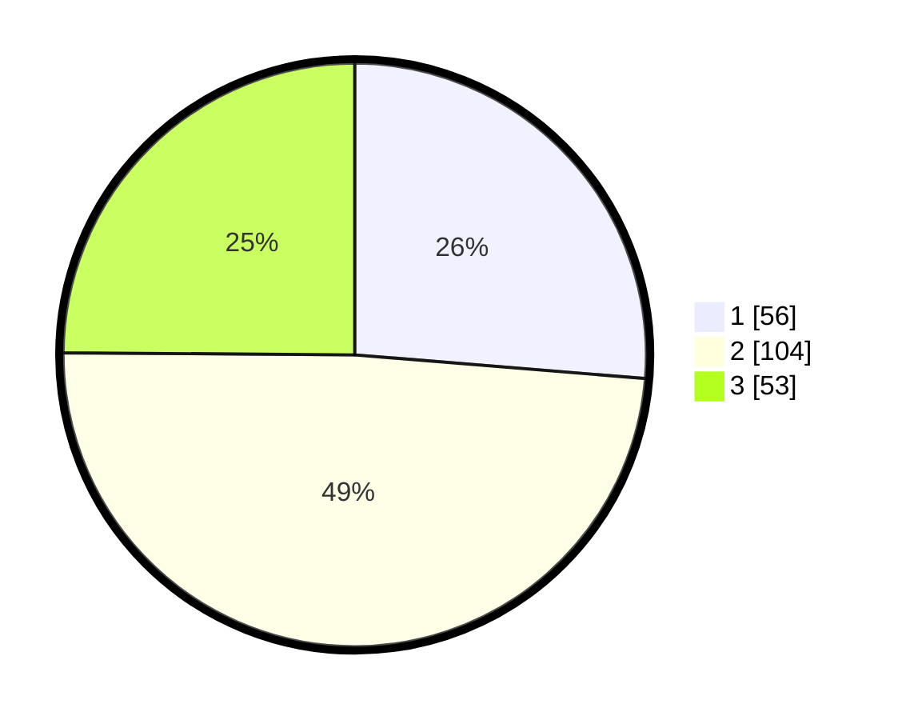

# Hasil

## Grafik

## Tabel

| No.    | Nama Paslon    | Suara | Suara (raw) | Persentase |
|:------ |:-------------- | -----:| -----------:| ----------:|
| 100025 | ANIES MUHAIMIN | 56    | [56][p-1]   | 26,29      |
| 100026 | PRABOWO GIBRAN | 104   | [104][p-2]  | 48,83      |
| 100027 | GANJAR MAHFUD  | 53    | [53][p-3]   | 24,88      |

[p-1]: https://github.com/gigit-pemilu/pemilu-2024/blob/main/pilpres/hitung-suara/sub/31-dki-jakarta/sub/75-jakarta-timur/sub/05-pasar-rebo/sub/1003-cijantung/sub/082-tps/sub/paslon-1.txt
[p-2]: https://github.com/gigit-pemilu/pemilu-2024/blob/main/pilpres/hitung-suara/sub/31-dki-jakarta/sub/75-jakarta-timur/sub/05-pasar-rebo/sub/1003-cijantung/sub/082-tps/sub/paslon-2.txt
[p-3]: https://github.com/gigit-pemilu/pemilu-2024/blob/main/pilpres/hitung-suara/sub/31-dki-jakarta/sub/75-jakarta-timur/sub/05-pasar-rebo/sub/1003-cijantung/sub/082-tps/sub/paslon-3.txt

## Foto C Plano

https://sirekap-obj-formc.kpu.go.id/c967/pemilu/ppwp/31/75/05/10/03/3175051003082-20240215-024440--e668c9dc-6a56-459e-994e-2f44a20eec7f.jpg

https://sirekap-obj-formc.kpu.go.id/c967/pemilu/ppwp/31/75/05/10/03/3175051003082-20240215-024737--a5ec3fd3-8c2a-447b-baaa-64bea46e3252.jpg

https://sirekap-obj-formc.kpu.go.id/c967/pemilu/ppwp/31/75/05/10/03/3175051003082-20240215-024820--887db1c5-e56c-4cd6-8fd2-6bdd2b88f552.jpg

## Metadata

| Key        | Value               |
| ---------- | ------------------- |
| Time Stamp | 2024-02-15 09:00:24 |

