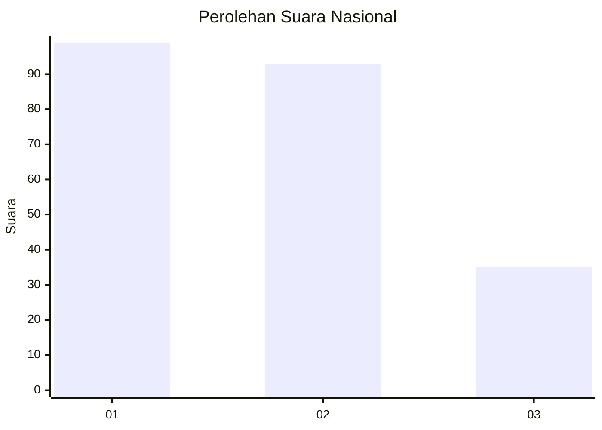
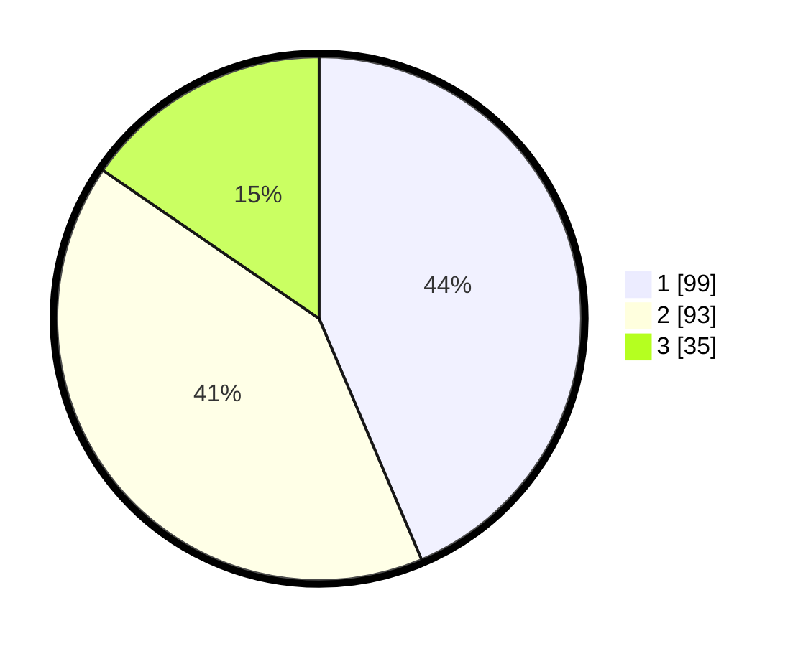

# Hasil

## Grafik

## Tabel

| No.    | Nama Paslon    | Suara | Suara (raw) | Persentase |
|:------ |:-------------- | -----:| -----------:| ----------:|
| 100025 | ANIES MUHAIMIN | 99    | [99][p-1]   | 43,61      |
| 100026 | PRABOWO GIBRAN | 93    | [93][p-2]   | 40,97      |
| 100027 | GANJAR MAHFUD  | 35    | [35][p-3]   | 15,42      |

[p-1]: https://github.com/gigit-pemilu/pemilu-2024/blob/main/pilpres/hitung-suara/sub/31-dki-jakarta/sub/75-jakarta-timur/sub/05-pasar-rebo/sub/1003-cijantung/sub/086-tps/sub/paslon-1.txt
[p-2]: https://github.com/gigit-pemilu/pemilu-2024/blob/main/pilpres/hitung-suara/sub/31-dki-jakarta/sub/75-jakarta-timur/sub/05-pasar-rebo/sub/1003-cijantung/sub/086-tps/sub/paslon-2.txt
[p-3]: https://github.com/gigit-pemilu/pemilu-2024/blob/main/pilpres/hitung-suara/sub/31-dki-jakarta/sub/75-jakarta-timur/sub/05-pasar-rebo/sub/1003-cijantung/sub/086-tps/sub/paslon-3.txt

## Foto C Plano

https://sirekap-obj-formc.kpu.go.id/f8eb/pemilu/ppwp/31/75/05/10/03/3175051003086-20240215-022937--d3be8ddc-9b13-42d4-888f-acf6af16406e.jpg

https://sirekap-obj-formc.kpu.go.id/f8eb/pemilu/ppwp/31/75/05/10/03/3175051003086-20240215-023024--913c7fe1-a635-4492-aad0-793ddd08b9f4.jpg

https://sirekap-obj-formc.kpu.go.id/f8eb/pemilu/ppwp/31/75/05/10/03/3175051003086-20240215-023113--5f108cc4-540d-4407-88ac-8dea874e3cd6.jpg

## Metadata

| Key        | Value               |
| ---------- | ------------------- |
| Time Stamp | 2024-02-16 01:30:27 |

