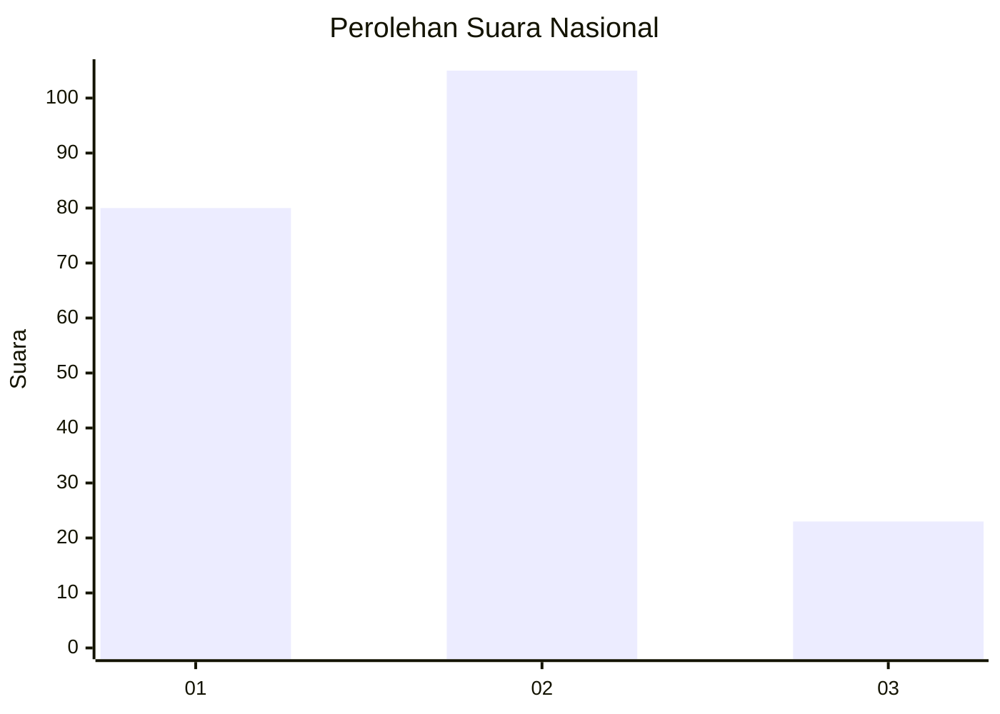
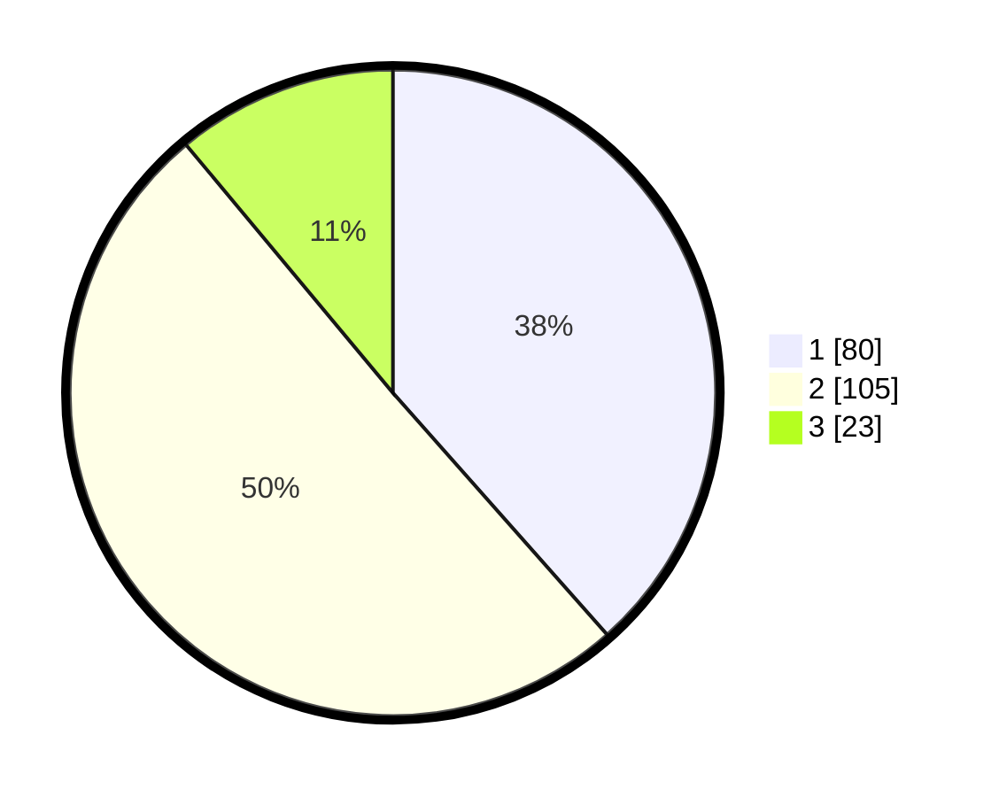

# Hasil

## Grafik

## Tabel

| No.    | Nama Paslon    | Suara | Suara (raw) | Persentase |
|:------ |:-------------- | -----:| -----------:| ----------:|
| 100025 | ANIES MUHAIMIN | 80    | [80][p-1]   | 38,46      |
| 100026 | PRABOWO GIBRAN | 105   | [105][p-2]  | 50,48      |
| 100027 | GANJAR MAHFUD  | 23    | [23][p-3]   | 11,06      |

[p-1]: https://github.com/gigit-pemilu/pemilu-2024/blob/main/pilpres/hitung-suara/sub/31-dki-jakarta/sub/75-jakarta-timur/sub/05-pasar-rebo/sub/1003-cijantung/sub/092-tps/sub/paslon-1.txt
[p-2]: https://github.com/gigit-pemilu/pemilu-2024/blob/main/pilpres/hitung-suara/sub/31-dki-jakarta/sub/75-jakarta-timur/sub/05-pasar-rebo/sub/1003-cijantung/sub/092-tps/sub/paslon-2.txt
[p-3]: https://github.com/gigit-pemilu/pemilu-2024/blob/main/pilpres/hitung-suara/sub/31-dki-jakarta/sub/75-jakarta-timur/sub/05-pasar-rebo/sub/1003-cijantung/sub/092-tps/sub/paslon-3.txt

## Foto C Plano

https://sirekap-obj-formc.kpu.go.id/5c99/pemilu/ppwp/31/75/05/10/03/3175051003092-20240215-010214--faf9efe6-9ec3-481f-8c52-305025888837.jpg

https://sirekap-obj-formc.kpu.go.id/5c99/pemilu/ppwp/31/75/05/10/03/3175051003092-20240215-010224--207668c8-7136-4045-a6d4-aac1c24b9740.jpg

https://sirekap-obj-formc.kpu.go.id/5c99/pemilu/ppwp/31/75/05/10/03/3175051003092-20240215-010229--b4487df4-d50e-41bb-b054-80ce5aa5ca34.jpg

## Metadata

| Key        | Value               |
| ---------- | ------------------- |
| Time Stamp | 2024-02-24 22:31:28 |

