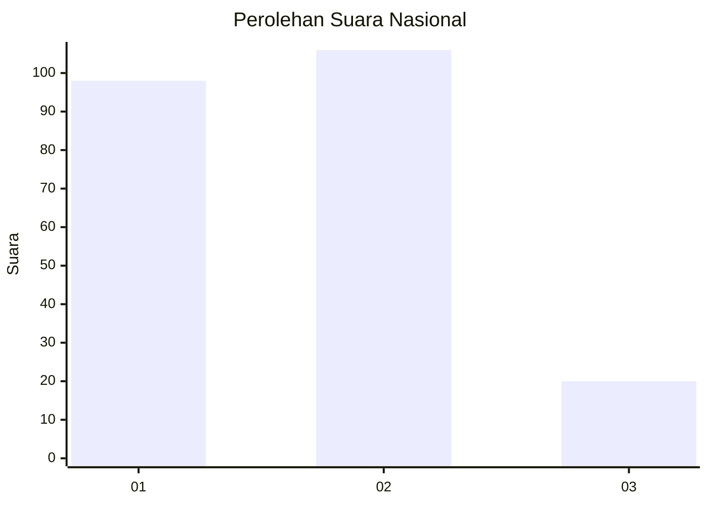
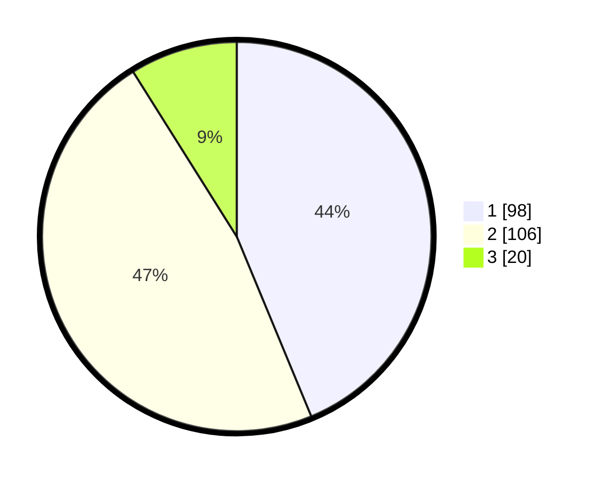

# Hasil

## Grafik

## Tabel

| No.    | Nama Paslon    | Suara | Suara (raw) | Persentase |
|:------ |:-------------- | -----:| -----------:| ----------:|
| 100025 | ANIES MUHAIMIN | 98    | [98][p-1]   | 43,75      |
| 100026 | PRABOWO GIBRAN | 106   | [106][p-2]  | 47,32      |
| 100027 | GANJAR MAHFUD  | 20    | [20][p-3]   | 8,93       |

[p-1]: https://github.com/gigit-pemilu/pemilu-2024/blob/main/pilpres/hitung-suara/sub/31-dki-jakarta/sub/75-jakarta-timur/sub/05-pasar-rebo/sub/1003-cijantung/sub/098-tps/sub/paslon-1.txt
[p-2]: https://github.com/gigit-pemilu/pemilu-2024/blob/main/pilpres/hitung-suara/sub/31-dki-jakarta/sub/75-jakarta-timur/sub/05-pasar-rebo/sub/1003-cijantung/sub/098-tps/sub/paslon-2.txt
[p-3]: https://github.com/gigit-pemilu/pemilu-2024/blob/main/pilpres/hitung-suara/sub/31-dki-jakarta/sub/75-jakarta-timur/sub/05-pasar-rebo/sub/1003-cijantung/sub/098-tps/sub/paslon-3.txt

## Foto C Plano

https://sirekap-obj-formc.kpu.go.id/dc41/pemilu/ppwp/31/75/05/10/03/3175051003098-20240215-000946--15f708dc-2440-4e91-a4ac-a7866b53462f.jpg

https://sirekap-obj-formc.kpu.go.id/dc41/pemilu/ppwp/31/75/05/10/03/3175051003098-20240214-212144--e93c5439-0dac-40b2-b0a5-8d1020cf9335.jpg

https://sirekap-obj-formc.kpu.go.id/dc41/pemilu/ppwp/31/75/05/10/03/3175051003098-20240214-212211--0e0ad0c4-3789-4c71-ae1a-d17e782015da.jpg

## Metadata

| Key        | Value               |
| ---------- | ------------------- |
| Time Stamp | 2024-02-24 22:31:28 |

