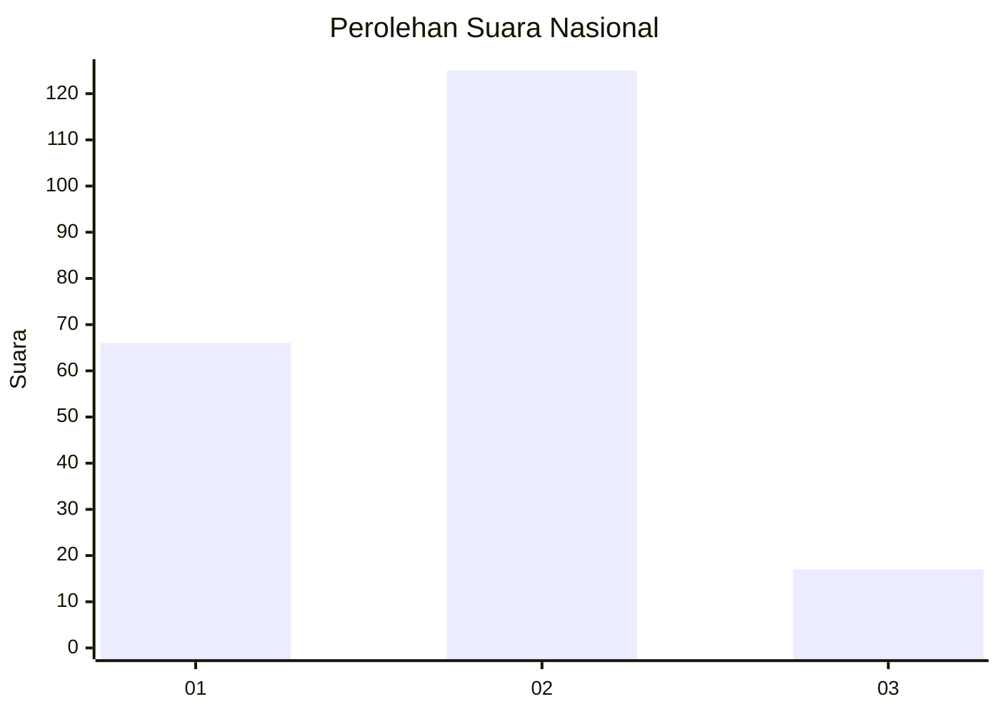
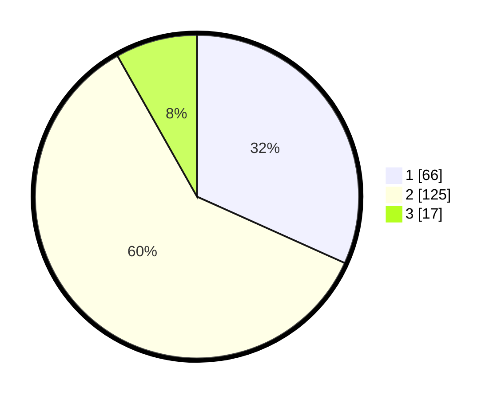

# Hasil

## Grafik

## Tabel

| No.    | Nama Paslon    | Suara | Suara (raw) | Persentase |
|:------ |:-------------- | -----:| -----------:| ----------:|
| 100025 | ANIES MUHAIMIN | 66    | [66][p-1]   | 31,73      |
| 100026 | PRABOWO GIBRAN | 125   | [125][p-2]  | 60,10      |
| 100027 | GANJAR MAHFUD  | 17    | [17][p-3]   | 8,17       |

[p-1]: https://github.com/gigit-pemilu/pemilu-2024/blob/main/pilpres/hitung-suara/sub/31-dki-jakarta/sub/75-jakarta-timur/sub/05-pasar-rebo/sub/1003-cijantung/sub/101-tps/sub/paslon-1.txt
[p-2]: https://github.com/gigit-pemilu/pemilu-2024/blob/main/pilpres/hitung-suara/sub/31-dki-jakarta/sub/75-jakarta-timur/sub/05-pasar-rebo/sub/1003-cijantung/sub/101-tps/sub/paslon-2.txt
[p-3]: https://github.com/gigit-pemilu/pemilu-2024/blob/main/pilpres/hitung-suara/sub/31-dki-jakarta/sub/75-jakarta-timur/sub/05-pasar-rebo/sub/1003-cijantung/sub/101-tps/sub/paslon-3.txt

## Foto C Plano

https://sirekap-obj-formc.kpu.go.id/b2f0/pemilu/ppwp/31/75/05/10/03/3175051003101-20240214-215543--ae453be2-2087-4f7b-81cb-ab69c842ee53.jpg

https://sirekap-obj-formc.kpu.go.id/b2f0/pemilu/ppwp/31/75/05/10/03/3175051003101-20240214-220158--fec2e454-f917-4604-9927-4a354601c649.jpg

https://sirekap-obj-formc.kpu.go.id/b2f0/pemilu/ppwp/31/75/05/10/03/3175051003101-20240214-141517--8c4cd8f6-61c3-4016-bc29-d16865ddfdd8.jpg

## Metadata

| Key        | Value               |
| ---------- | ------------------- |
| Time Stamp | 2024-02-25 18:00:00 |

