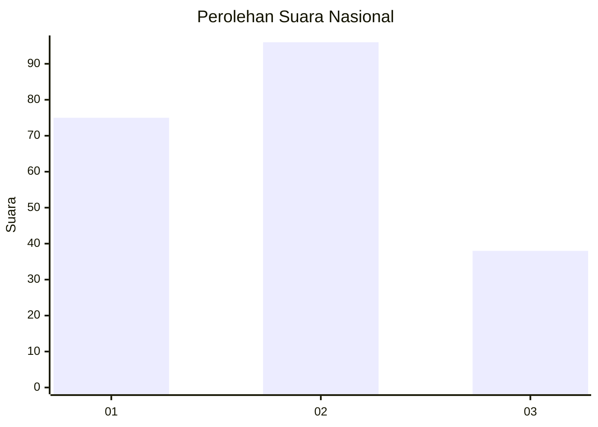
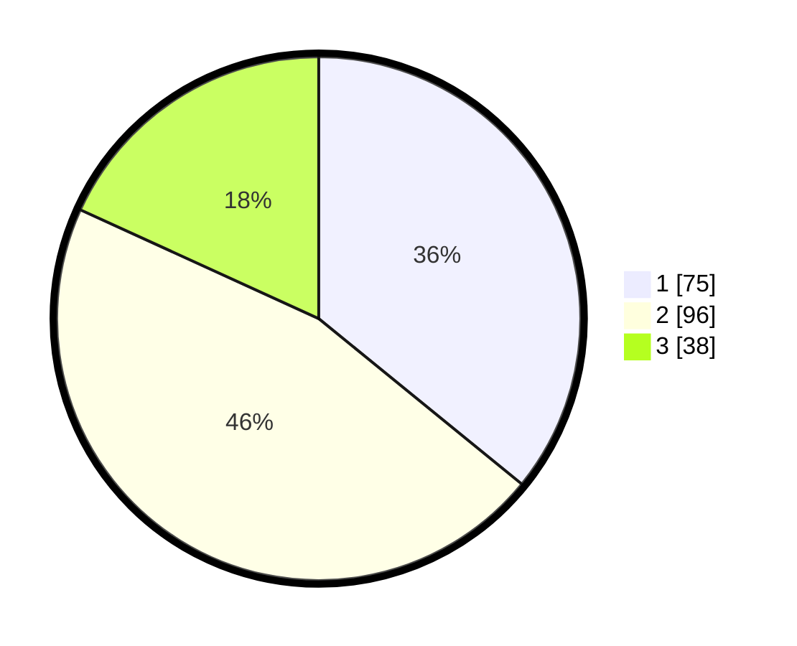

# Hasil

## Grafik

## Tabel

| No.    | Nama Paslon    | Suara | Suara (raw) | Persentase |
|:------ |:-------------- | -----:| -----------:| ----------:|
| 100025 | ANIES MUHAIMIN | 75    | [75][p-1]   | 35,89      |
| 100026 | PRABOWO GIBRAN | 96    | [96][p-2]   | 45,93      |
| 100027 | GANJAR MAHFUD  | 38    | [38][p-3]   | 18,18      |

[p-1]: https://github.com/gigit-pemilu/pemilu-2024/blob/main/pilpres/hitung-suara/sub/31-dki-jakarta/sub/75-jakarta-timur/sub/05-pasar-rebo/sub/1003-cijantung/sub/108-tps/sub/paslon-1.txt
[p-2]: https://github.com/gigit-pemilu/pemilu-2024/blob/main/pilpres/hitung-suara/sub/31-dki-jakarta/sub/75-jakarta-timur/sub/05-pasar-rebo/sub/1003-cijantung/sub/108-tps/sub/paslon-2.txt
[p-3]: https://github.com/gigit-pemilu/pemilu-2024/blob/main/pilpres/hitung-suara/sub/31-dki-jakarta/sub/75-jakarta-timur/sub/05-pasar-rebo/sub/1003-cijantung/sub/108-tps/sub/paslon-3.txt

## Foto C Plano

https://sirekap-obj-formc.kpu.go.id/893f/pemilu/ppwp/31/75/05/10/03/3175051003108-20240214-234541--f5a6d7cb-fd08-447b-8380-7facb5d3d68d.jpg

https://sirekap-obj-formc.kpu.go.id/893f/pemilu/ppwp/31/75/05/10/03/3175051003108-20240214-234630--0e322da1-7580-4597-a323-4699b3fa1778.jpg

https://sirekap-obj-formc.kpu.go.id/893f/pemilu/ppwp/31/75/05/10/03/3175051003108-20240214-234731--4192a8f3-2146-473e-b7f6-43748bb868c4.jpg

## Metadata

| Key        | Value               |
| ---------- | ------------------- |
| Time Stamp | 2024-02-24 22:31:28 |

