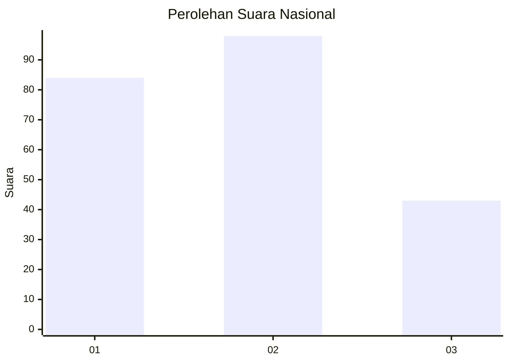
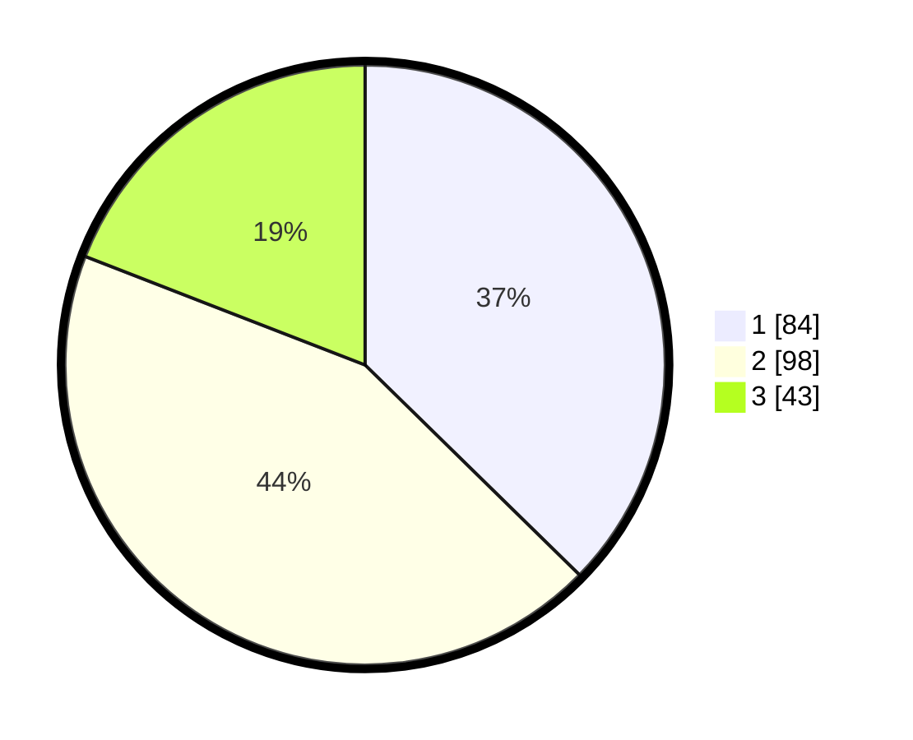

# Hasil

## Grafik

## Tabel

| No.    | Nama Paslon    | Suara | Suara (raw) | Persentase |
|:------ |:-------------- | -----:| -----------:| ----------:|
| 100025 | ANIES MUHAIMIN | 84    | [84][p-1]   | 37,33      |
| 100026 | PRABOWO GIBRAN | 98    | [98][p-2]   | 43,56      |
| 100027 | GANJAR MAHFUD  | 43    | [43][p-3]   | 19,11      |

[p-1]: https://github.com/gigit-pemilu/pemilu-2024/blob/main/pilpres/hitung-suara/sub/31-dki-jakarta/sub/75-jakarta-timur/sub/05-pasar-rebo/sub/1003-cijantung/sub/125-tps/sub/paslon-1.txt
[p-2]: https://github.com/gigit-pemilu/pemilu-2024/blob/main/pilpres/hitung-suara/sub/31-dki-jakarta/sub/75-jakarta-timur/sub/05-pasar-rebo/sub/1003-cijantung/sub/125-tps/sub/paslon-2.txt
[p-3]: https://github.com/gigit-pemilu/pemilu-2024/blob/main/pilpres/hitung-suara/sub/31-dki-jakarta/sub/75-jakarta-timur/sub/05-pasar-rebo/sub/1003-cijantung/sub/125-tps/sub/paslon-3.txt

## Foto C Plano

https://sirekap-obj-formc.kpu.go.id/6c06/pemilu/ppwp/31/75/05/10/03/3175051003125-20240215-025926--1f56f554-4dd3-4b87-ad36-f4c250f56baf.jpg

https://sirekap-obj-formc.kpu.go.id/6c06/pemilu/ppwp/31/75/05/10/03/3175051003125-20240215-033017--83b16a77-94e8-44dc-8df6-8b26a983636b.jpg

https://sirekap-obj-formc.kpu.go.id/6c06/pemilu/ppwp/31/75/05/10/03/3175051003125-20240215-032342--8f1383e1-cbe0-4cfe-8ba9-1efcd2f98688.jpg

## Metadata

| Key        | Value               |
| ---------- | ------------------- |
| Time Stamp | 2024-02-16 01:30:27 |

