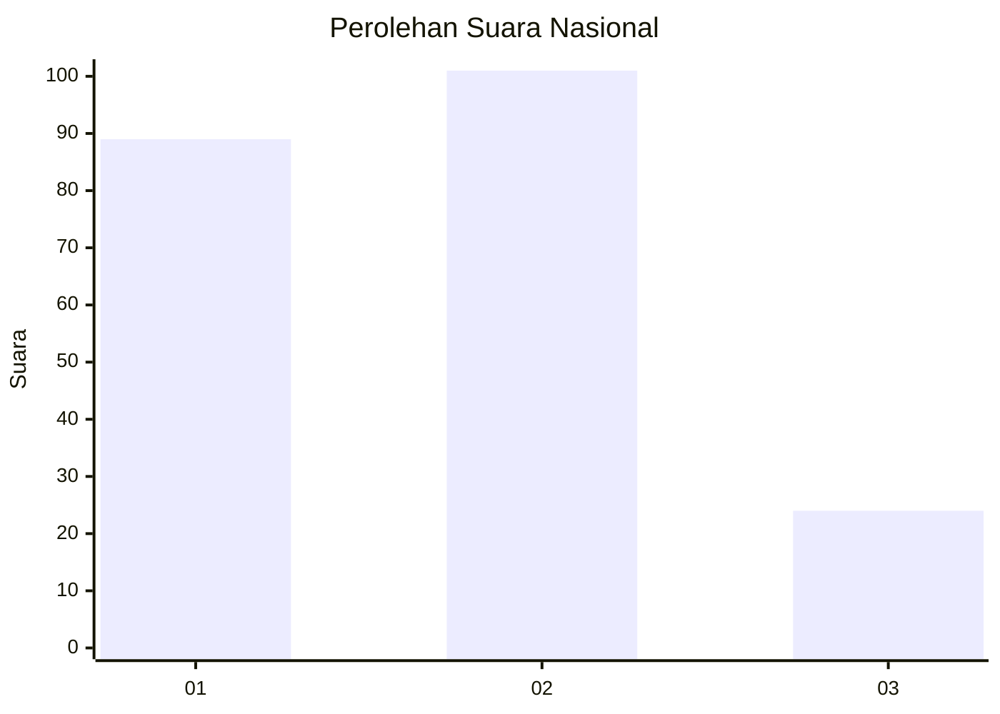
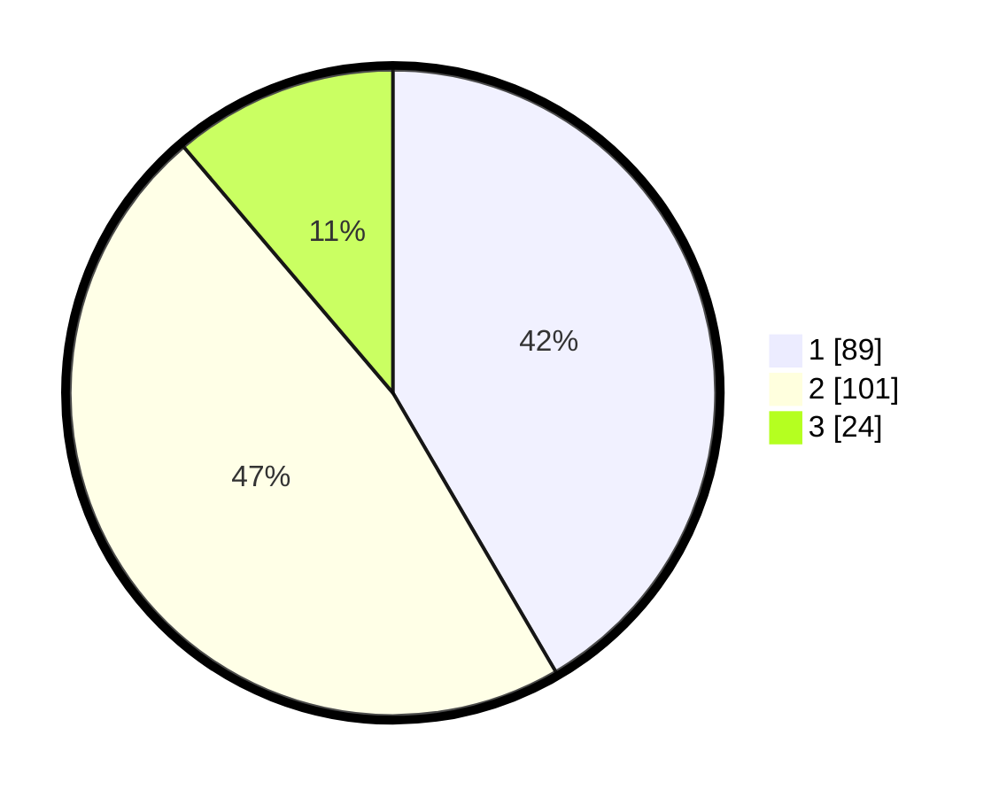

# Hasil

## Grafik

## Tabel

| No.    | Nama Paslon    | Suara | Suara (raw) | Persentase |
|:------ |:-------------- | -----:| -----------:| ----------:|
| 100025 | ANIES MUHAIMIN | 89    | [89][p-1]   | 41,59      |
| 100026 | PRABOWO GIBRAN | 101   | [101][p-2]  | 47,20      |
| 100027 | GANJAR MAHFUD  | 24    | [24][p-3]   | 11,21      |

[p-1]: https://github.com/gigit-pemilu/pemilu-2024/blob/main/pilpres/hitung-suara/sub/31-dki-jakarta/sub/75-jakarta-timur/sub/05-pasar-rebo/sub/1003-cijantung/sub/133-tps/sub/paslon-1.txt
[p-2]: https://github.com/gigit-pemilu/pemilu-2024/blob/main/pilpres/hitung-suara/sub/31-dki-jakarta/sub/75-jakarta-timur/sub/05-pasar-rebo/sub/1003-cijantung/sub/133-tps/sub/paslon-2.txt
[p-3]: https://github.com/gigit-pemilu/pemilu-2024/blob/main/pilpres/hitung-suara/sub/31-dki-jakarta/sub/75-jakarta-timur/sub/05-pasar-rebo/sub/1003-cijantung/sub/133-tps/sub/paslon-3.txt

## Foto C Plano

https://sirekap-obj-formc.kpu.go.id/d93b/pemilu/ppwp/31/75/05/10/03/3175051003133-20240214-215005--79967c82-38cc-47d9-9aba-789c21c0beb0.jpg

https://sirekap-obj-formc.kpu.go.id/d93b/pemilu/ppwp/31/75/05/10/03/3175051003133-20240214-215102--456be8fd-eaf8-4614-ad62-b5baf34d896b.jpg

https://sirekap-obj-formc.kpu.go.id/d93b/pemilu/ppwp/31/75/05/10/03/3175051003133-20240214-215145--87829192-8268-45e5-9b20-d1347a86ed3a.jpg

## Metadata

| Key        | Value               |
| ---------- | ------------------- |
| Time Stamp | 2024-02-16 01:30:27 |

