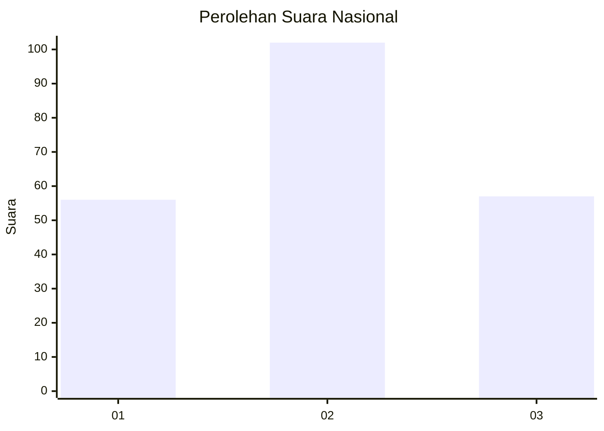
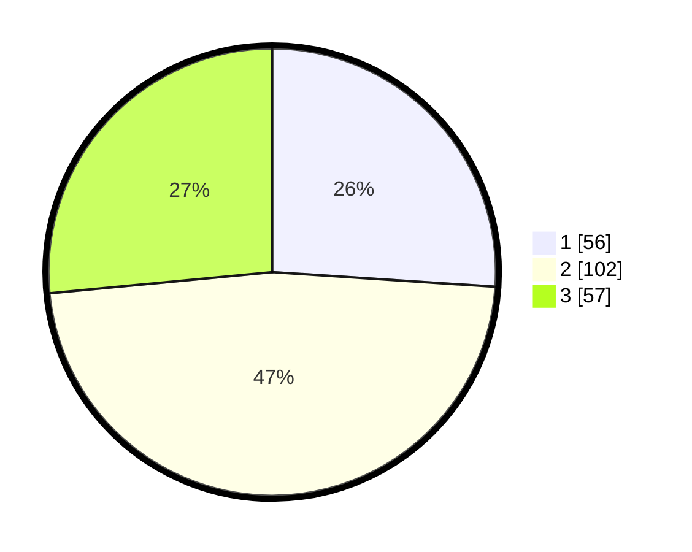

# Hasil

## Grafik

## Tabel

| No.    | Nama Paslon    | Suara | Suara (raw) | Persentase |
|:------ |:-------------- | -----:| -----------:| ----------:|
| 100025 | ANIES MUHAIMIN | 56    | [56][p-1]   | 26,05      |
| 100026 | PRABOWO GIBRAN | 102   | [102][p-2]  | 47,44      |
| 100027 | GANJAR MAHFUD  | 57    | [57][p-3]   | 26,51      |

[p-1]: https://github.com/gigit-pemilu/pemilu-2024/blob/main/pilpres/hitung-suara/sub/31-dki-jakarta/sub/75-jakarta-timur/sub/05-pasar-rebo/sub/1003-cijantung/sub/140-tps/sub/paslon-1.txt
[p-2]: https://github.com/gigit-pemilu/pemilu-2024/blob/main/pilpres/hitung-suara/sub/31-dki-jakarta/sub/75-jakarta-timur/sub/05-pasar-rebo/sub/1003-cijantung/sub/140-tps/sub/paslon-2.txt
[p-3]: https://github.com/gigit-pemilu/pemilu-2024/blob/main/pilpres/hitung-suara/sub/31-dki-jakarta/sub/75-jakarta-timur/sub/05-pasar-rebo/sub/1003-cijantung/sub/140-tps/sub/paslon-3.txt

## Foto C Plano

https://sirekap-obj-formc.kpu.go.id/4bf0/pemilu/ppwp/31/75/05/10/03/3175051003140-20240214-232938--885ff66d-275c-479c-b2ad-3ba9b15fec40.jpg

https://sirekap-obj-formc.kpu.go.id/4bf0/pemilu/ppwp/31/75/05/10/03/3175051003140-20240214-233052--b86e90ab-8b0c-44be-bb58-7b6a255a9cb7.jpg

https://sirekap-obj-formc.kpu.go.id/4bf0/pemilu/ppwp/31/75/05/10/03/3175051003140-20240214-233119--f5169474-06da-45e5-9f2a-201de9d2d6c1.jpg

## Metadata

| Key        | Value               |
| ---------- | ------------------- |
| Time Stamp | 2024-02-16 01:30:27 |

