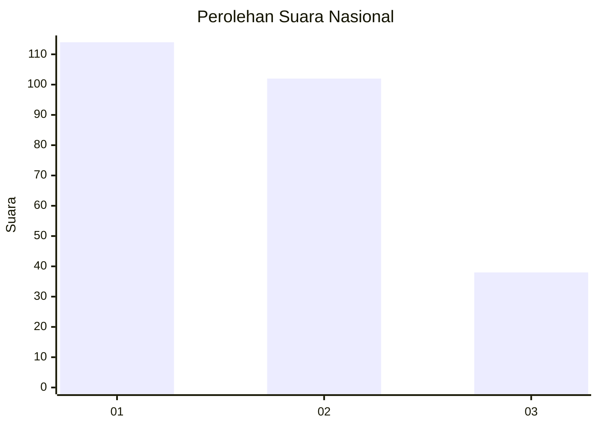
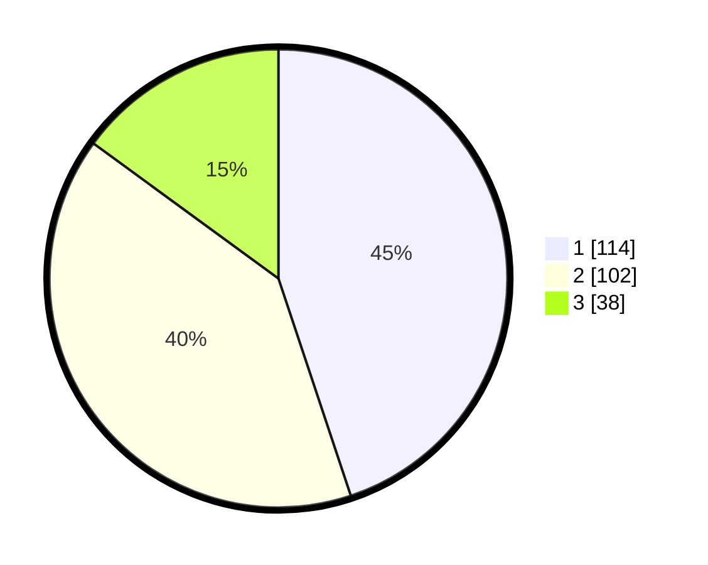

# Hasil

## Grafik

## Tabel

| No.    | Nama Paslon    | Suara | Suara (raw) | Persentase |
|:------ |:-------------- | -----:| -----------:| ----------:|
| 100025 | ANIES MUHAIMIN | 114   | [114][p-1]  | 44,88      |
| 100026 | PRABOWO GIBRAN | 102   | [102][p-2]  | 40,16      |
| 100027 | GANJAR MAHFUD  | 38    | [38][p-3]   | 14,96      |

[p-1]: https://github.com/gigit-pemilu/pemilu-2024/blob/main/pilpres/hitung-suara/sub/31-dki-jakarta/sub/75-jakarta-timur/sub/05-pasar-rebo/sub/1004-kalisari/sub/007-tps/sub/paslon-1.txt
[p-2]: https://github.com/gigit-pemilu/pemilu-2024/blob/main/pilpres/hitung-suara/sub/31-dki-jakarta/sub/75-jakarta-timur/sub/05-pasar-rebo/sub/1004-kalisari/sub/007-tps/sub/paslon-2.txt
[p-3]: https://github.com/gigit-pemilu/pemilu-2024/blob/main/pilpres/hitung-suara/sub/31-dki-jakarta/sub/75-jakarta-timur/sub/05-pasar-rebo/sub/1004-kalisari/sub/007-tps/sub/paslon-3.txt

## Foto C Plano

https://sirekap-obj-formc.kpu.go.id/5e22/pemilu/ppwp/31/75/05/10/04/3175051004007-20240215-042125--3c4c7648-ec32-4f68-8af6-2155026a32a5.jpg

https://sirekap-obj-formc.kpu.go.id/5e22/pemilu/ppwp/31/75/05/10/04/3175051004007-20240215-042435--e8a3eef1-4f34-4304-9cb3-6b645222d29f.jpg

https://sirekap-obj-formc.kpu.go.id/5e22/pemilu/ppwp/31/75/05/10/04/3175051004007-20240215-042217--b649a67a-7a84-4876-b672-68e8588619ba.jpg

## Metadata

| Key        | Value               |
| ---------- | ------------------- |
| Time Stamp | 2024-02-24 22:31:28 |

