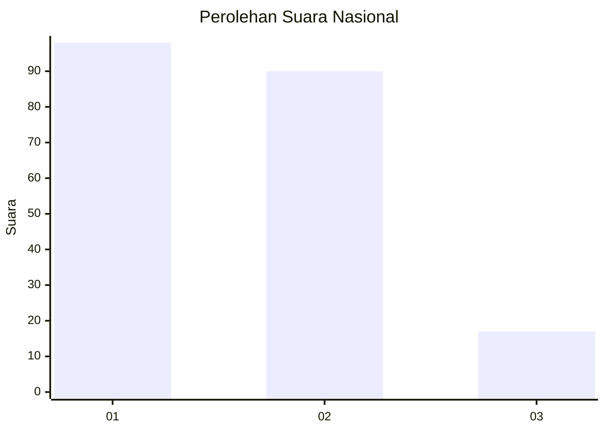
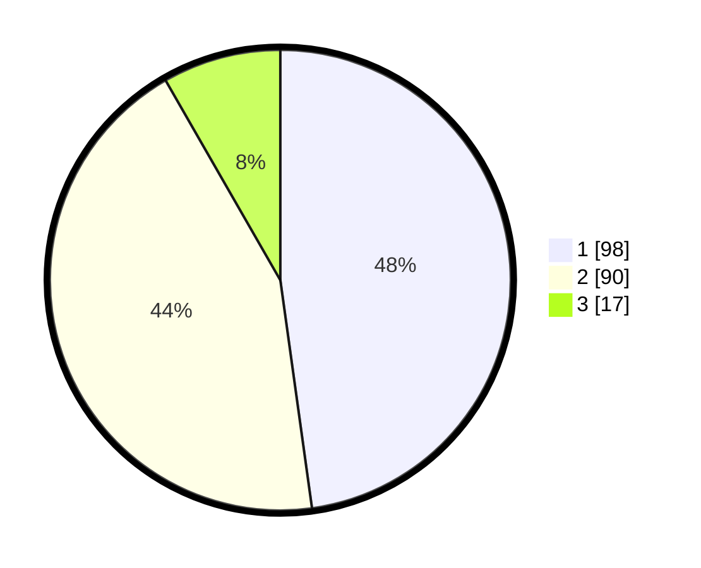

# Hasil

## Grafik

## Tabel

| No.    | Nama Paslon    | Suara | Suara (raw) | Persentase |
|:------ |:-------------- | -----:| -----------:| ----------:|
| 100025 | ANIES MUHAIMIN | 98    | [98][p-1]   | 47,80      |
| 100026 | PRABOWO GIBRAN | 90    | [90][p-2]   | 43,90      |
| 100027 | GANJAR MAHFUD  | 17    | [17][p-3]   | 8,29       |

[p-1]: https://github.com/gigit-pemilu/pemilu-2024/blob/main/pilpres/hitung-suara/sub/31-dki-jakarta/sub/75-jakarta-timur/sub/05-pasar-rebo/sub/1004-kalisari/sub/011-tps/sub/paslon-1.txt
[p-2]: https://github.com/gigit-pemilu/pemilu-2024/blob/main/pilpres/hitung-suara/sub/31-dki-jakarta/sub/75-jakarta-timur/sub/05-pasar-rebo/sub/1004-kalisari/sub/011-tps/sub/paslon-2.txt
[p-3]: https://github.com/gigit-pemilu/pemilu-2024/blob/main/pilpres/hitung-suara/sub/31-dki-jakarta/sub/75-jakarta-timur/sub/05-pasar-rebo/sub/1004-kalisari/sub/011-tps/sub/paslon-3.txt

## Foto C Plano

https://sirekap-obj-formc.kpu.go.id/5d6f/pemilu/ppwp/31/75/05/10/04/3175051004011-20240214-220355--daa0050b-564c-4fb2-b1f1-b82be39e4696.jpg

https://sirekap-obj-formc.kpu.go.id/5d6f/pemilu/ppwp/31/75/05/10/04/3175051004011-20240214-220323--20098e32-11b9-40ee-97c6-79964ab9202c.jpg

https://sirekap-obj-formc.kpu.go.id/5d6f/pemilu/ppwp/31/75/05/10/04/3175051004011-20240214-220654--9791245f-c0e3-46f4-a076-15aae2364e26.jpg

## Metadata

| Key        | Value               |
| ---------- | ------------------- |
| Time Stamp | 2024-02-24 22:31:28 |

