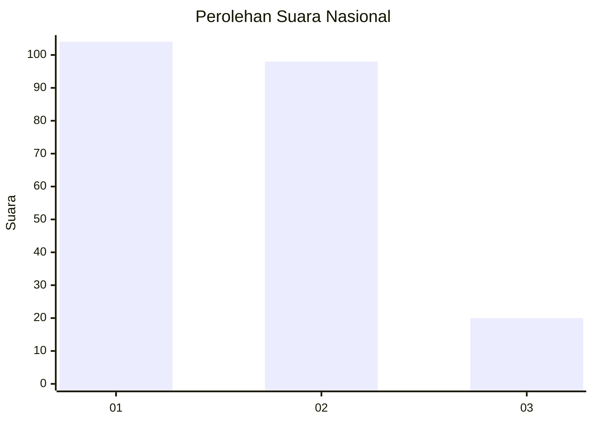
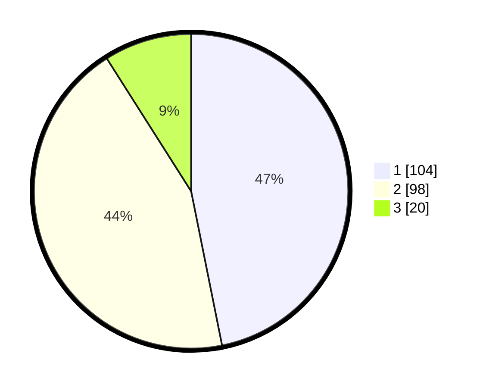

# Hasil

## Grafik

## Tabel

| No.    | Nama Paslon    | Suara | Suara (raw) | Persentase |
|:------ |:-------------- | -----:| -----------:| ----------:|
| 100025 | ANIES MUHAIMIN | 104   | [104][p-1]  | 46,85      |
| 100026 | PRABOWO GIBRAN | 98    | [98][p-2]   | 44,14      |
| 100027 | GANJAR MAHFUD  | 20    | [20][p-3]   | 9,01       |

[p-1]: https://github.com/gigit-pemilu/pemilu-2024/blob/main/pilpres/hitung-suara/sub/31-dki-jakarta/sub/75-jakarta-timur/sub/05-pasar-rebo/sub/1004-kalisari/sub/019-tps/sub/paslon-1.txt
[p-2]: https://github.com/gigit-pemilu/pemilu-2024/blob/main/pilpres/hitung-suara/sub/31-dki-jakarta/sub/75-jakarta-timur/sub/05-pasar-rebo/sub/1004-kalisari/sub/019-tps/sub/paslon-2.txt
[p-3]: https://github.com/gigit-pemilu/pemilu-2024/blob/main/pilpres/hitung-suara/sub/31-dki-jakarta/sub/75-jakarta-timur/sub/05-pasar-rebo/sub/1004-kalisari/sub/019-tps/sub/paslon-3.txt

## Foto C Plano

https://sirekap-obj-formc.kpu.go.id/de24/pemilu/ppwp/31/75/05/10/04/3175051004019-20240214-222514--7a826272-ac81-4cd5-a18e-568f626daff2.jpg

https://sirekap-obj-formc.kpu.go.id/de24/pemilu/ppwp/31/75/05/10/04/3175051004019-20240214-204654--c0010883-407b-410e-9267-6795570c2340.jpg

https://sirekap-obj-formc.kpu.go.id/de24/pemilu/ppwp/31/75/05/10/04/3175051004019-20240214-191133--da5b4ac5-8017-4a5d-a96a-7bc8a7668373.jpg

## Metadata

| Key        | Value               |
| ---------- | ------------------- |
| Time Stamp | 2024-02-15 15:00:29 |

