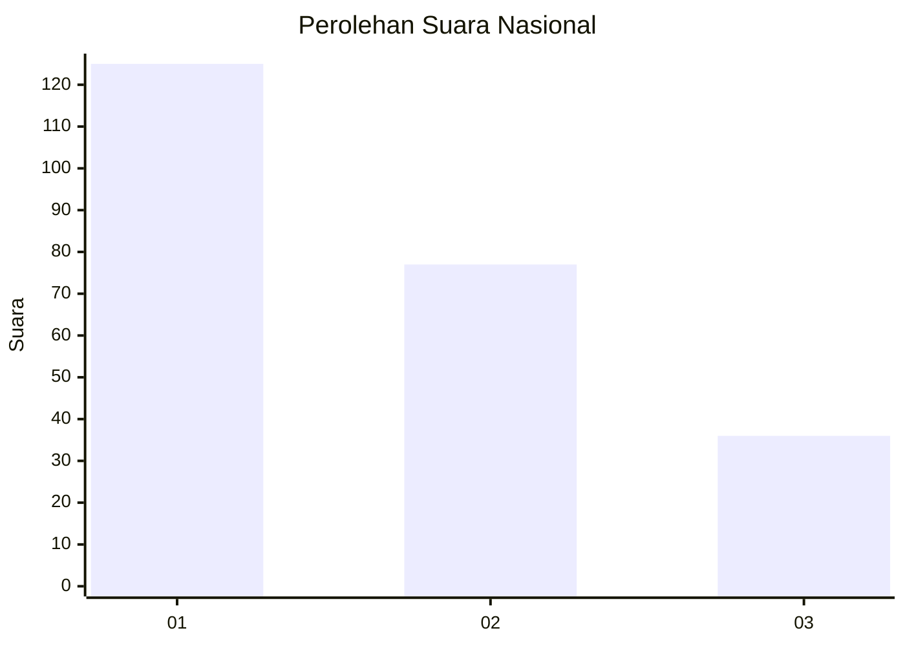
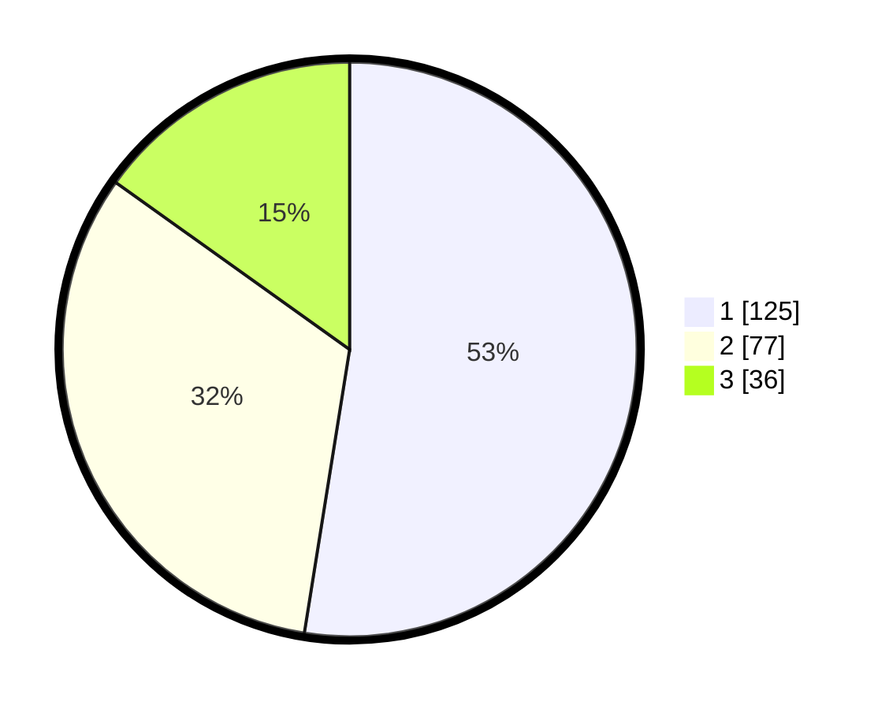

# Hasil

## Grafik

## Tabel

| No.    | Nama Paslon    | Suara | Suara (raw) | Persentase |
|:------ |:-------------- | -----:| -----------:| ----------:|
| 100025 | ANIES MUHAIMIN | 125   | [125][p-1]  | 52,52      |
| 100026 | PRABOWO GIBRAN | 77    | [77][p-2]   | 32,35      |
| 100027 | GANJAR MAHFUD  | 36    | [36][p-3]   | 15,13      |

[p-1]: https://github.com/gigit-pemilu/pemilu-2024/blob/main/pilpres/hitung-suara/sub/31-dki-jakarta/sub/75-jakarta-timur/sub/05-pasar-rebo/sub/1004-kalisari/sub/026-tps/sub/paslon-1.txt
[p-2]: https://github.com/gigit-pemilu/pemilu-2024/blob/main/pilpres/hitung-suara/sub/31-dki-jakarta/sub/75-jakarta-timur/sub/05-pasar-rebo/sub/1004-kalisari/sub/026-tps/sub/paslon-2.txt
[p-3]: https://github.com/gigit-pemilu/pemilu-2024/blob/main/pilpres/hitung-suara/sub/31-dki-jakarta/sub/75-jakarta-timur/sub/05-pasar-rebo/sub/1004-kalisari/sub/026-tps/sub/paslon-3.txt

## Foto C Plano

https://sirekap-obj-formc.kpu.go.id/87b2/pemilu/ppwp/31/75/05/10/04/3175051004026-20240215-013041--6b14a822-4fd5-4756-af24-cb152cfdc975.jpg

https://sirekap-obj-formc.kpu.go.id/87b2/pemilu/ppwp/31/75/05/10/04/3175051004026-20240215-013127--7ef026a2-b283-430a-92f5-46fddb2f18ba.jpg

https://sirekap-obj-formc.kpu.go.id/87b2/pemilu/ppwp/31/75/05/10/04/3175051004026-20240215-013157--e166faec-a324-483e-b9ce-cdd565b0e051.jpg

## Metadata

| Key        | Value               |
| ---------- | ------------------- |
| Time Stamp | 2024-02-24 22:31:28 |

