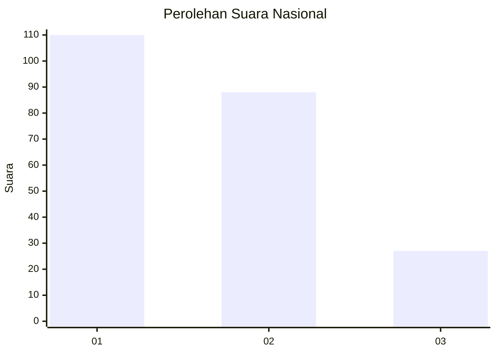
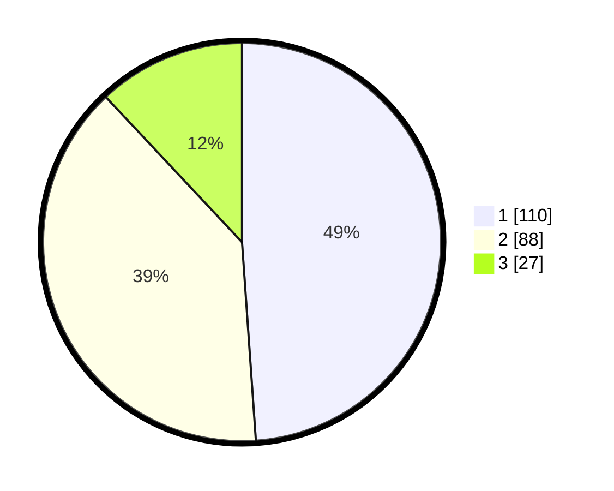

# Hasil

## Grafik

## Tabel

| No.    | Nama Paslon    | Suara | Suara (raw) | Persentase |
|:------ |:-------------- | -----:| -----------:| ----------:|
| 100025 | ANIES MUHAIMIN | 110   | [110][p-1]  | 48,89      |
| 100026 | PRABOWO GIBRAN | 88    | [88][p-2]   | 39,11      |
| 100027 | GANJAR MAHFUD  | 27    | [27][p-3]   | 12,00      |

[p-1]: https://github.com/gigit-pemilu/pemilu-2024/blob/main/pilpres/hitung-suara/sub/31-dki-jakarta/sub/75-jakarta-timur/sub/05-pasar-rebo/sub/1004-kalisari/sub/041-tps/sub/paslon-1.txt
[p-2]: https://github.com/gigit-pemilu/pemilu-2024/blob/main/pilpres/hitung-suara/sub/31-dki-jakarta/sub/75-jakarta-timur/sub/05-pasar-rebo/sub/1004-kalisari/sub/041-tps/sub/paslon-2.txt
[p-3]: https://github.com/gigit-pemilu/pemilu-2024/blob/main/pilpres/hitung-suara/sub/31-dki-jakarta/sub/75-jakarta-timur/sub/05-pasar-rebo/sub/1004-kalisari/sub/041-tps/sub/paslon-3.txt

## Foto C Plano

https://sirekap-obj-formc.kpu.go.id/0324/pemilu/ppwp/31/75/05/10/04/3175051004041-20240214-214822--a8ca477d-7f88-4532-83f7-1f357706e84d.jpg

https://sirekap-obj-formc.kpu.go.id/0324/pemilu/ppwp/31/75/05/10/04/3175051004041-20240214-214955--601efb79-229f-4b55-9029-62092be0fbb1.jpg

https://sirekap-obj-formc.kpu.go.id/0324/pemilu/ppwp/31/75/05/10/04/3175051004041-20240214-215059--315e2d39-c78e-4a68-83e4-09a047ad1891.jpg

## Metadata

| Key        | Value               |
| ---------- | ------------------- |
| Time Stamp | 2024-02-25 12:00:00 |

