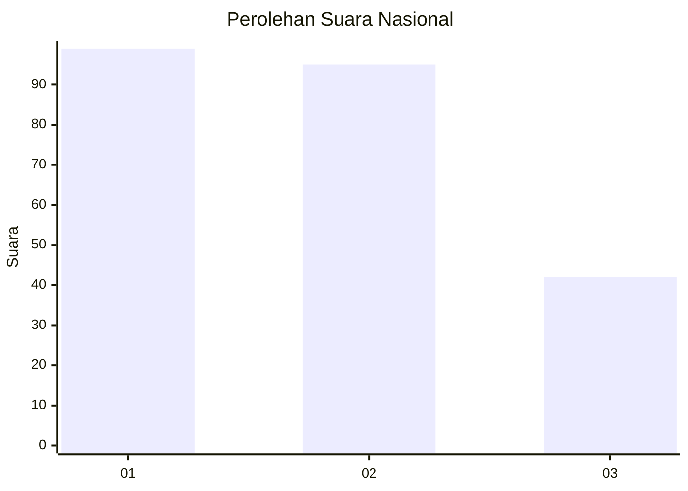
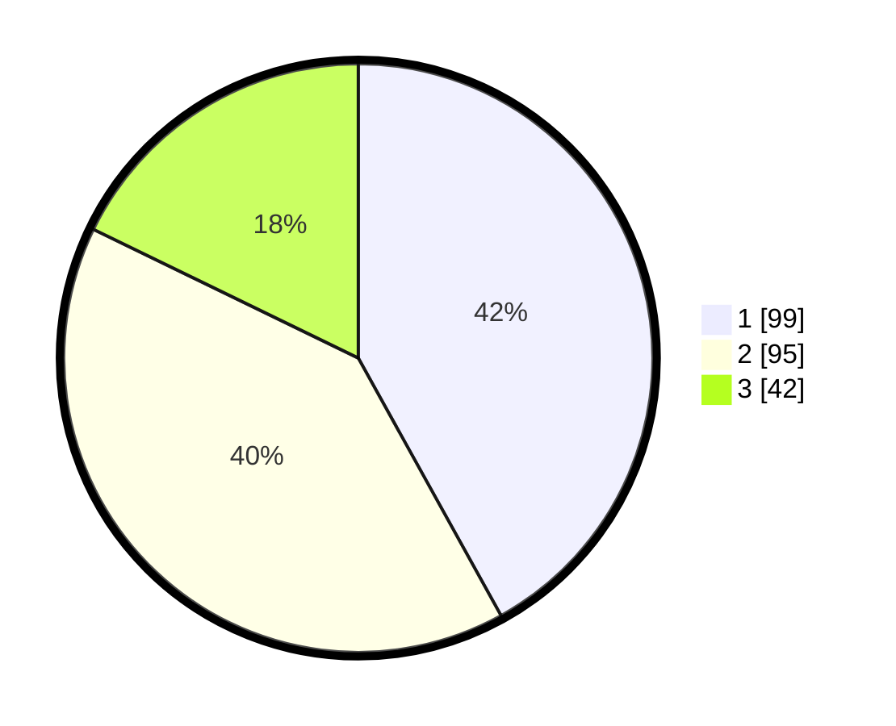

# Hasil

## Grafik

## Tabel

| No.    | Nama Paslon    | Suara | Suara (raw) | Persentase |
|:------ |:-------------- | -----:| -----------:| ----------:|
| 100025 | ANIES MUHAIMIN | 99    | [99][p-1]   | 41,95      |
| 100026 | PRABOWO GIBRAN | 95    | [95][p-2]   | 40,25      |
| 100027 | GANJAR MAHFUD  | 42    | [42][p-3]   | 17,80      |

[p-1]: https://github.com/gigit-pemilu/pemilu-2024/blob/main/pilpres/hitung-suara/sub/31-dki-jakarta/sub/75-jakarta-timur/sub/05-pasar-rebo/sub/1004-kalisari/sub/045-tps/sub/paslon-1.txt
[p-2]: https://github.com/gigit-pemilu/pemilu-2024/blob/main/pilpres/hitung-suara/sub/31-dki-jakarta/sub/75-jakarta-timur/sub/05-pasar-rebo/sub/1004-kalisari/sub/045-tps/sub/paslon-2.txt
[p-3]: https://github.com/gigit-pemilu/pemilu-2024/blob/main/pilpres/hitung-suara/sub/31-dki-jakarta/sub/75-jakarta-timur/sub/05-pasar-rebo/sub/1004-kalisari/sub/045-tps/sub/paslon-3.txt

## Foto C Plano

https://sirekap-obj-formc.kpu.go.id/c001/pemilu/ppwp/31/75/05/10/04/3175051004045-20240215-015634--98e18469-81e3-4a1a-936c-8adfcac3d324.jpg

https://sirekap-obj-formc.kpu.go.id/c001/pemilu/ppwp/31/75/05/10/04/3175051004045-20240215-015319--288cd99e-8362-4361-826d-76cdfa938858.jpg

https://sirekap-obj-formc.kpu.go.id/c001/pemilu/ppwp/31/75/05/10/04/3175051004045-20240215-020142--78afe1f5-8116-40ff-9a71-5a01e465f431.jpg

## Metadata

| Key        | Value               |
| ---------- | ------------------- |
| Time Stamp | 2024-02-24 22:31:28 |

