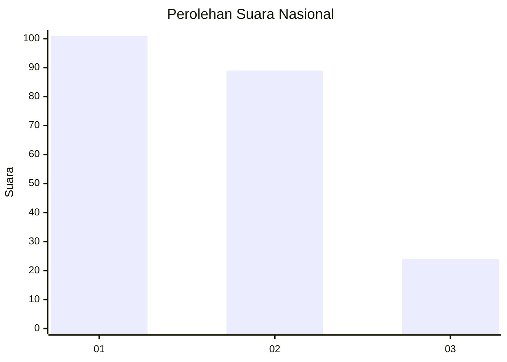
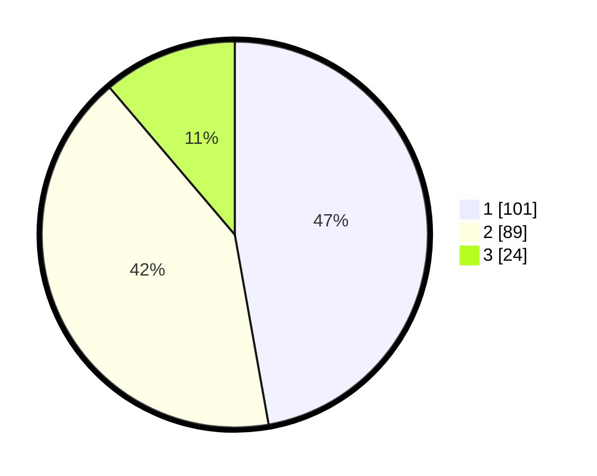

# Hasil

## Grafik

## Tabel

| No.    | Nama Paslon    | Suara | Suara (raw) | Persentase |
|:------ |:-------------- | -----:| -----------:| ----------:|
| 100025 | ANIES MUHAIMIN | 101   | [101][p-1]  | 47,20      |
| 100026 | PRABOWO GIBRAN | 89    | [89][p-2]   | 41,59      |
| 100027 | GANJAR MAHFUD  | 24    | [24][p-3]   | 11,21      |

[p-1]: https://github.com/gigit-pemilu/pemilu-2024/blob/main/pilpres/hitung-suara/sub/31-dki-jakarta/sub/75-jakarta-timur/sub/05-pasar-rebo/sub/1004-kalisari/sub/054-tps/sub/paslon-1.txt
[p-2]: https://github.com/gigit-pemilu/pemilu-2024/blob/main/pilpres/hitung-suara/sub/31-dki-jakarta/sub/75-jakarta-timur/sub/05-pasar-rebo/sub/1004-kalisari/sub/054-tps/sub/paslon-2.txt
[p-3]: https://github.com/gigit-pemilu/pemilu-2024/blob/main/pilpres/hitung-suara/sub/31-dki-jakarta/sub/75-jakarta-timur/sub/05-pasar-rebo/sub/1004-kalisari/sub/054-tps/sub/paslon-3.txt

## Foto C Plano

https://sirekap-obj-formc.kpu.go.id/e6f8/pemilu/ppwp/31/75/05/10/04/3175051004054-20240215-032330--c5b2bafa-ab58-4712-8058-4e2575c3ca38.jpg

https://sirekap-obj-formc.kpu.go.id/e6f8/pemilu/ppwp/31/75/05/10/04/3175051004054-20240215-032334--61f167bf-b0b7-41a0-8dbd-e6a95495dfff.jpg

https://sirekap-obj-formc.kpu.go.id/e6f8/pemilu/ppwp/31/75/05/10/04/3175051004054-20240215-032338--4eb2191f-37a4-4617-a7b8-227063e9c884.jpg

## Metadata

| Key        | Value               |
| ---------- | ------------------- |
| Time Stamp | 2024-02-16 02:00:27 |

