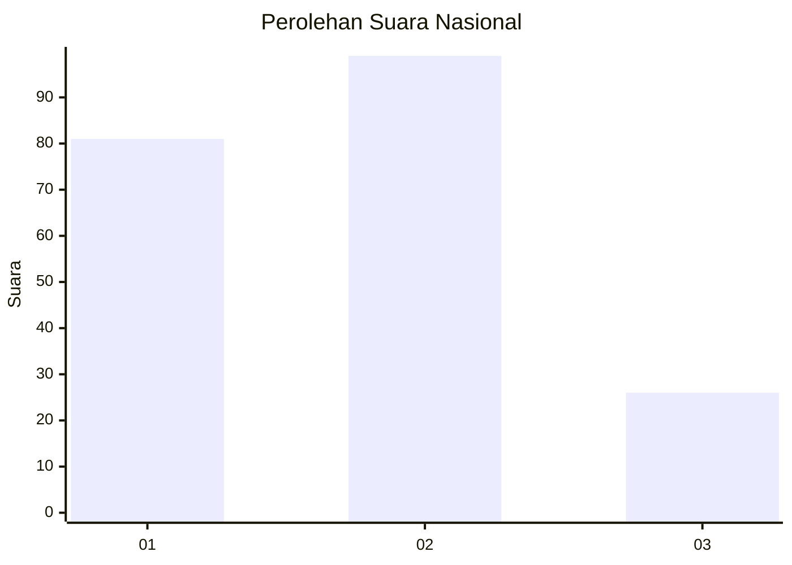
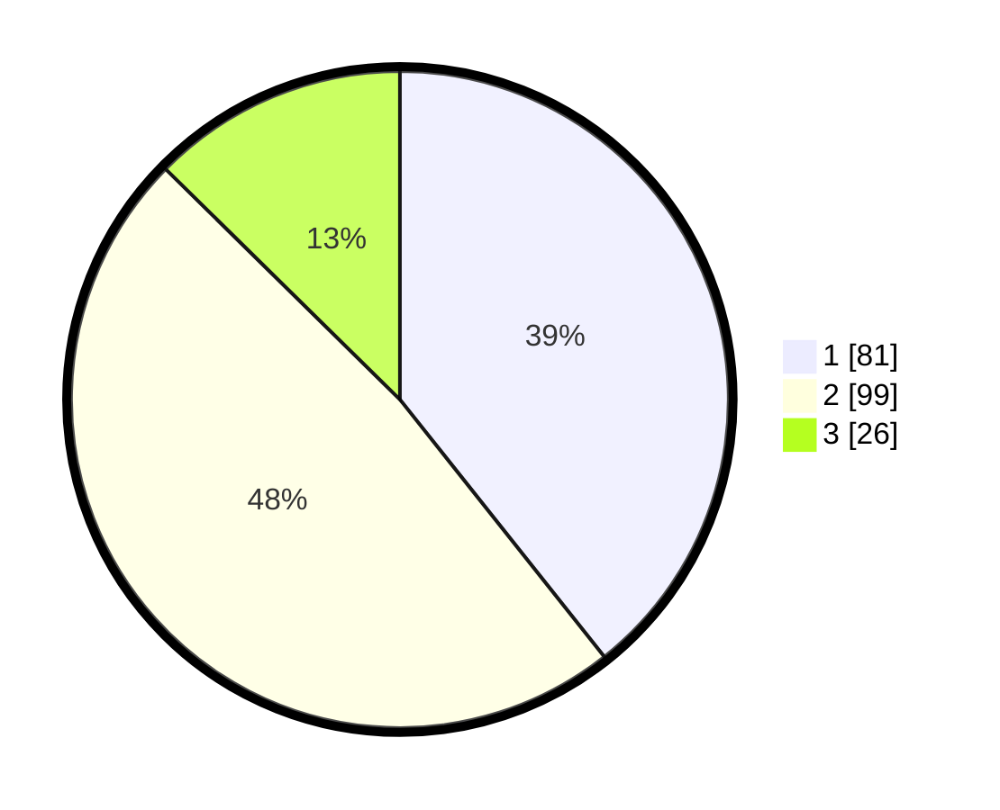

# Hasil

## Grafik

## Tabel

| No.    | Nama Paslon    | Suara | Suara (raw) | Persentase |
|:------ |:-------------- | -----:| -----------:| ----------:|
| 100025 | ANIES MUHAIMIN | 81    | [81][p-1]   | 39,32      |
| 100026 | PRABOWO GIBRAN | 99    | [99][p-2]   | 48,06      |
| 100027 | GANJAR MAHFUD  | 26    | [26][p-3]   | 12,62      |

[p-1]: https://github.com/gigit-pemilu/pemilu-2024/blob/main/pilpres/hitung-suara/sub/31-dki-jakarta/sub/75-jakarta-timur/sub/05-pasar-rebo/sub/1004-kalisari/sub/079-tps/sub/paslon-1.txt
[p-2]: https://github.com/gigit-pemilu/pemilu-2024/blob/main/pilpres/hitung-suara/sub/31-dki-jakarta/sub/75-jakarta-timur/sub/05-pasar-rebo/sub/1004-kalisari/sub/079-tps/sub/paslon-2.txt
[p-3]: https://github.com/gigit-pemilu/pemilu-2024/blob/main/pilpres/hitung-suara/sub/31-dki-jakarta/sub/75-jakarta-timur/sub/05-pasar-rebo/sub/1004-kalisari/sub/079-tps/sub/paslon-3.txt

## Foto C Plano

https://sirekap-obj-formc.kpu.go.id/0370/pemilu/ppwp/31/75/05/10/04/3175051004079-20240214-212714--5e7667ae-0d80-441c-931a-f2b0c6e6fbd0.jpg

https://sirekap-obj-formc.kpu.go.id/0370/pemilu/ppwp/31/75/05/10/04/3175051004079-20240214-223803--616f6ced-6ffb-4bb8-8d3c-423b2723659d.jpg

https://sirekap-obj-formc.kpu.go.id/0370/pemilu/ppwp/31/75/05/10/04/3175051004079-20240214-223820--ddefadf7-86ec-4d80-9fd2-5e4e6eba66af.jpg

## Metadata

| Key        | Value               |
| ---------- | ------------------- |
| Time Stamp | 2024-02-15 22:30:27 |

