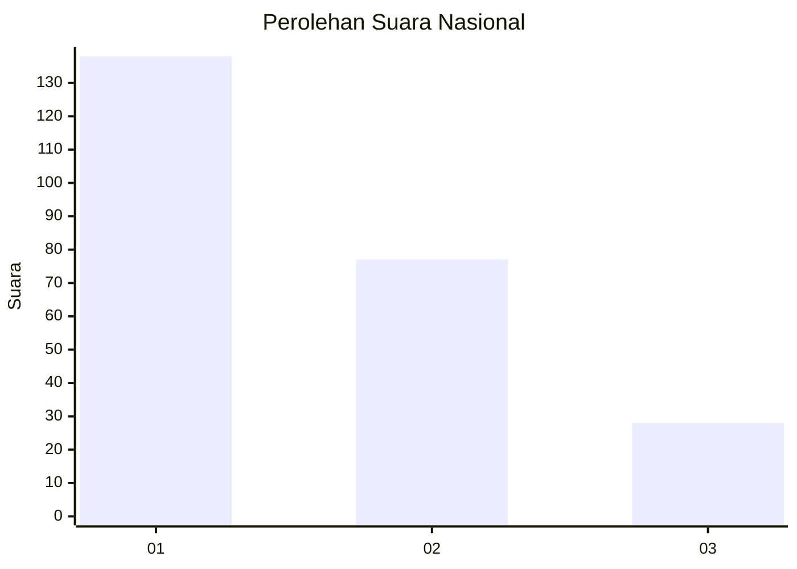
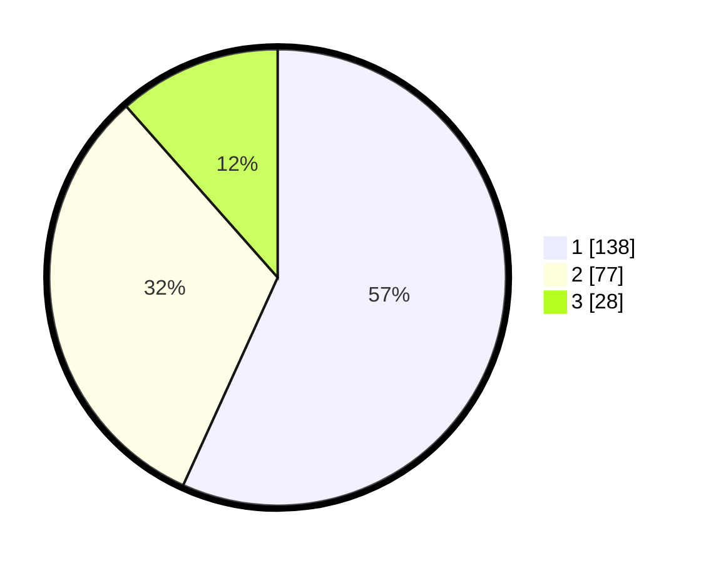

# Hasil

## Grafik

## Tabel

| No.    | Nama Paslon    | Suara | Suara (raw) | Persentase |
|:------ |:-------------- | -----:| -----------:| ----------:|
| 100025 | ANIES MUHAIMIN | 138   | [138][p-1]  | 56,79      |
| 100026 | PRABOWO GIBRAN | 77    | [77][p-2]   | 31,69      |
| 100027 | GANJAR MAHFUD  | 28    | [28][p-3]   | 11,52      |

[p-1]: https://github.com/gigit-pemilu/pemilu-2024/blob/main/pilpres/hitung-suara/sub/31-dki-jakarta/sub/75-jakarta-timur/sub/05-pasar-rebo/sub/1004-kalisari/sub/081-tps/sub/paslon-1.txt
[p-2]: https://github.com/gigit-pemilu/pemilu-2024/blob/main/pilpres/hitung-suara/sub/31-dki-jakarta/sub/75-jakarta-timur/sub/05-pasar-rebo/sub/1004-kalisari/sub/081-tps/sub/paslon-2.txt
[p-3]: https://github.com/gigit-pemilu/pemilu-2024/blob/main/pilpres/hitung-suara/sub/31-dki-jakarta/sub/75-jakarta-timur/sub/05-pasar-rebo/sub/1004-kalisari/sub/081-tps/sub/paslon-3.txt

## Foto C Plano

https://sirekap-obj-formc.kpu.go.id/9daa/pemilu/ppwp/31/75/05/10/04/3175051004081-20240214-223257--dc595157-5cc4-4d03-a8da-98f2148bc89f.jpg

https://sirekap-obj-formc.kpu.go.id/9daa/pemilu/ppwp/31/75/05/10/04/3175051004081-20240214-223043--ac32c51d-c3c6-43fa-8f95-1a6ad0507be3.jpg

https://sirekap-obj-formc.kpu.go.id/9daa/pemilu/ppwp/31/75/05/10/04/3175051004081-20240214-223351--189e2cd9-8139-49e0-ac4c-f19fd8399576.jpg

## Metadata

| Key        | Value               |
| ---------- | ------------------- |
| Time Stamp | 2024-02-16 03:00:26 |

