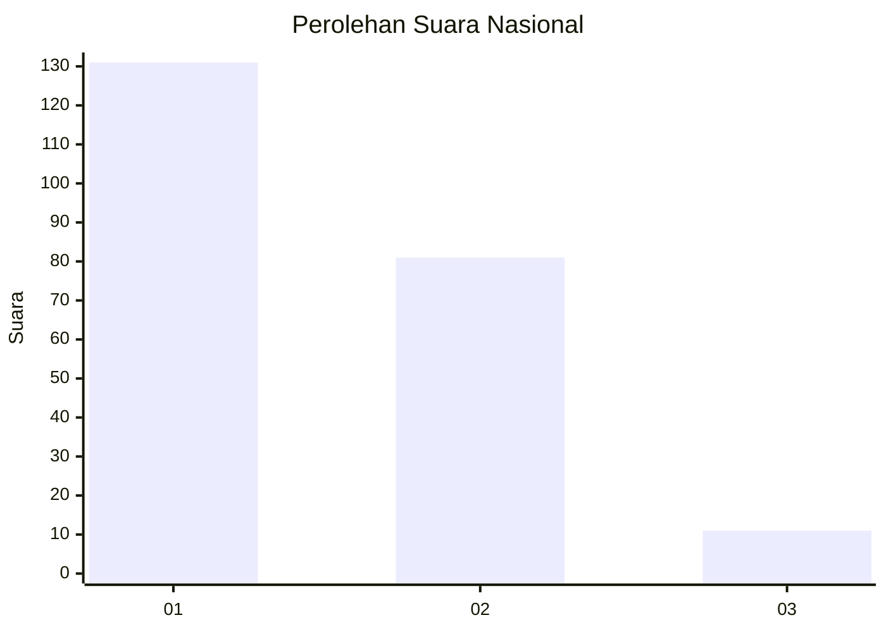
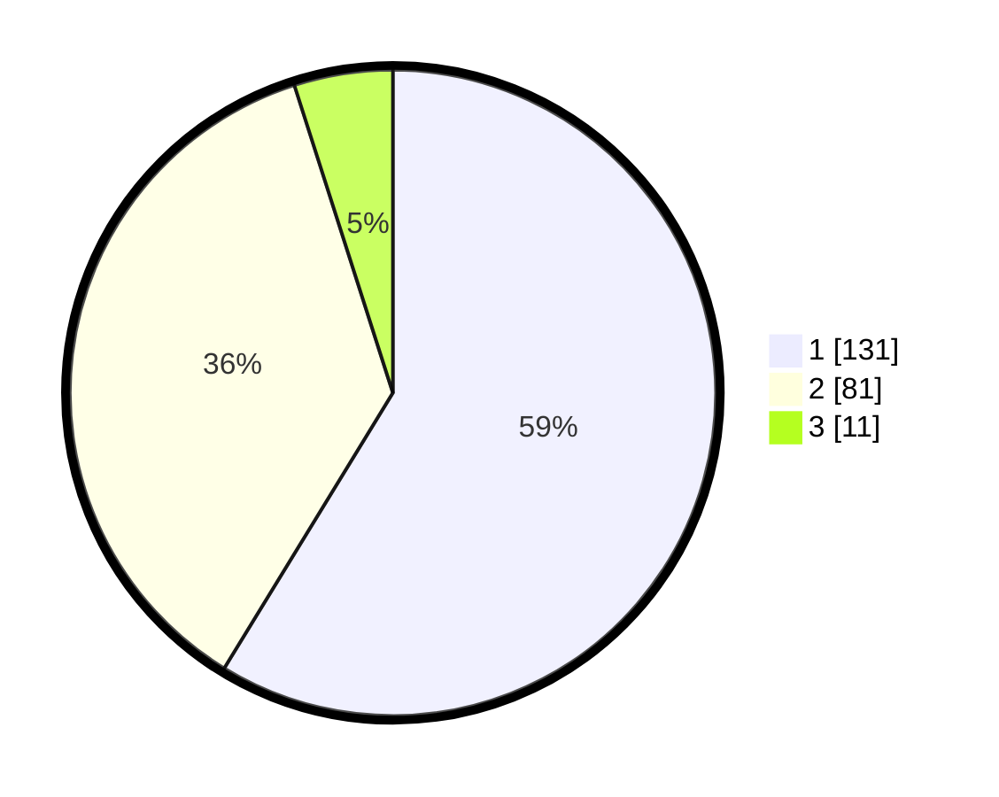

# Hasil

## Grafik

## Tabel

| No.    | Nama Paslon    | Suara | Suara (raw) | Persentase |
|:------ |:-------------- | -----:| -----------:| ----------:|
| 100025 | ANIES MUHAIMIN | 131   | [131][p-1]  | 58,74      |
| 100026 | PRABOWO GIBRAN | 81    | [81][p-2]   | 36,32      |
| 100027 | GANJAR MAHFUD  | 11    | [11][p-3]   | 4,93       |

[p-1]: https://github.com/gigit-pemilu/pemilu-2024/blob/main/pilpres/hitung-suara/sub/31-dki-jakarta/sub/75-jakarta-timur/sub/05-pasar-rebo/sub/1004-kalisari/sub/096-tps/sub/paslon-1.txt
[p-2]: https://github.com/gigit-pemilu/pemilu-2024/blob/main/pilpres/hitung-suara/sub/31-dki-jakarta/sub/75-jakarta-timur/sub/05-pasar-rebo/sub/1004-kalisari/sub/096-tps/sub/paslon-2.txt
[p-3]: https://github.com/gigit-pemilu/pemilu-2024/blob/main/pilpres/hitung-suara/sub/31-dki-jakarta/sub/75-jakarta-timur/sub/05-pasar-rebo/sub/1004-kalisari/sub/096-tps/sub/paslon-3.txt

## Foto C Plano

https://sirekap-obj-formc.kpu.go.id/5158/pemilu/ppwp/31/75/05/10/04/3175051004096-20240215-012043--29b058c9-7b1f-4416-b17c-9810e9856234.jpg

https://sirekap-obj-formc.kpu.go.id/5158/pemilu/ppwp/31/75/05/10/04/3175051004096-20240215-012714--bd56022b-a441-4f00-bbf7-ce0680687e60.jpg

https://sirekap-obj-formc.kpu.go.id/5158/pemilu/ppwp/31/75/05/10/04/3175051004096-20240215-012913--9fa2e565-ed52-45a8-94c5-36ef3c7657cb.jpg

## Metadata

| Key        | Value               |
| ---------- | ------------------- |
| Time Stamp | 2024-02-15 15:00:29 |

