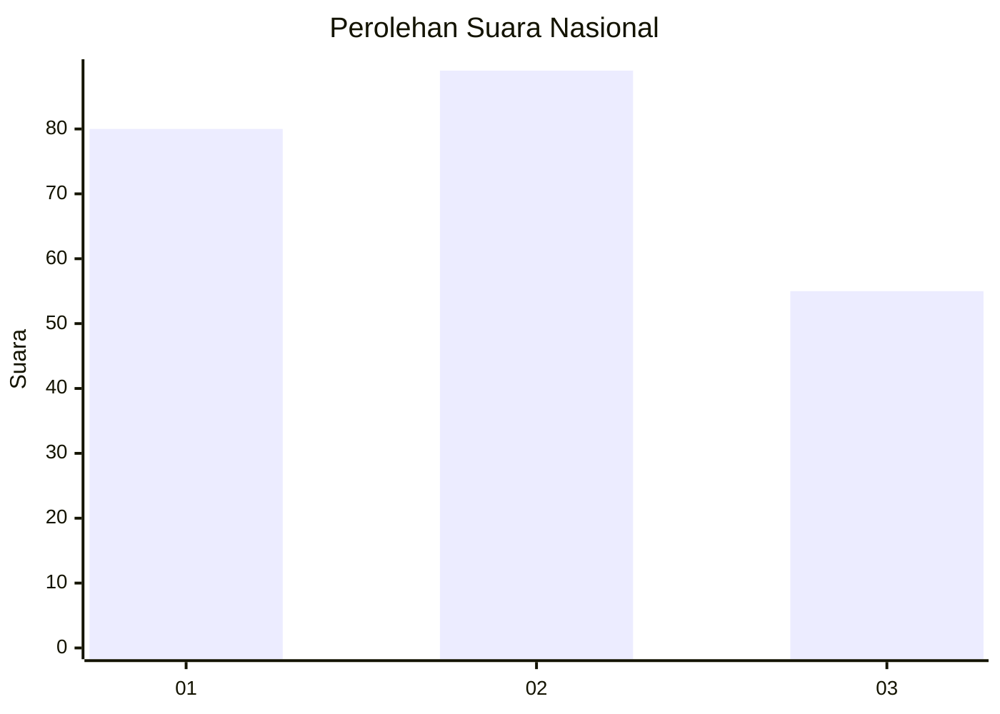
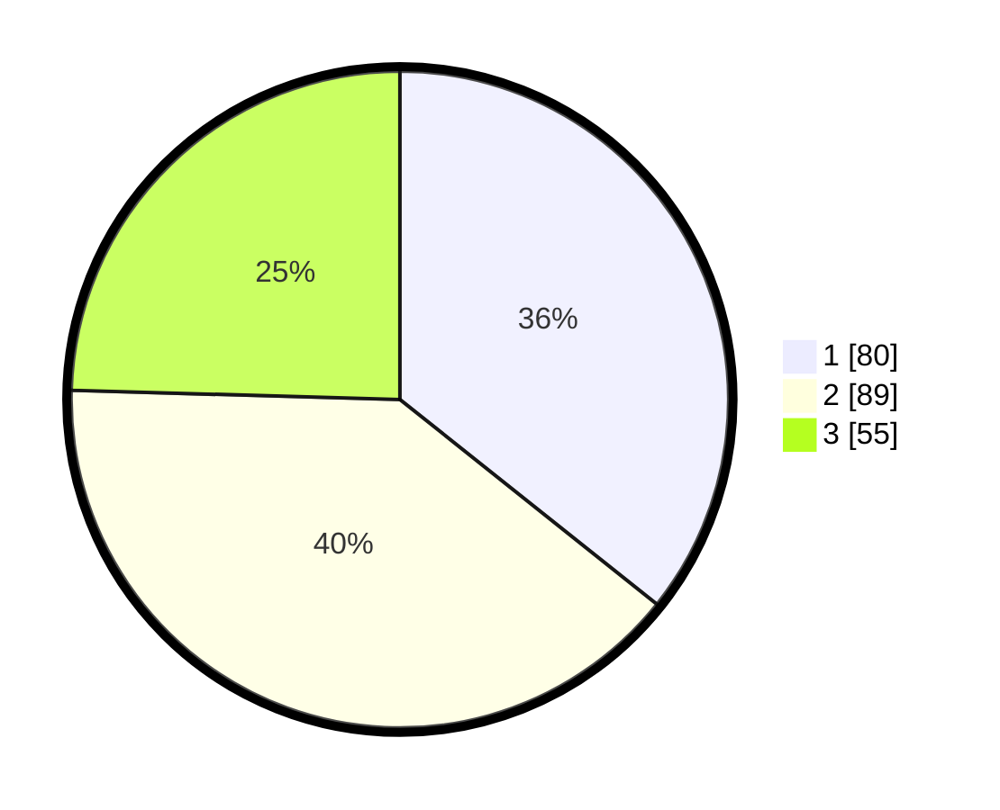

# Hasil

## Grafik

## Tabel

| No.    | Nama Paslon    | Suara | Suara (raw) | Persentase |
|:------ |:-------------- | -----:| -----------:| ----------:|
| 100025 | ANIES MUHAIMIN | 80    | [80][p-1]   | 35,71      |
| 100026 | PRABOWO GIBRAN | 89    | [89][p-2]   | 39,73      |
| 100027 | GANJAR MAHFUD  | 55    | [55][p-3]   | 24,55      |

[p-1]: https://github.com/gigit-pemilu/pemilu-2024/blob/main/pilpres/hitung-suara/sub/31-dki-jakarta/sub/75-jakarta-timur/sub/05-pasar-rebo/sub/1004-kalisari/sub/097-tps/sub/paslon-1.txt
[p-2]: https://github.com/gigit-pemilu/pemilu-2024/blob/main/pilpres/hitung-suara/sub/31-dki-jakarta/sub/75-jakarta-timur/sub/05-pasar-rebo/sub/1004-kalisari/sub/097-tps/sub/paslon-2.txt
[p-3]: https://github.com/gigit-pemilu/pemilu-2024/blob/main/pilpres/hitung-suara/sub/31-dki-jakarta/sub/75-jakarta-timur/sub/05-pasar-rebo/sub/1004-kalisari/sub/097-tps/sub/paslon-3.txt

## Foto C Plano

https://sirekap-obj-formc.kpu.go.id/8a89/pemilu/ppwp/31/75/05/10/04/3175051004097-20240215-140438--98cfded9-dd65-42ed-b903-6434d616996b.jpg

https://sirekap-obj-formc.kpu.go.id/8a89/pemilu/ppwp/31/75/05/10/04/3175051004097-20240215-140446--5f548b5d-2bb3-48f2-9609-90eac1422fe8.jpg

https://sirekap-obj-formc.kpu.go.id/8a89/pemilu/ppwp/31/75/05/10/04/3175051004097-20240215-140450--922ac2e9-6117-4985-80bb-1a38afded631.jpg

## Metadata

| Key        | Value               |
| ---------- | ------------------- |
| Time Stamp | 2024-02-16 03:00:26 |

