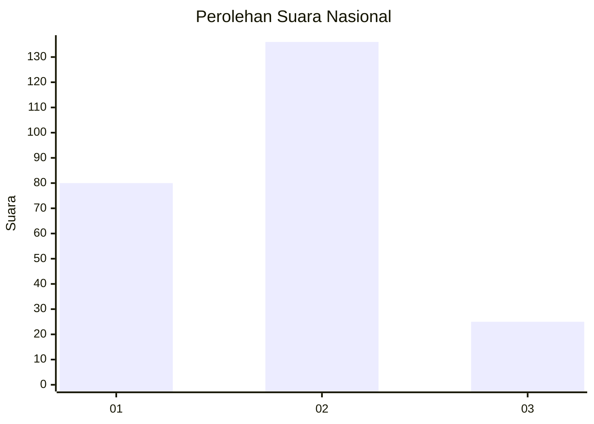
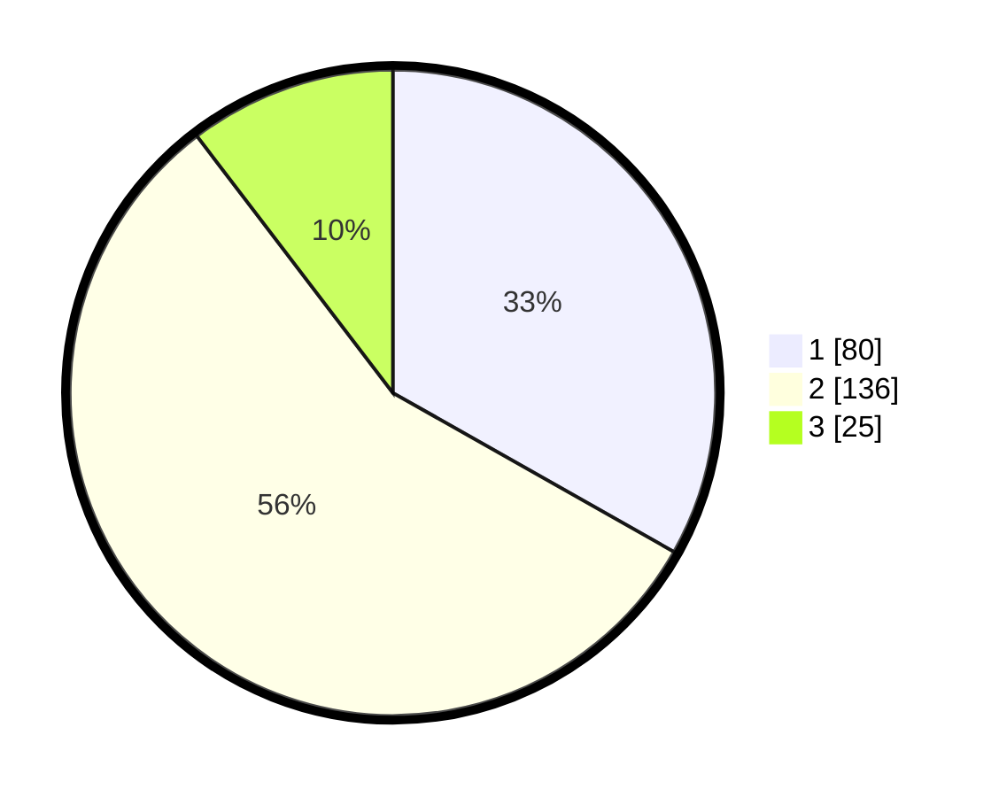

# Hasil

## Grafik

## Tabel

| No.    | Nama Paslon    | Suara | Suara (raw) | Persentase |
|:------ |:-------------- | -----:| -----------:| ----------:|
| 100025 | ANIES MUHAIMIN | 80    | [80][p-1]   | 33,20      |
| 100026 | PRABOWO GIBRAN | 136   | [136][p-2]  | 56,43      |
| 100027 | GANJAR MAHFUD  | 25    | [25][p-3]   | 10,37      |

[p-1]: https://github.com/gigit-pemilu/pemilu-2024/blob/main/pilpres/hitung-suara/sub/31-dki-jakarta/sub/75-jakarta-timur/sub/05-pasar-rebo/sub/1004-kalisari/sub/107-tps/sub/paslon-1.txt
[p-2]: https://github.com/gigit-pemilu/pemilu-2024/blob/main/pilpres/hitung-suara/sub/31-dki-jakarta/sub/75-jakarta-timur/sub/05-pasar-rebo/sub/1004-kalisari/sub/107-tps/sub/paslon-2.txt
[p-3]: https://github.com/gigit-pemilu/pemilu-2024/blob/main/pilpres/hitung-suara/sub/31-dki-jakarta/sub/75-jakarta-timur/sub/05-pasar-rebo/sub/1004-kalisari/sub/107-tps/sub/paslon-3.txt

## Foto C Plano

https://sirekap-obj-formc.kpu.go.id/22cd/pemilu/ppwp/31/75/05/10/04/3175051004107-20240214-184608--38af7012-652d-4535-b3a3-9a69b3def7fa.jpg

https://sirekap-obj-formc.kpu.go.id/22cd/pemilu/ppwp/31/75/05/10/04/3175051004107-20240214-184732--ca989ed5-daaa-4e7c-8bc9-3e0b4ba436d4.jpg

https://sirekap-obj-formc.kpu.go.id/22cd/pemilu/ppwp/31/75/05/10/04/3175051004107-20240214-184634--35315da7-4c52-454c-a462-96032d0322fd.jpg

## Metadata

| Key        | Value               |
| ---------- | ------------------- |
| Time Stamp | 2024-02-24 22:31:28 |

