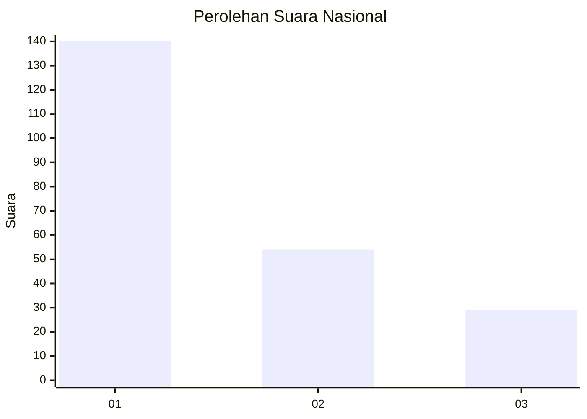
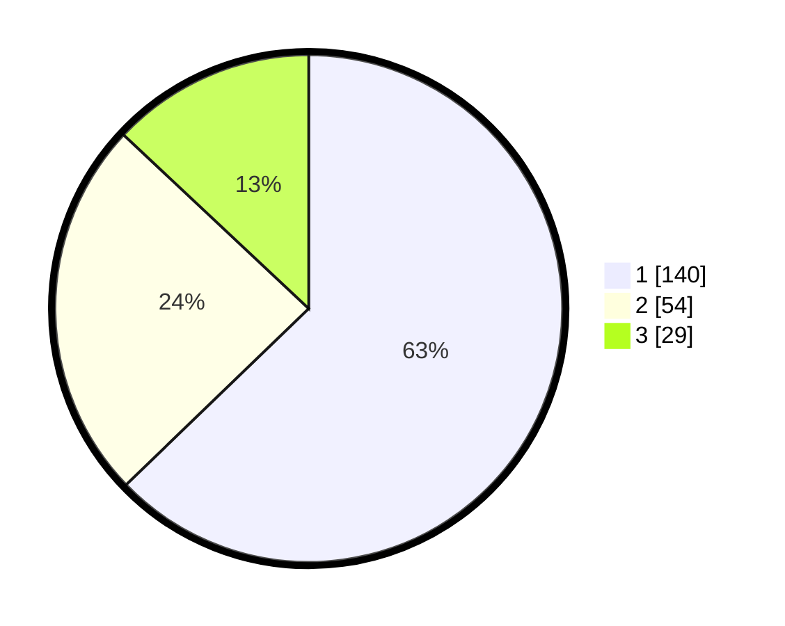

# Hasil

## Grafik

## Tabel

| No.    | Nama Paslon    | Suara | Suara (raw) | Persentase |
|:------ |:-------------- | -----:| -----------:| ----------:|
| 100025 | ANIES MUHAIMIN | 140   | [140][p-1]  | 62,78      |
| 100026 | PRABOWO GIBRAN | 54    | [54][p-2]   | 24,22      |
| 100027 | GANJAR MAHFUD  | 29    | [29][p-3]   | 13,00      |

[p-1]: https://github.com/gigit-pemilu/pemilu-2024/blob/main/pilpres/hitung-suara/sub/31-dki-jakarta/sub/75-jakarta-timur/sub/05-pasar-rebo/sub/1004-kalisari/sub/116-tps/sub/paslon-1.txt
[p-2]: https://github.com/gigit-pemilu/pemilu-2024/blob/main/pilpres/hitung-suara/sub/31-dki-jakarta/sub/75-jakarta-timur/sub/05-pasar-rebo/sub/1004-kalisari/sub/116-tps/sub/paslon-2.txt
[p-3]: https://github.com/gigit-pemilu/pemilu-2024/blob/main/pilpres/hitung-suara/sub/31-dki-jakarta/sub/75-jakarta-timur/sub/05-pasar-rebo/sub/1004-kalisari/sub/116-tps/sub/paslon-3.txt

## Foto C Plano

https://sirekap-obj-formc.kpu.go.id/edcc/pemilu/ppwp/31/75/05/10/04/3175051004116-20240214-215708--be5ef31b-4630-4910-8619-1c76100f73c2.jpg

https://sirekap-obj-formc.kpu.go.id/edcc/pemilu/ppwp/31/75/05/10/04/3175051004116-20240214-214328--b2c3f623-f6f8-4504-8ed2-86127c3adb5b.jpg

https://sirekap-obj-formc.kpu.go.id/edcc/pemilu/ppwp/31/75/05/10/04/3175051004116-20240214-214920--eaf14dfc-de16-45da-8a1e-ff8e055453e1.jpg

## Metadata

| Key        | Value               |
| ---------- | ------------------- |
| Time Stamp | 2024-02-24 22:31:28 |

