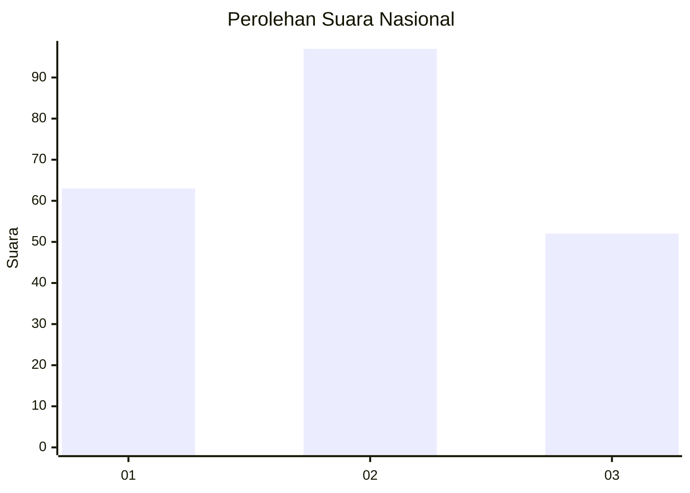
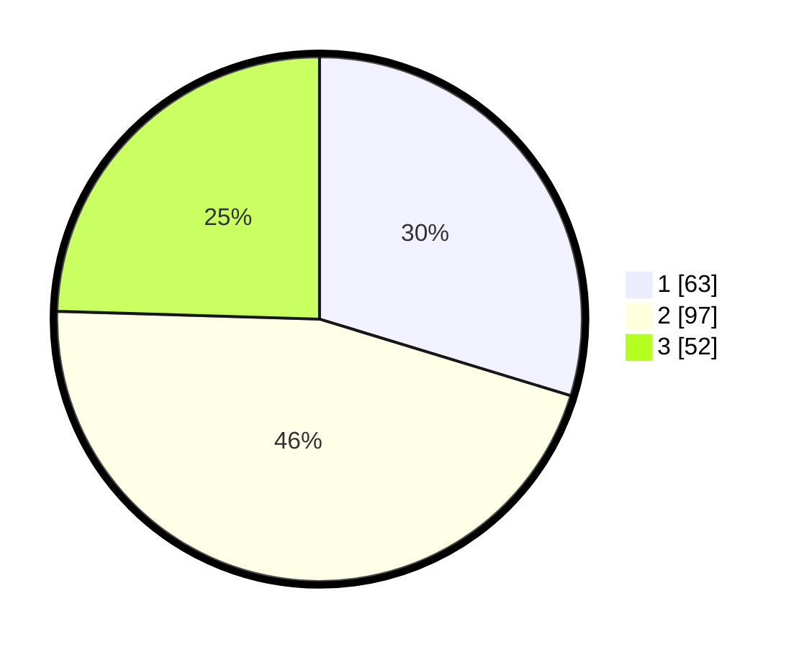

# Hasil

## Grafik

## Tabel

| No.    | Nama Paslon    | Suara | Suara (raw) | Persentase |
|:------ |:-------------- | -----:| -----------:| ----------:|
| 100025 | ANIES MUHAIMIN | 63    | [63][p-1]   | 29,72      |
| 100026 | PRABOWO GIBRAN | 97    | [97][p-2]   | 45,75      |
| 100027 | GANJAR MAHFUD  | 52    | [52][p-3]   | 24,53      |

[p-1]: https://github.com/gigit-pemilu/pemilu-2024/blob/main/pilpres/hitung-suara/sub/31-dki-jakarta/sub/75-jakarta-timur/sub/05-pasar-rebo/sub/1004-kalisari/sub/118-tps/sub/paslon-1.txt
[p-2]: https://github.com/gigit-pemilu/pemilu-2024/blob/main/pilpres/hitung-suara/sub/31-dki-jakarta/sub/75-jakarta-timur/sub/05-pasar-rebo/sub/1004-kalisari/sub/118-tps/sub/paslon-2.txt
[p-3]: https://github.com/gigit-pemilu/pemilu-2024/blob/main/pilpres/hitung-suara/sub/31-dki-jakarta/sub/75-jakarta-timur/sub/05-pasar-rebo/sub/1004-kalisari/sub/118-tps/sub/paslon-3.txt

## Foto C Plano

https://sirekap-obj-formc.kpu.go.id/bb5c/pemilu/ppwp/31/75/05/10/04/3175051004118-20240215-072555--b4bb5e07-bd94-4c3e-857f-44d33c2de488.jpg

https://sirekap-obj-formc.kpu.go.id/bb5c/pemilu/ppwp/31/75/05/10/04/3175051004118-20240215-072701--e4cb5ff9-d091-40b8-b2e6-37734a044b25.jpg

https://sirekap-obj-formc.kpu.go.id/bb5c/pemilu/ppwp/31/75/05/10/04/3175051004118-20240215-072806--f267e558-9c9d-493a-9d1c-dcd3c3bf346a.jpg

## Metadata

| Key        | Value               |
| ---------- | ------------------- |
| Time Stamp | 2024-02-16 03:00:26 |

