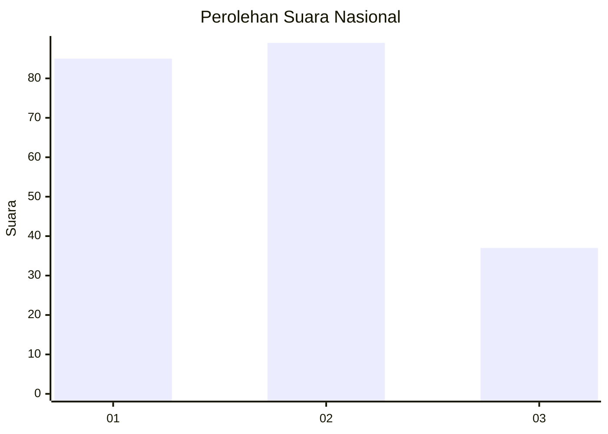
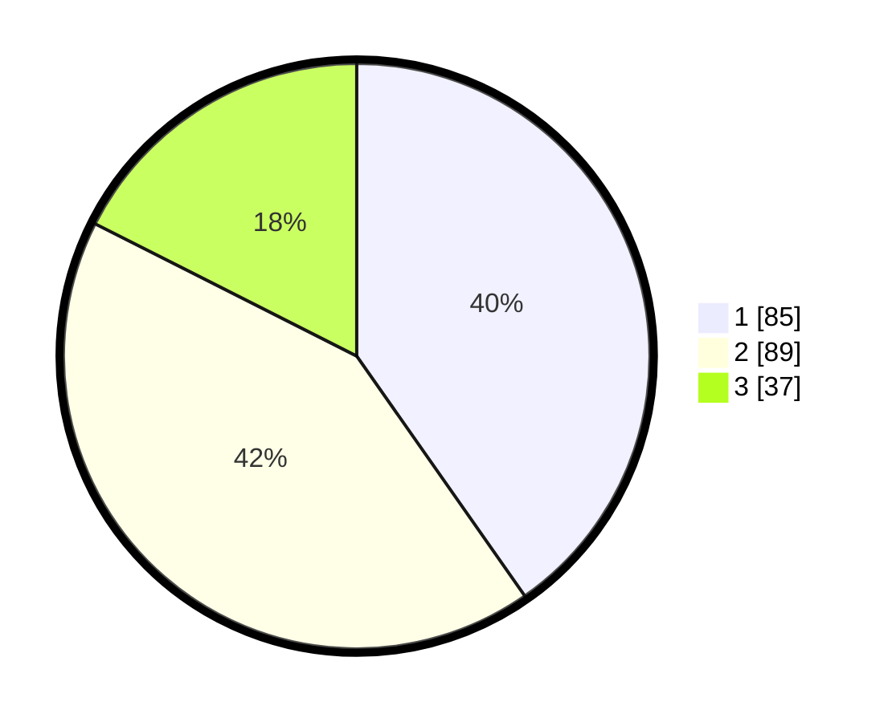

# Hasil

## Grafik

## Tabel

| No.    | Nama Paslon    | Suara | Suara (raw) | Persentase |
|:------ |:-------------- | -----:| -----------:| ----------:|
| 100025 | ANIES MUHAIMIN | 85    | [85][p-1]   | 40,28      |
| 100026 | PRABOWO GIBRAN | 89    | [89][p-2]   | 42,18      |
| 100027 | GANJAR MAHFUD  | 37    | [37][p-3]   | 17,54      |

[p-1]: https://github.com/gigit-pemilu/pemilu-2024/blob/main/pilpres/hitung-suara/sub/31-dki-jakarta/sub/75-jakarta-timur/sub/05-pasar-rebo/sub/1005-pekayon/sub/031-tps/sub/paslon-1.txt
[p-2]: https://github.com/gigit-pemilu/pemilu-2024/blob/main/pilpres/hitung-suara/sub/31-dki-jakarta/sub/75-jakarta-timur/sub/05-pasar-rebo/sub/1005-pekayon/sub/031-tps/sub/paslon-2.txt
[p-3]: https://github.com/gigit-pemilu/pemilu-2024/blob/main/pilpres/hitung-suara/sub/31-dki-jakarta/sub/75-jakarta-timur/sub/05-pasar-rebo/sub/1005-pekayon/sub/031-tps/sub/paslon-3.txt

## Foto C Plano

https://sirekap-obj-formc.kpu.go.id/7b7d/pemilu/ppwp/31/75/05/10/05/3175051005031-20240214-194327--644304a6-d270-4642-8072-7ea3be7adf39.jpg

https://sirekap-obj-formc.kpu.go.id/7b7d/pemilu/ppwp/31/75/05/10/05/3175051005031-20240215-002839--042cfbaa-3e73-4de6-9a04-458c89e2b12d.jpg

https://sirekap-obj-formc.kpu.go.id/7b7d/pemilu/ppwp/31/75/05/10/05/3175051005031-20240215-002911--887a175c-65b6-4cf9-bbd1-00af3ffda22f.jpg

## Metadata

| Key        | Value               |
| ---------- | ------------------- |
| Time Stamp | 2024-02-24 22:31:28 |

