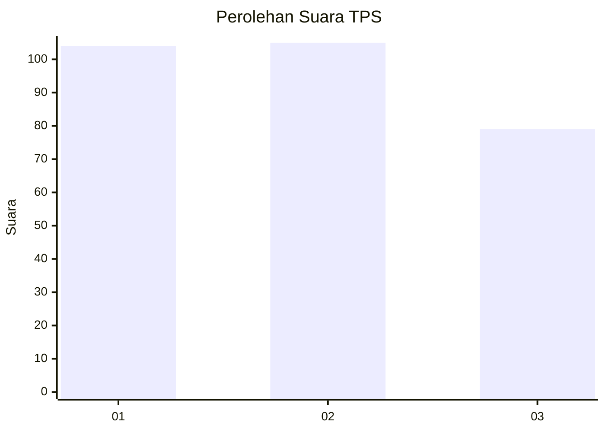
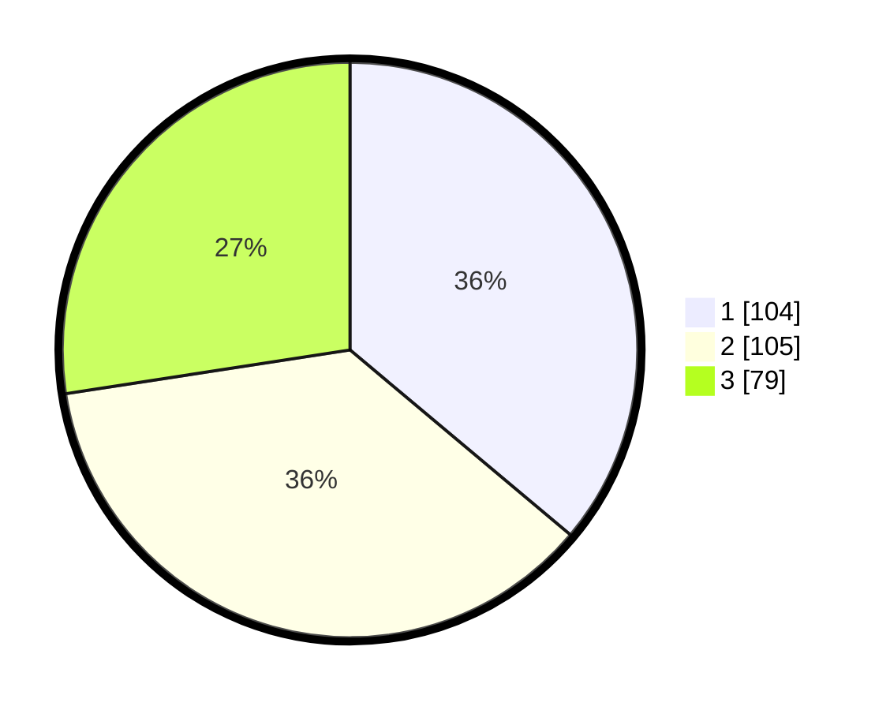

# Hasil

## Grafik

## Tabel

| No. | Nama Paslon    | Suara | Suara (raw) | Persentase |
|:--- |:-------------- | -----:| -----------:| ----------:|
| 1   | ANIES MUHAIMIN | 104   | [104][p-1]  | 36,11      |
| 2   | PRABOWO GIBRAN | 105   | [105][p-2]  | 36,46      |
| 3   | GANJAR MAHFUD  | 79    | [79][p-3]   | 27,43      |

[p-1]: https://github.com/gigit-pemilu/pemilu-2024-31-dki-jakarta/blob/main/pilpres/hitung-suara/sub/31-dki-jakarta/sub/75-jakarta-timur/sub/05-pasar-rebo/sub/1005-pekayon/sub/043-tps/sub/paslon-1.txt
[p-2]: https://github.com/gigit-pemilu/pemilu-2024-31-dki-jakarta/blob/main/pilpres/hitung-suara/sub/31-dki-jakarta/sub/75-jakarta-timur/sub/05-pasar-rebo/sub/1005-pekayon/sub/043-tps/sub/paslon-2.txt
[p-3]: https://github.com/gigit-pemilu/pemilu-2024-31-dki-jakarta/blob/main/pilpres/hitung-suara/sub/31-dki-jakarta/sub/75-jakarta-timur/sub/05-pasar-rebo/sub/1005-pekayon/sub/043-tps/sub/paslon-3.txt

## Foto C Plano

https://sirekap-obj-formc.kpu.go.id/354e/pemilu/ppwp/31/75/05/10/05/3175051005043-20240214-201228--0e6f5d7a-7081-463d-932d-1a022440bb24.jpg

https://sirekap-obj-formc.kpu.go.id/354e/pemilu/ppwp/31/75/05/10/05/3175051005043-20240214-203653--0b115356-6b4b-4e80-8d1f-b5a615b59a3c.jpg

https://sirekap-obj-formc.kpu.go.id/354e/pemilu/ppwp/31/75/05/10/05/3175051005043-20240214-230105--36821146-430b-4afb-a51c-21239c48688d.jpg

## Metadata

| Key        | Value               |
| ---------- | ------------------- |
| Time Stamp | 2024-02-15 12:00:28 |

