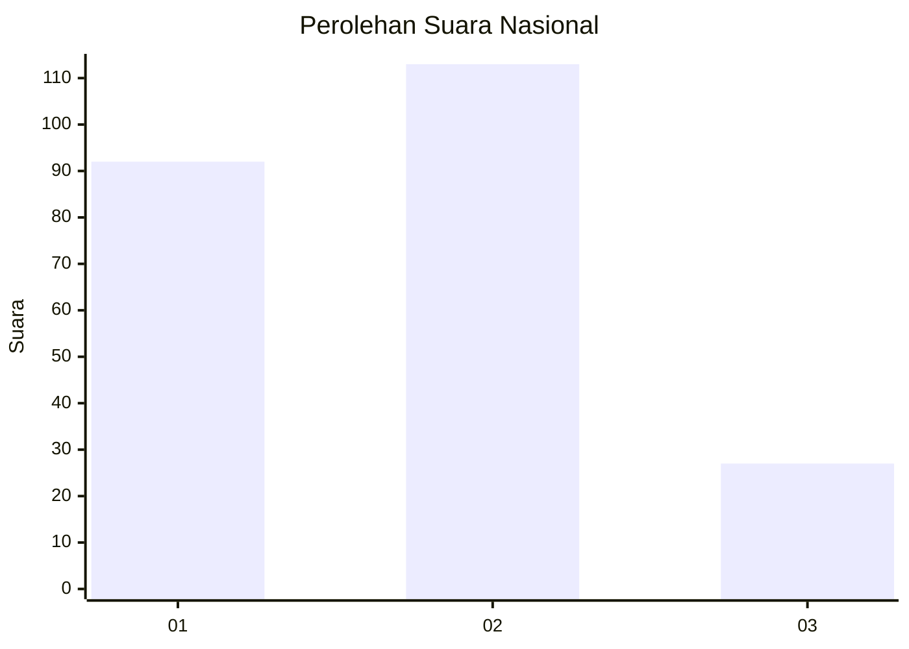
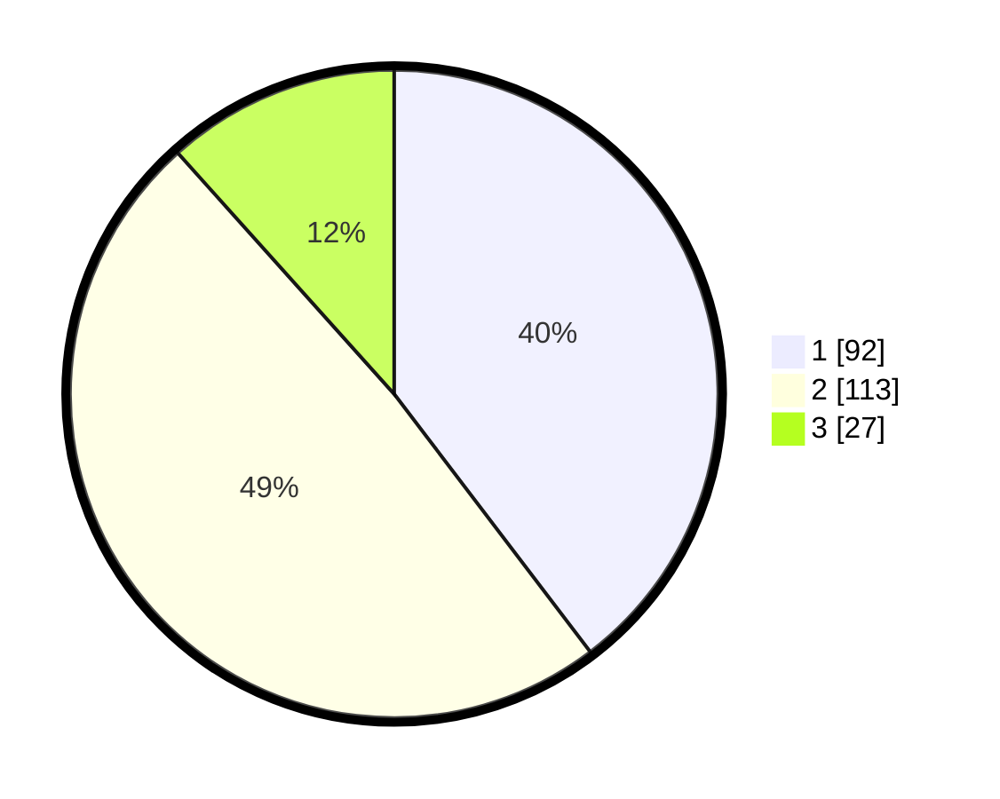

# Hasil

## Grafik

## Tabel

| No.    | Nama Paslon    | Suara | Suara (raw) | Persentase |
|:------ |:-------------- | -----:| -----------:| ----------:|
| 100025 | ANIES MUHAIMIN | 92    | [92][p-1]   | 39,66      |
| 100026 | PRABOWO GIBRAN | 113   | [113][p-2]  | 48,71      |
| 100027 | GANJAR MAHFUD  | 27    | [27][p-3]   | 11,64      |

[p-1]: https://github.com/gigit-pemilu/pemilu-2024/blob/main/pilpres/hitung-suara/sub/31-dki-jakarta/sub/75-jakarta-timur/sub/05-pasar-rebo/sub/1005-pekayon/sub/077-tps/sub/paslon-1.txt
[p-2]: https://github.com/gigit-pemilu/pemilu-2024/blob/main/pilpres/hitung-suara/sub/31-dki-jakarta/sub/75-jakarta-timur/sub/05-pasar-rebo/sub/1005-pekayon/sub/077-tps/sub/paslon-2.txt
[p-3]: https://github.com/gigit-pemilu/pemilu-2024/blob/main/pilpres/hitung-suara/sub/31-dki-jakarta/sub/75-jakarta-timur/sub/05-pasar-rebo/sub/1005-pekayon/sub/077-tps/sub/paslon-3.txt

## Foto C Plano

https://sirekap-obj-formc.kpu.go.id/7247/pemilu/ppwp/31/75/05/10/05/3175051005077-20240214-231701--293a0b68-38e9-49a0-b62f-5f7b7b6649da.jpg

https://sirekap-obj-formc.kpu.go.id/7247/pemilu/ppwp/31/75/05/10/05/3175051005077-20240214-231735--c9f9b383-452f-48eb-ac54-fd2da9fc6e57.jpg

https://sirekap-obj-formc.kpu.go.id/7247/pemilu/ppwp/31/75/05/10/05/3175051005077-20240214-231833--eeb439f3-9183-48bf-b410-f7fc1287cddb.jpg

## Metadata

| Key        | Value               |
| ---------- | ------------------- |
| Time Stamp | 2024-02-24 22:31:28 |

