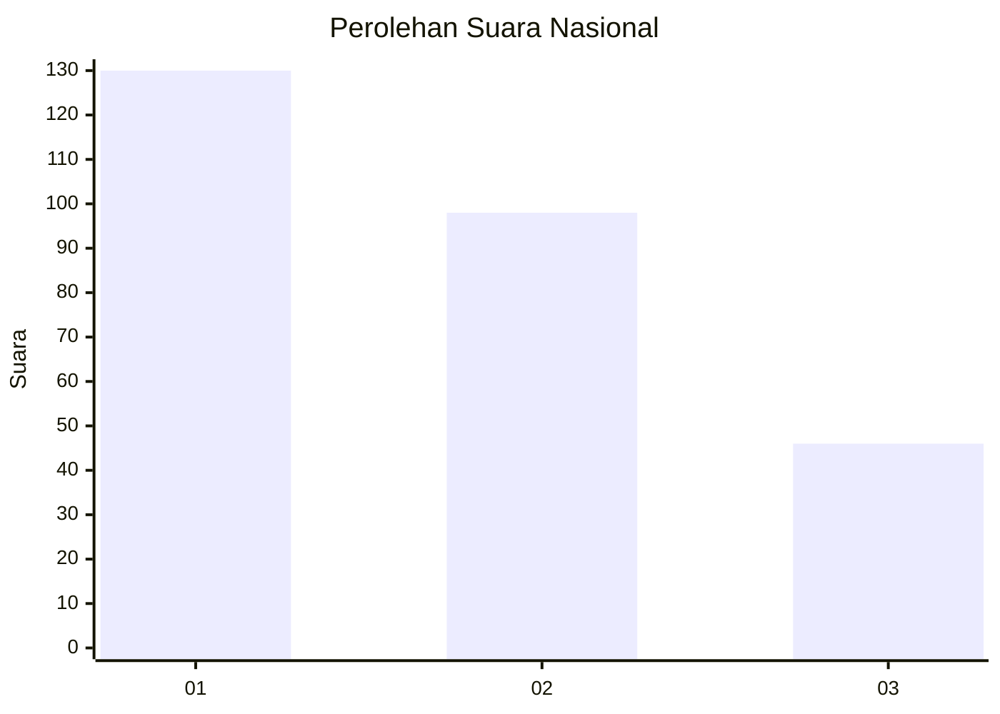
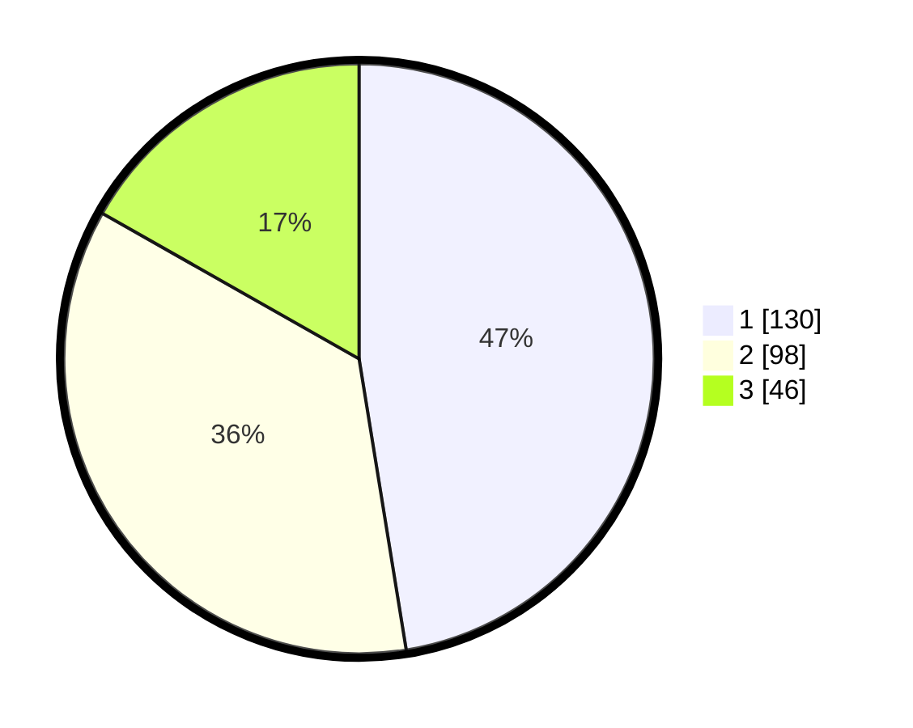

# Hasil

## Grafik

## Tabel

| No.    | Nama Paslon    | Suara | Suara (raw) | Persentase |
|:------ |:-------------- | -----:| -----------:| ----------:|
| 100025 | ANIES MUHAIMIN | 130   | [130][p-1]  | 47,45      |
| 100026 | PRABOWO GIBRAN | 98    | [98][p-2]   | 35,77      |
| 100027 | GANJAR MAHFUD  | 46    | [46][p-3]   | 16,79      |

[p-1]: https://github.com/gigit-pemilu/pemilu-2024/blob/main/pilpres/hitung-suara/sub/31-dki-jakarta/sub/75-jakarta-timur/sub/05-pasar-rebo/sub/1005-pekayon/sub/083-tps/sub/paslon-1.txt
[p-2]: https://github.com/gigit-pemilu/pemilu-2024/blob/main/pilpres/hitung-suara/sub/31-dki-jakarta/sub/75-jakarta-timur/sub/05-pasar-rebo/sub/1005-pekayon/sub/083-tps/sub/paslon-2.txt
[p-3]: https://github.com/gigit-pemilu/pemilu-2024/blob/main/pilpres/hitung-suara/sub/31-dki-jakarta/sub/75-jakarta-timur/sub/05-pasar-rebo/sub/1005-pekayon/sub/083-tps/sub/paslon-3.txt

## Foto C Plano

https://sirekap-obj-formc.kpu.go.id/157c/pemilu/ppwp/31/75/05/10/05/3175051005083-20240215-180221--4e36f737-c47e-4730-a551-58ecce723f3e.jpg

https://sirekap-obj-formc.kpu.go.id/157c/pemilu/ppwp/31/75/05/10/05/3175051005083-20240215-215912--19662b81-d306-4973-9ba8-71f07437dfbb.jpg

https://sirekap-obj-formc.kpu.go.id/157c/pemilu/ppwp/31/75/05/10/05/3175051005083-20240215-220117--72f13f38-c486-4755-813a-ecdff3a89d3b.jpg

## Metadata

| Key        | Value               |
| ---------- | ------------------- |
| Time Stamp | 2024-02-15 23:29:50 |

