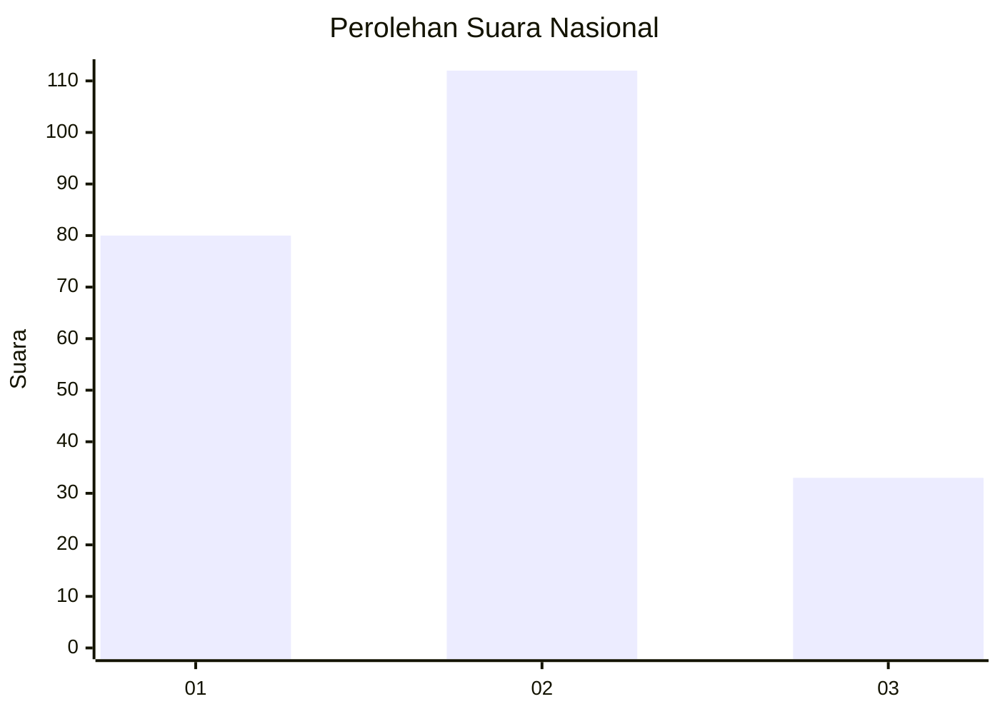
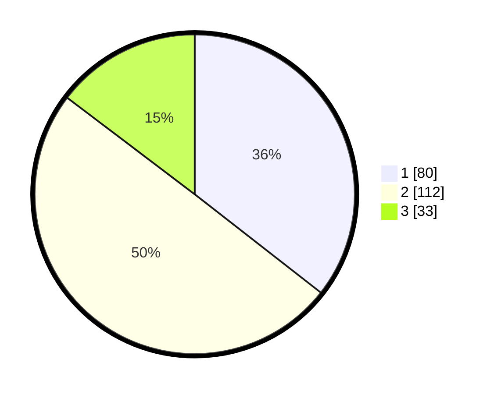

# Hasil

## Grafik

## Tabel

| No.    | Nama Paslon    | Suara | Suara (raw) | Persentase |
|:------ |:-------------- | -----:| -----------:| ----------:|
| 100025 | ANIES MUHAIMIN | 80    | [80][p-1]   | 35,56      |
| 100026 | PRABOWO GIBRAN | 112   | [112][p-2]  | 49,78      |
| 100027 | GANJAR MAHFUD  | 33    | [33][p-3]   | 14,67      |

[p-1]: https://github.com/gigit-pemilu/pemilu-2024/blob/main/pilpres/hitung-suara/sub/31-dki-jakarta/sub/75-jakarta-timur/sub/05-pasar-rebo/sub/1005-pekayon/sub/085-tps/sub/paslon-1.txt
[p-2]: https://github.com/gigit-pemilu/pemilu-2024/blob/main/pilpres/hitung-suara/sub/31-dki-jakarta/sub/75-jakarta-timur/sub/05-pasar-rebo/sub/1005-pekayon/sub/085-tps/sub/paslon-2.txt
[p-3]: https://github.com/gigit-pemilu/pemilu-2024/blob/main/pilpres/hitung-suara/sub/31-dki-jakarta/sub/75-jakarta-timur/sub/05-pasar-rebo/sub/1005-pekayon/sub/085-tps/sub/paslon-3.txt

## Foto C Plano

https://sirekap-obj-formc.kpu.go.id/349e/pemilu/ppwp/31/75/05/10/05/3175051005085-20240215-012206--0995c9ff-39fa-4b09-95be-f44622860be1.jpg

https://sirekap-obj-formc.kpu.go.id/349e/pemilu/ppwp/31/75/05/10/05/3175051005085-20240215-010340--d67b4e55-8250-4755-8467-5787c9fca430.jpg

https://sirekap-obj-formc.kpu.go.id/349e/pemilu/ppwp/31/75/05/10/05/3175051005085-20240215-012325--95c8c307-2e8b-49e1-a156-c1844de9bb50.jpg

## Metadata

| Key        | Value               |
| ---------- | ------------------- |
| Time Stamp | 2024-02-24 22:31:28 |

