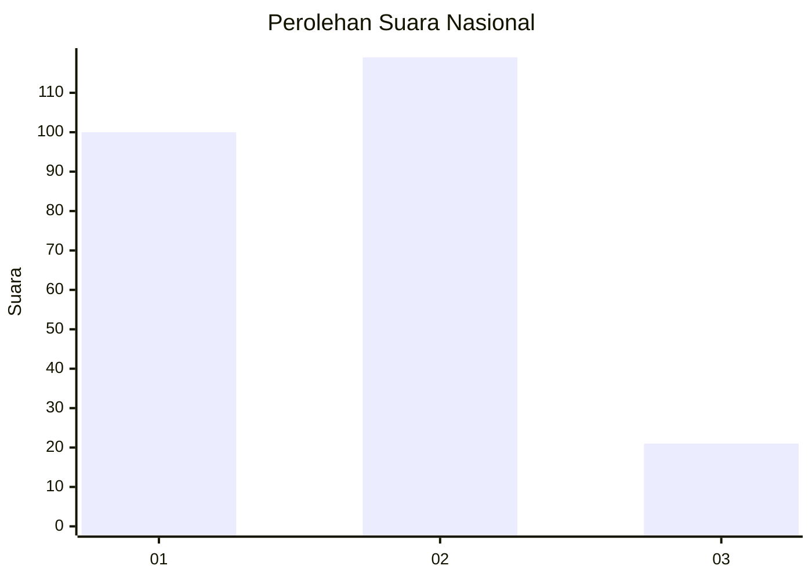
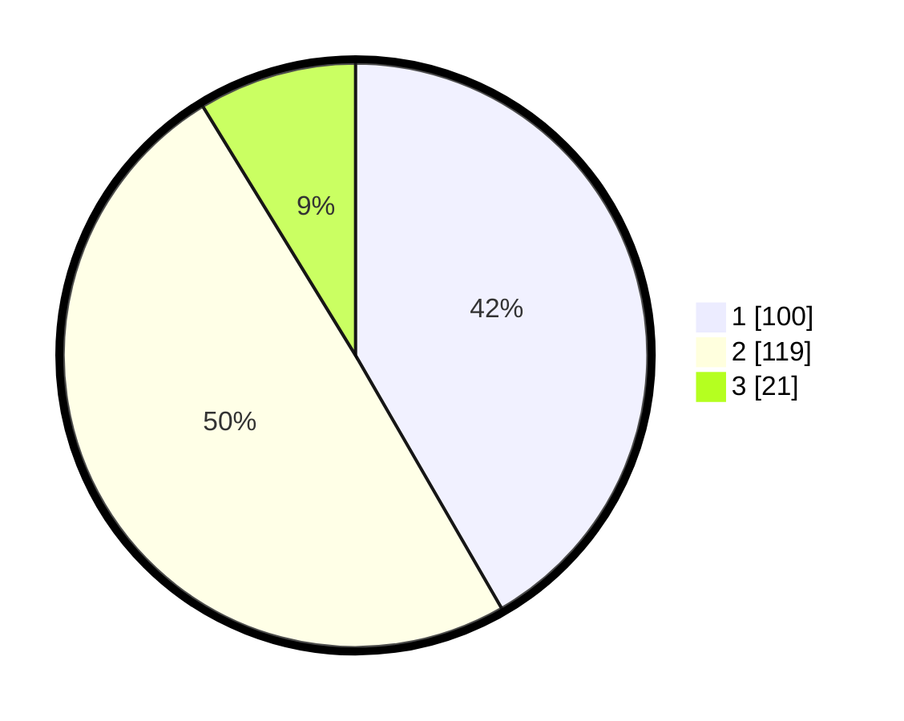

# Hasil

## Grafik

## Tabel

| No.    | Nama Paslon    | Suara | Suara (raw) | Persentase |
|:------ |:-------------- | -----:| -----------:| ----------:|
| 100025 | ANIES MUHAIMIN | 100   | [100][p-1]  | 41,67      |
| 100026 | PRABOWO GIBRAN | 119   | [119][p-2]  | 49,58      |
| 100027 | GANJAR MAHFUD  | 21    | [21][p-3]   | 8,75       |

[p-1]: https://github.com/gigit-pemilu/pemilu-2024/blob/main/pilpres/hitung-suara/sub/31-dki-jakarta/sub/75-jakarta-timur/sub/05-pasar-rebo/sub/1005-pekayon/sub/095-tps/sub/paslon-1.txt
[p-2]: https://github.com/gigit-pemilu/pemilu-2024/blob/main/pilpres/hitung-suara/sub/31-dki-jakarta/sub/75-jakarta-timur/sub/05-pasar-rebo/sub/1005-pekayon/sub/095-tps/sub/paslon-2.txt
[p-3]: https://github.com/gigit-pemilu/pemilu-2024/blob/main/pilpres/hitung-suara/sub/31-dki-jakarta/sub/75-jakarta-timur/sub/05-pasar-rebo/sub/1005-pekayon/sub/095-tps/sub/paslon-3.txt

## Foto C Plano

https://sirekap-obj-formc.kpu.go.id/845a/pemilu/ppwp/31/75/05/10/05/3175051005095-20240215-033143--bf058a4a-4de4-4fda-b3c2-76599308917b.jpg

https://sirekap-obj-formc.kpu.go.id/845a/pemilu/ppwp/31/75/05/10/05/3175051005095-20240215-033224--6124fbe2-84ff-42b3-a9aa-6cf8a7ec2f6a.jpg

https://sirekap-obj-formc.kpu.go.id/845a/pemilu/ppwp/31/75/05/10/05/3175051005095-20240215-033305--cfd90d8e-12b6-4661-a7df-c08473513fff.jpg

## Metadata

| Key        | Value               |
| ---------- | ------------------- |
| Time Stamp | 2024-02-24 22:31:28 |

