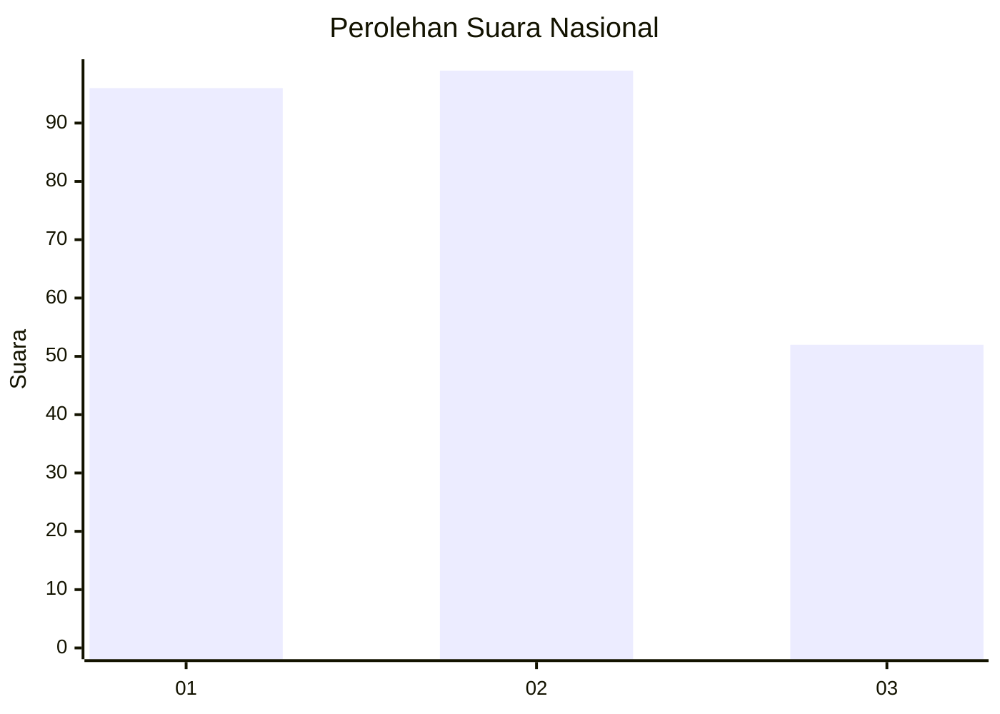
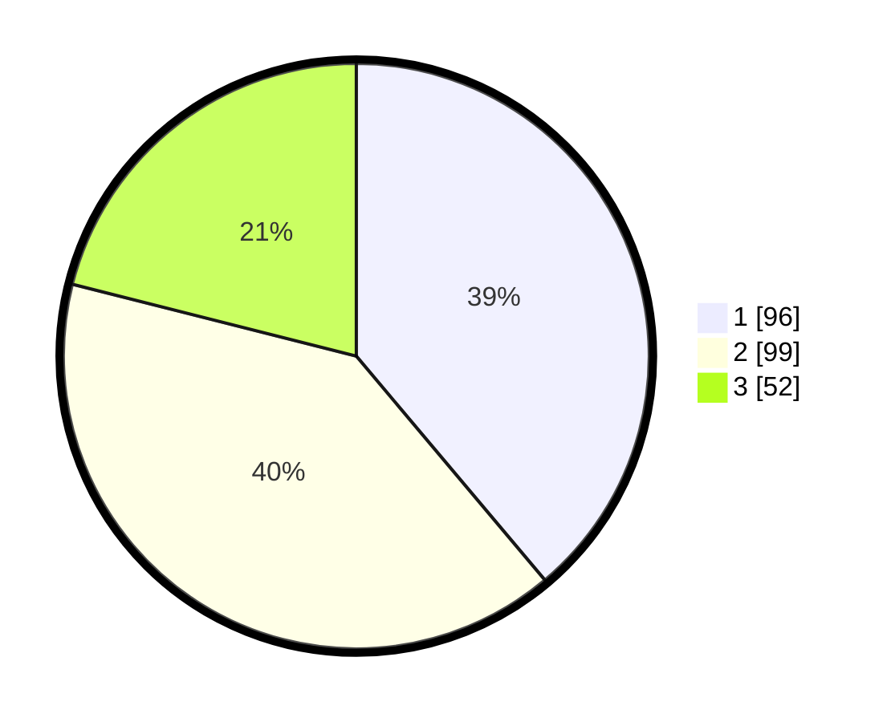

# Hasil

## Grafik

## Tabel

| No.    | Nama Paslon    | Suara | Suara (raw) | Persentase |
|:------ |:-------------- | -----:| -----------:| ----------:|
| 100025 | ANIES MUHAIMIN | 96    | [96][p-1]   | 38,87      |
| 100026 | PRABOWO GIBRAN | 99    | [99][p-2]   | 40,08      |
| 100027 | GANJAR MAHFUD  | 52    | [52][p-3]   | 21,05      |

[p-1]: https://github.com/gigit-pemilu/pemilu-2024/blob/main/pilpres/hitung-suara/sub/31-dki-jakarta/sub/75-jakarta-timur/sub/05-pasar-rebo/sub/1005-pekayon/sub/097-tps/sub/paslon-1.txt
[p-2]: https://github.com/gigit-pemilu/pemilu-2024/blob/main/pilpres/hitung-suara/sub/31-dki-jakarta/sub/75-jakarta-timur/sub/05-pasar-rebo/sub/1005-pekayon/sub/097-tps/sub/paslon-2.txt
[p-3]: https://github.com/gigit-pemilu/pemilu-2024/blob/main/pilpres/hitung-suara/sub/31-dki-jakarta/sub/75-jakarta-timur/sub/05-pasar-rebo/sub/1005-pekayon/sub/097-tps/sub/paslon-3.txt

## Foto C Plano

https://sirekap-obj-formc.kpu.go.id/f11a/pemilu/ppwp/31/75/05/10/05/3175051005097-20240214-155157--6c5e0326-b071-4184-b36f-9373798ed7c1.jpg

https://sirekap-obj-formc.kpu.go.id/f11a/pemilu/ppwp/31/75/05/10/05/3175051005097-20240214-155400--b0044cde-4fcd-47e2-8dec-3150d6aebf37.jpg

https://sirekap-obj-formc.kpu.go.id/f11a/pemilu/ppwp/31/75/05/10/05/3175051005097-20240214-155821--503da688-1d44-488b-98ae-ed253228079c.jpg

## Metadata

| Key        | Value               |
| ---------- | ------------------- |
| Time Stamp | 2024-02-16 12:51:22 |

