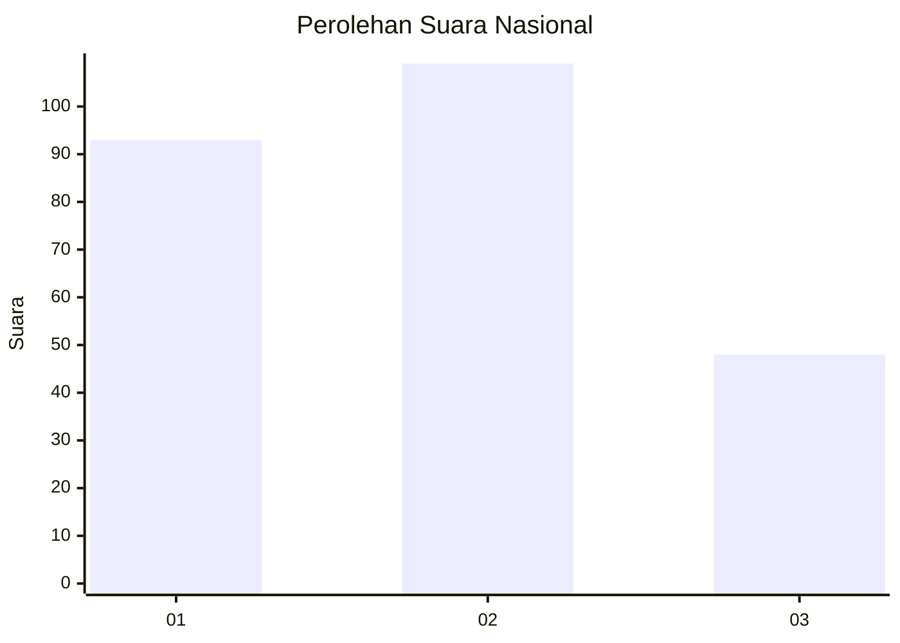
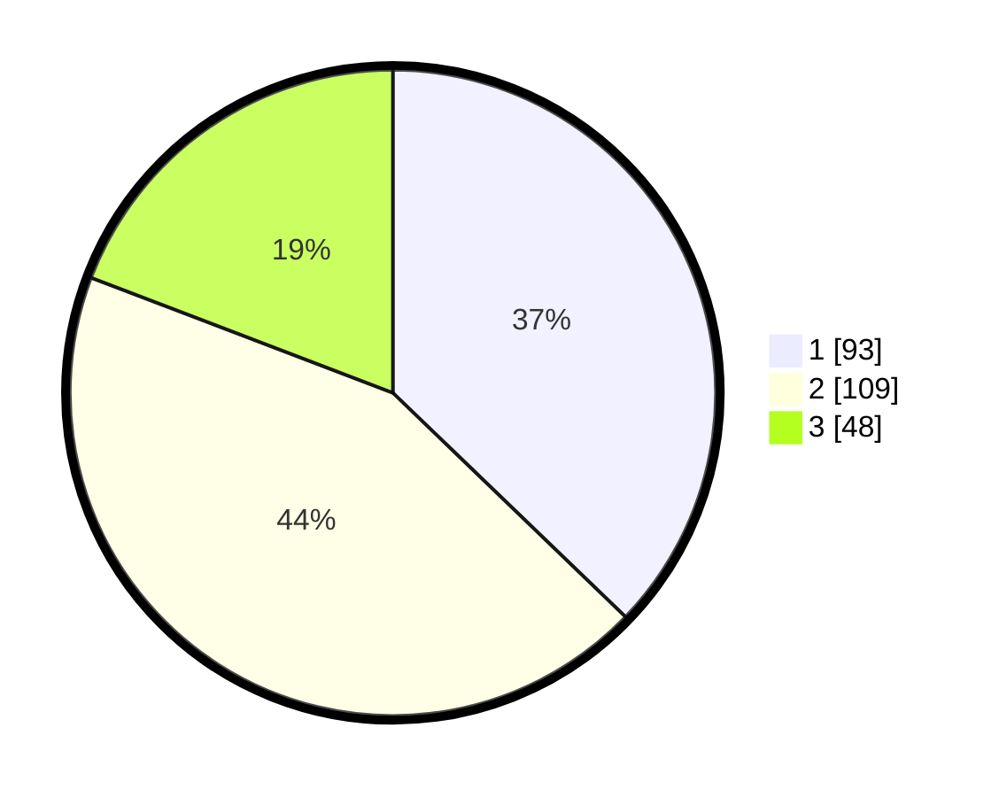

# Hasil

## Grafik

## Tabel

| No.    | Nama Paslon    | Suara | Suara (raw) | Persentase |
|:------ |:-------------- | -----:| -----------:| ----------:|
| 100025 | ANIES MUHAIMIN | 93    | [93][p-1]   | 37,20      |
| 100026 | PRABOWO GIBRAN | 109   | [109][p-2]  | 43,60      |
| 100027 | GANJAR MAHFUD  | 48    | [48][p-3]   | 19,20      |

[p-1]: https://github.com/gigit-pemilu/pemilu-2024/blob/main/pilpres/hitung-suara/sub/31-dki-jakarta/sub/75-jakarta-timur/sub/05-pasar-rebo/sub/1005-pekayon/sub/123-tps/sub/paslon-1.txt
[p-2]: https://github.com/gigit-pemilu/pemilu-2024/blob/main/pilpres/hitung-suara/sub/31-dki-jakarta/sub/75-jakarta-timur/sub/05-pasar-rebo/sub/1005-pekayon/sub/123-tps/sub/paslon-2.txt
[p-3]: https://github.com/gigit-pemilu/pemilu-2024/blob/main/pilpres/hitung-suara/sub/31-dki-jakarta/sub/75-jakarta-timur/sub/05-pasar-rebo/sub/1005-pekayon/sub/123-tps/sub/paslon-3.txt

## Foto C Plano

https://sirekap-obj-formc.kpu.go.id/0787/pemilu/ppwp/31/75/05/10/05/3175051005123-20240215-022818--4555dbbe-c0e4-4a86-abbf-8c5b1a451fb9.jpg

https://sirekap-obj-formc.kpu.go.id/0787/pemilu/ppwp/31/75/05/10/05/3175051005123-20240215-061459--ee51425e-8caf-41df-a15e-ecaa94e7683d.jpg

https://sirekap-obj-formc.kpu.go.id/0787/pemilu/ppwp/31/75/05/10/05/3175051005123-20240215-023019--1f3ae00f-aaaf-431a-bacd-24dbeb88a61b.jpg

## Metadata

| Key        | Value               |
| ---------- | ------------------- |
| Time Stamp | 2024-02-16 03:00:26 |

