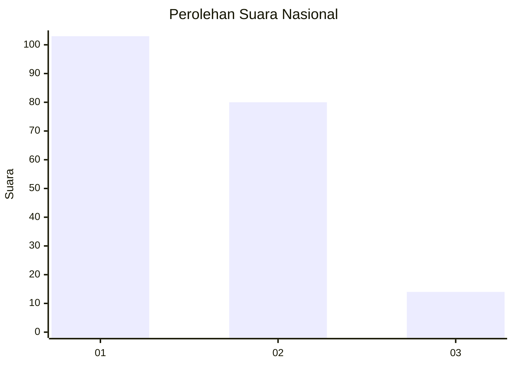
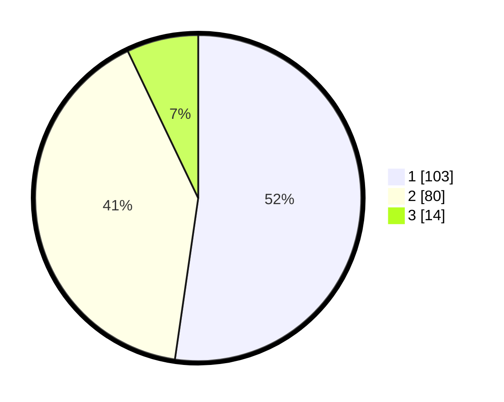

# Hasil

## Grafik

## Tabel

| No.    | Nama Paslon    | Suara | Suara (raw) | Persentase |
|:------ |:-------------- | -----:| -----------:| ----------:|
| 100025 | ANIES MUHAIMIN | 103   | [103][p-1]  | 52,28      |
| 100026 | PRABOWO GIBRAN | 80    | [80][p-2]   | 40,61      |
| 100027 | GANJAR MAHFUD  | 14    | [14][p-3]   | 7,11       |

[p-1]: https://github.com/gigit-pemilu/pemilu-2024/blob/main/pilpres/hitung-suara/sub/31-dki-jakarta/sub/75-jakarta-timur/sub/06-cakung/sub/1001-jatinegara/sub/001-tps/sub/paslon-1.txt
[p-2]: https://github.com/gigit-pemilu/pemilu-2024/blob/main/pilpres/hitung-suara/sub/31-dki-jakarta/sub/75-jakarta-timur/sub/06-cakung/sub/1001-jatinegara/sub/001-tps/sub/paslon-2.txt
[p-3]: https://github.com/gigit-pemilu/pemilu-2024/blob/main/pilpres/hitung-suara/sub/31-dki-jakarta/sub/75-jakarta-timur/sub/06-cakung/sub/1001-jatinegara/sub/001-tps/sub/paslon-3.txt

## Foto C Plano

https://sirekap-obj-formc.kpu.go.id/1042/pemilu/ppwp/31/75/06/10/01/3175061001001-20240214-232727--d23d1679-2ea0-48da-9f6d-19da453e41da.jpg

https://sirekap-obj-formc.kpu.go.id/1042/pemilu/ppwp/31/75/06/10/01/3175061001001-20240214-232707--ee5840d9-2561-4eeb-9324-58b192470629.jpg

https://sirekap-obj-formc.kpu.go.id/1042/pemilu/ppwp/31/75/06/10/01/3175061001001-20240214-232859--c2bbd7ca-8e62-4a16-9270-2b02f8bab6dc.jpg

## Metadata

| Key        | Value               |
| ---------- | ------------------- |
| Time Stamp | 2024-02-15 20:00:44 |

