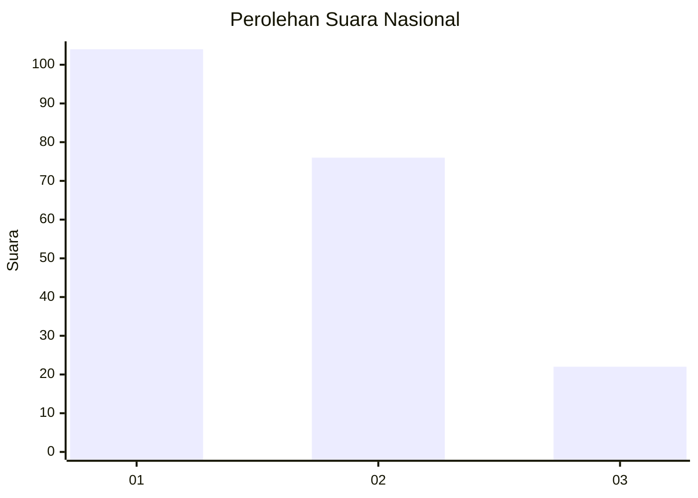
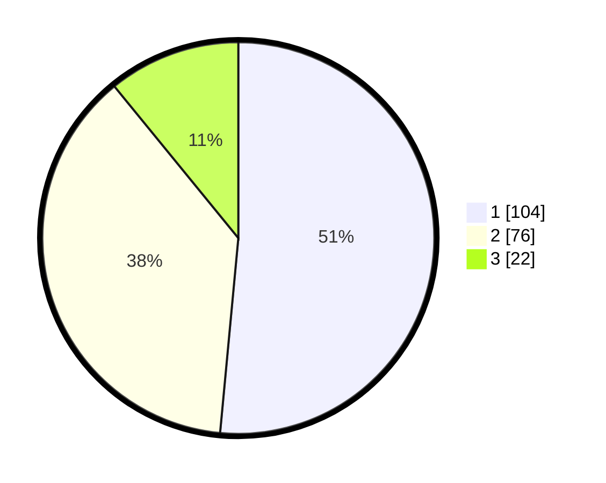

# Hasil

## Grafik

## Tabel

| No.    | Nama Paslon    | Suara | Suara (raw) | Persentase |
|:------ |:-------------- | -----:| -----------:| ----------:|
| 100025 | ANIES MUHAIMIN | 104   | [104][p-1]  | 51,49      |
| 100026 | PRABOWO GIBRAN | 76    | [76][p-2]   | 37,62      |
| 100027 | GANJAR MAHFUD  | 22    | [22][p-3]   | 10,89      |

[p-1]: https://github.com/gigit-pemilu/pemilu-2024/blob/main/pilpres/hitung-suara/sub/31-dki-jakarta/sub/75-jakarta-timur/sub/06-cakung/sub/1001-jatinegara/sub/003-tps/sub/paslon-1.txt
[p-2]: https://github.com/gigit-pemilu/pemilu-2024/blob/main/pilpres/hitung-suara/sub/31-dki-jakarta/sub/75-jakarta-timur/sub/06-cakung/sub/1001-jatinegara/sub/003-tps/sub/paslon-2.txt
[p-3]: https://github.com/gigit-pemilu/pemilu-2024/blob/main/pilpres/hitung-suara/sub/31-dki-jakarta/sub/75-jakarta-timur/sub/06-cakung/sub/1001-jatinegara/sub/003-tps/sub/paslon-3.txt

## Foto C Plano

https://sirekap-obj-formc.kpu.go.id/3951/pemilu/ppwp/31/75/06/10/01/3175061001003-20240214-234323--9eb4f8c6-7e2b-4452-889d-71a91f62413b.jpg

https://sirekap-obj-formc.kpu.go.id/3951/pemilu/ppwp/31/75/06/10/01/3175061001003-20240214-234753--d482417c-59cf-44ea-8ccd-3219e954d267.jpg

https://sirekap-obj-formc.kpu.go.id/3951/pemilu/ppwp/31/75/06/10/01/3175061001003-20240214-235306--2da5d397-2da4-43f8-b1bb-a4d0a789b723.jpg

## Metadata

| Key        | Value               |
| ---------- | ------------------- |
| Time Stamp | 2024-02-15 20:00:44 |

