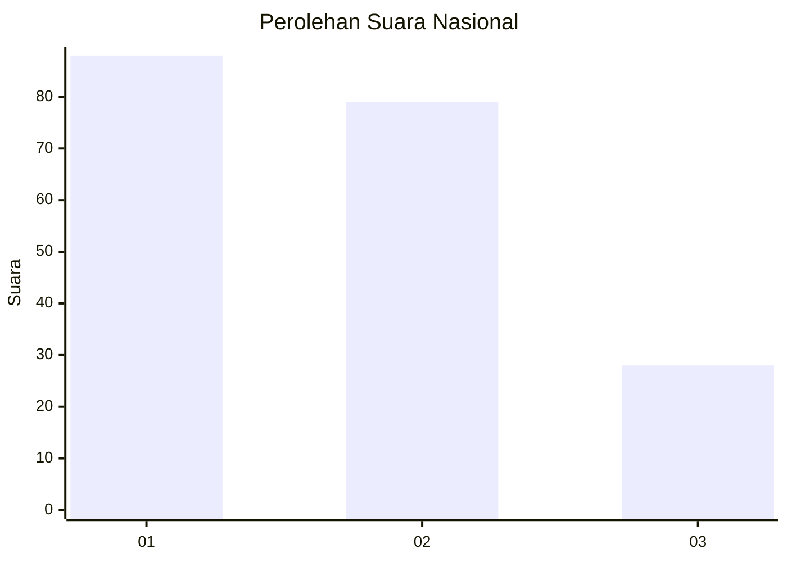
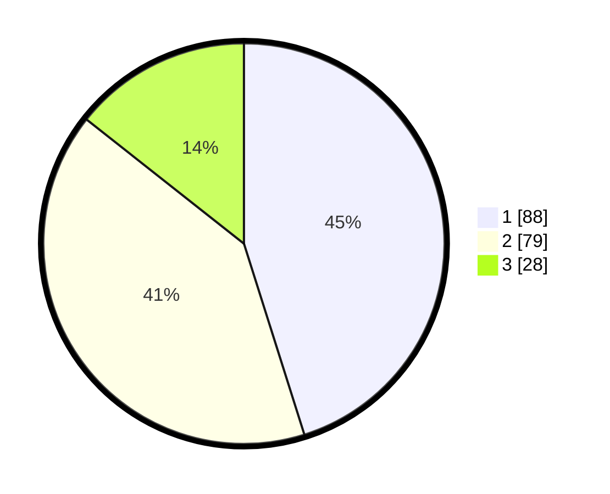

# Hasil

## Grafik

## Tabel

| No.    | Nama Paslon    | Suara | Suara (raw) | Persentase |
|:------ |:-------------- | -----:| -----------:| ----------:|
| 100025 | ANIES MUHAIMIN | 88    | [88][p-1]   | 45,13      |
| 100026 | PRABOWO GIBRAN | 79    | [79][p-2]   | 40,51      |
| 100027 | GANJAR MAHFUD  | 28    | [28][p-3]   | 14,36      |

[p-1]: https://github.com/gigit-pemilu/pemilu-2024/blob/main/pilpres/hitung-suara/sub/31-dki-jakarta/sub/75-jakarta-timur/sub/06-cakung/sub/1001-jatinegara/sub/004-tps/sub/paslon-1.txt
[p-2]: https://github.com/gigit-pemilu/pemilu-2024/blob/main/pilpres/hitung-suara/sub/31-dki-jakarta/sub/75-jakarta-timur/sub/06-cakung/sub/1001-jatinegara/sub/004-tps/sub/paslon-2.txt
[p-3]: https://github.com/gigit-pemilu/pemilu-2024/blob/main/pilpres/hitung-suara/sub/31-dki-jakarta/sub/75-jakarta-timur/sub/06-cakung/sub/1001-jatinegara/sub/004-tps/sub/paslon-3.txt

## Foto C Plano

https://sirekap-obj-formc.kpu.go.id/7ee7/pemilu/ppwp/31/75/06/10/01/3175061001004-20240214-205804--f5a5b394-350c-4394-b818-c999856a3ea6.jpg

https://sirekap-obj-formc.kpu.go.id/7ee7/pemilu/ppwp/31/75/06/10/01/3175061001004-20240214-205830--670e4efe-c1cb-48c3-bcb3-5f873e045163.jpg

https://sirekap-obj-formc.kpu.go.id/7ee7/pemilu/ppwp/31/75/06/10/01/3175061001004-20240214-205845--d36e4532-95fb-4b8f-8d85-2cb5a1926975.jpg

## Metadata

| Key        | Value               |
| ---------- | ------------------- |
| Time Stamp | 2024-02-15 18:00:26 |

