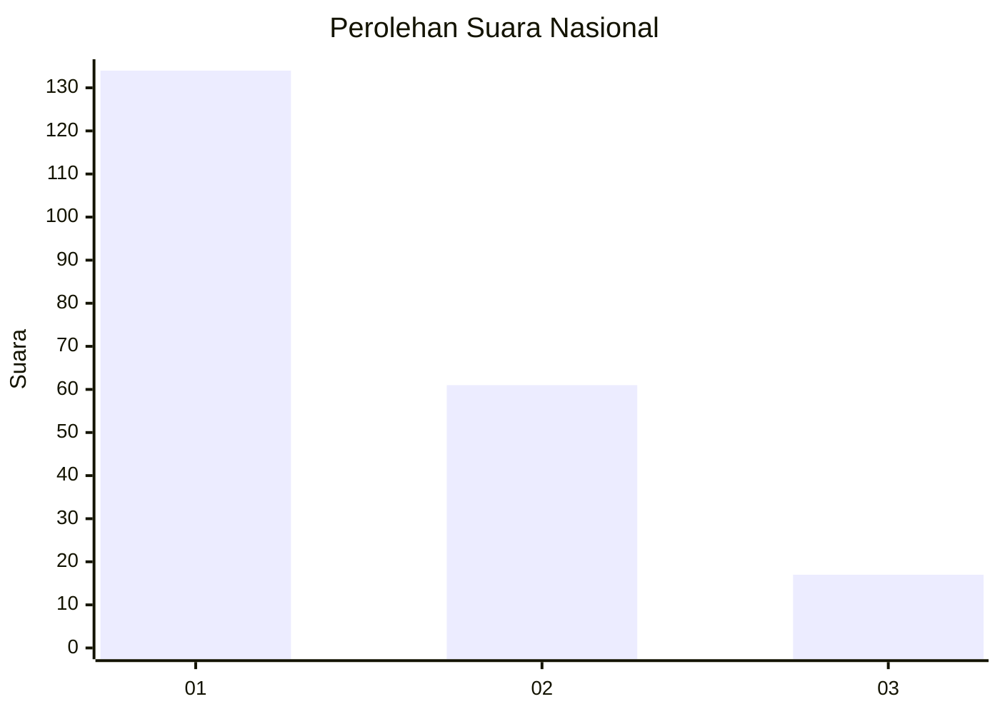
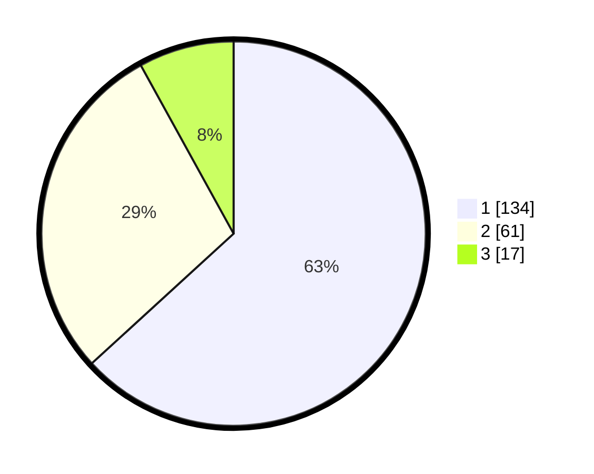

# Hasil

## Grafik

## Tabel

| No.    | Nama Paslon    | Suara | Suara (raw) | Persentase |
|:------ |:-------------- | -----:| -----------:| ----------:|
| 100025 | ANIES MUHAIMIN | 134   | [134][p-1]  | 63,21      |
| 100026 | PRABOWO GIBRAN | 61    | [61][p-2]   | 28,77      |
| 100027 | GANJAR MAHFUD  | 17    | [17][p-3]   | 8,02       |

[p-1]: https://github.com/gigit-pemilu/pemilu-2024/blob/main/pilpres/hitung-suara/sub/31-dki-jakarta/sub/75-jakarta-timur/sub/06-cakung/sub/1001-jatinegara/sub/025-tps/sub/paslon-1.txt
[p-2]: https://github.com/gigit-pemilu/pemilu-2024/blob/main/pilpres/hitung-suara/sub/31-dki-jakarta/sub/75-jakarta-timur/sub/06-cakung/sub/1001-jatinegara/sub/025-tps/sub/paslon-2.txt
[p-3]: https://github.com/gigit-pemilu/pemilu-2024/blob/main/pilpres/hitung-suara/sub/31-dki-jakarta/sub/75-jakarta-timur/sub/06-cakung/sub/1001-jatinegara/sub/025-tps/sub/paslon-3.txt

## Foto C Plano

https://sirekap-obj-formc.kpu.go.id/b39a/pemilu/ppwp/31/75/06/10/01/3175061001025-20240214-214018--752b98c7-bed3-485b-bd9a-139eb4c8ac7d.jpg

https://sirekap-obj-formc.kpu.go.id/b39a/pemilu/ppwp/31/75/06/10/01/3175061001025-20240214-215228--1c2db290-0a89-49bc-bb60-d71555a4bfdf.jpg

https://sirekap-obj-formc.kpu.go.id/b39a/pemilu/ppwp/31/75/06/10/01/3175061001025-20240214-214225--12f10520-47b3-4995-9e1d-7acdc6838b78.jpg

## Metadata

| Key        | Value               |
| ---------- | ------------------- |
| Time Stamp | 2024-02-24 22:31:28 |

