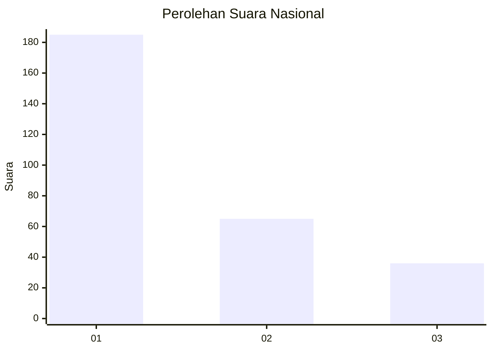
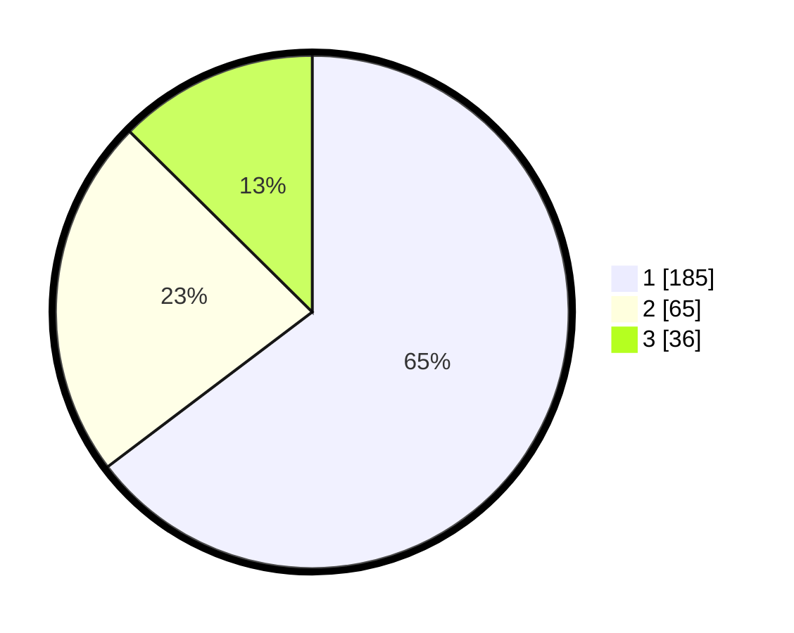

# Hasil

## Grafik

## Tabel

| No. | Nama Paslon    | Suara | Suara (raw) | Persentase |
|:--- |:-------------- | -----:| -----------:| ----------:|
| 1   | ANIES MUHAIMIN | 185   | [185][p-1]  | 64,69      |
| 2   | PRABOWO GIBRAN | 65    | [65][p-2]   | 22,73      |
| 3   | GANJAR MAHFUD  | 36    | [36][p-3]   | 12,59      |

[p-1]: https://github.com/gigit-pemilu/pemilu-2024/blob/main/pilpres/hitung-suara/sub/31-dki-jakarta/sub/75-jakarta-timur/sub/06-cakung/sub/1001-jatinegara/sub/050-tps/sub/paslon-1.txt
[p-2]: https://github.com/gigit-pemilu/pemilu-2024/blob/main/pilpres/hitung-suara/sub/31-dki-jakarta/sub/75-jakarta-timur/sub/06-cakung/sub/1001-jatinegara/sub/050-tps/sub/paslon-2.txt
[p-3]: https://github.com/gigit-pemilu/pemilu-2024/blob/main/pilpres/hitung-suara/sub/31-dki-jakarta/sub/75-jakarta-timur/sub/06-cakung/sub/1001-jatinegara/sub/050-tps/sub/paslon-3.txt

## Foto C Plano

https://sirekap-obj-formc.kpu.go.id/67c4/pemilu/ppwp/31/75/06/10/01/3175061001050-20240216-122437--5a3c6316-7b53-4452-be04-8acc00c8dabd.jpg

https://sirekap-obj-formc.kpu.go.id/67c4/pemilu/ppwp/31/75/06/10/01/3175061001050-20240216-122515--dfdb8193-558e-4af0-a919-301dba702add.jpg

https://sirekap-obj-formc.kpu.go.id/67c4/pemilu/ppwp/31/75/06/10/01/3175061001050-20240216-122556--a131df3b-ff1b-4320-9905-0bb07da7062f.jpg

## Metadata

| Key        | Value               |
| ---------- | ------------------- |
| Time Stamp | 2024-02-19 11:00:00 |

