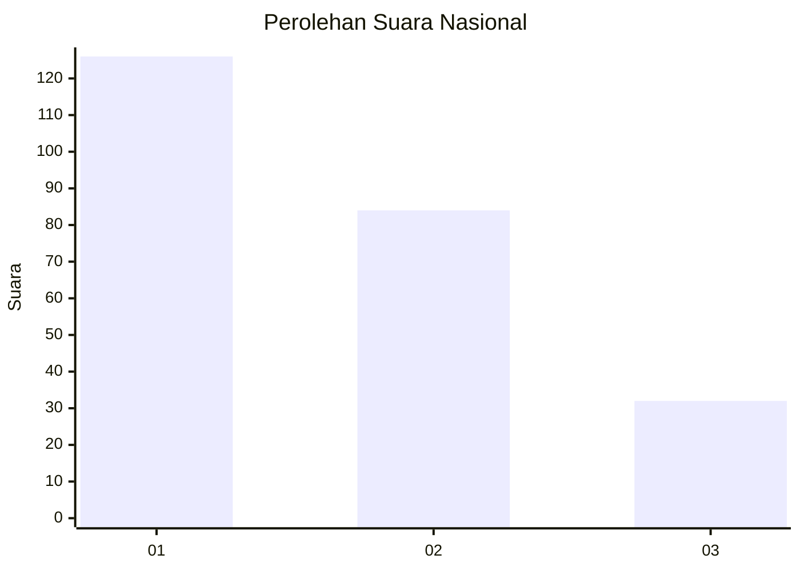
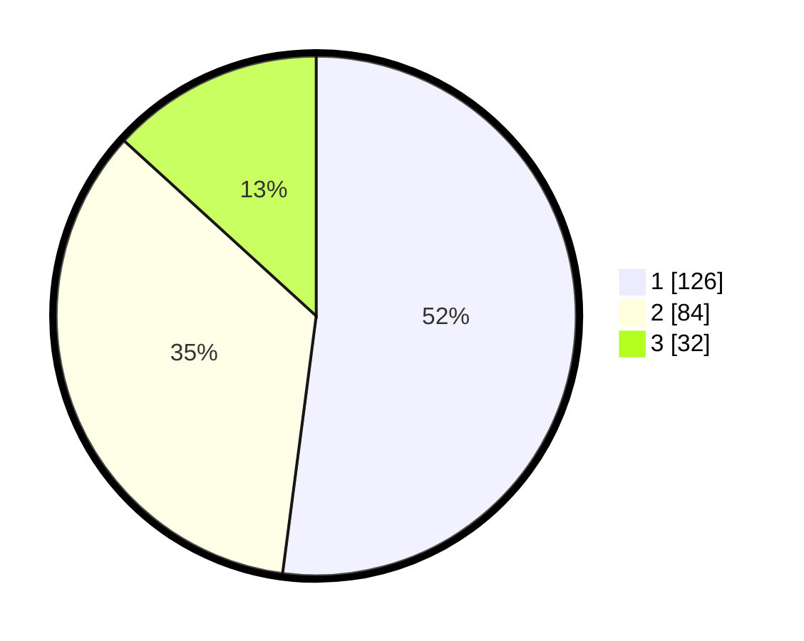

# Hasil

## Grafik

## Tabel

| No.    | Nama Paslon    | Suara | Suara (raw) | Persentase |
|:------ |:-------------- | -----:| -----------:| ----------:|
| 100025 | ANIES MUHAIMIN | 126   | [126][p-1]  | 52,07      |
| 100026 | PRABOWO GIBRAN | 84    | [84][p-2]   | 34,71      |
| 100027 | GANJAR MAHFUD  | 32    | [32][p-3]   | 13,22      |

[p-1]: https://github.com/gigit-pemilu/pemilu-2024/blob/main/pilpres/hitung-suara/sub/31-dki-jakarta/sub/75-jakarta-timur/sub/06-cakung/sub/1001-jatinegara/sub/058-tps/sub/paslon-1.txt
[p-2]: https://github.com/gigit-pemilu/pemilu-2024/blob/main/pilpres/hitung-suara/sub/31-dki-jakarta/sub/75-jakarta-timur/sub/06-cakung/sub/1001-jatinegara/sub/058-tps/sub/paslon-2.txt
[p-3]: https://github.com/gigit-pemilu/pemilu-2024/blob/main/pilpres/hitung-suara/sub/31-dki-jakarta/sub/75-jakarta-timur/sub/06-cakung/sub/1001-jatinegara/sub/058-tps/sub/paslon-3.txt

## Foto C Plano

https://sirekap-obj-formc.kpu.go.id/d9a7/pemilu/ppwp/31/75/06/10/01/3175061001058-20240215-011226--f218114a-5118-4a84-8bda-5061676994df.jpg

https://sirekap-obj-formc.kpu.go.id/d9a7/pemilu/ppwp/31/75/06/10/01/3175061001058-20240215-011500--1278f042-71e3-4f7c-8242-2c71b58d3b08.jpg

https://sirekap-obj-formc.kpu.go.id/d9a7/pemilu/ppwp/31/75/06/10/01/3175061001058-20240215-011718--fb4f69fb-7e92-4de8-b78c-71ece07882f1.jpg

## Metadata

| Key        | Value               |
| ---------- | ------------------- |
| Time Stamp | 2024-02-24 22:31:28 |

