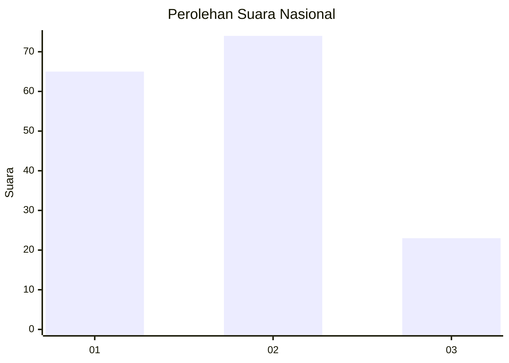
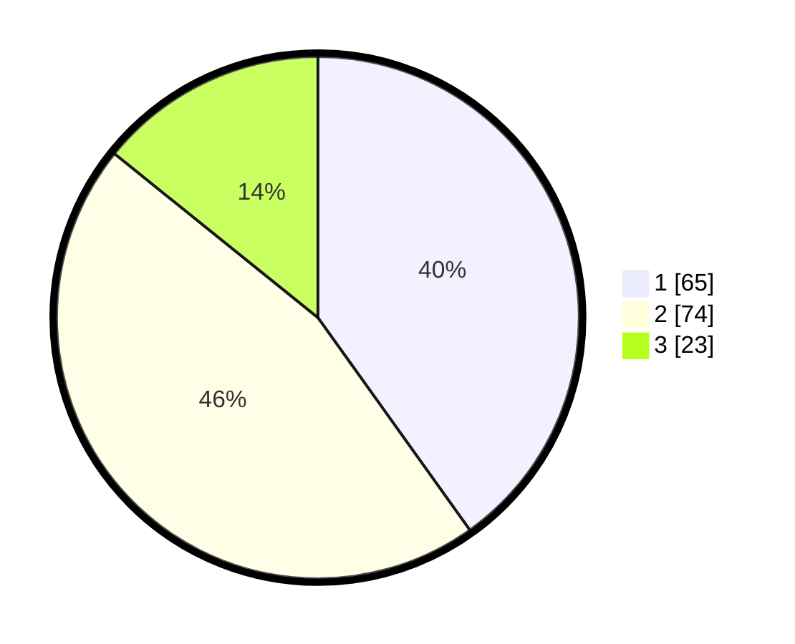

# Hasil

## Grafik

## Tabel

| No.    | Nama Paslon    | Suara | Suara (raw) | Persentase |
|:------ |:-------------- | -----:| -----------:| ----------:|
| 100025 | ANIES MUHAIMIN | 65    | [65][p-1]   | 40,12      |
| 100026 | PRABOWO GIBRAN | 74    | [74][p-2]   | 45,68      |
| 100027 | GANJAR MAHFUD  | 23    | [23][p-3]   | 14,20      |

[p-1]: https://github.com/gigit-pemilu/pemilu-2024/blob/main/pilpres/hitung-suara/sub/31-dki-jakarta/sub/75-jakarta-timur/sub/06-cakung/sub/1001-jatinegara/sub/071-tps/sub/paslon-1.txt
[p-2]: https://github.com/gigit-pemilu/pemilu-2024/blob/main/pilpres/hitung-suara/sub/31-dki-jakarta/sub/75-jakarta-timur/sub/06-cakung/sub/1001-jatinegara/sub/071-tps/sub/paslon-2.txt
[p-3]: https://github.com/gigit-pemilu/pemilu-2024/blob/main/pilpres/hitung-suara/sub/31-dki-jakarta/sub/75-jakarta-timur/sub/06-cakung/sub/1001-jatinegara/sub/071-tps/sub/paslon-3.txt

## Foto C Plano

https://sirekap-obj-formc.kpu.go.id/e106/pemilu/ppwp/31/75/06/10/01/3175061001071-20240215-095928--d69e800c-29b1-42ee-904f-629c5b15777e.jpg

https://sirekap-obj-formc.kpu.go.id/e106/pemilu/ppwp/31/75/06/10/01/3175061001071-20240215-100342--17732521-56a4-4a75-8cb9-4c5abc0eb079.jpg

https://sirekap-obj-formc.kpu.go.id/e106/pemilu/ppwp/31/75/06/10/01/3175061001071-20240215-100745--fd486f9c-77e1-4284-83a1-1397c938870c.jpg

## Metadata

| Key        | Value               |
| ---------- | ------------------- |
| Time Stamp | 2024-02-15 21:01:18 |

