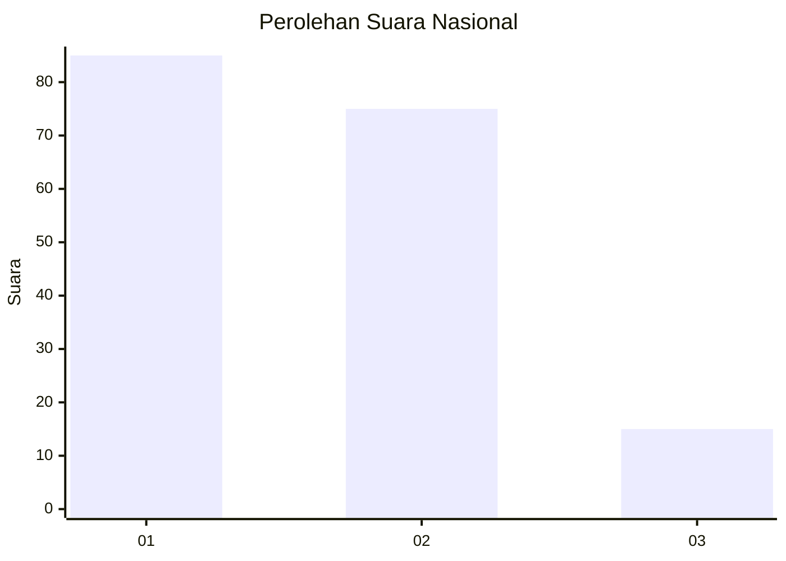
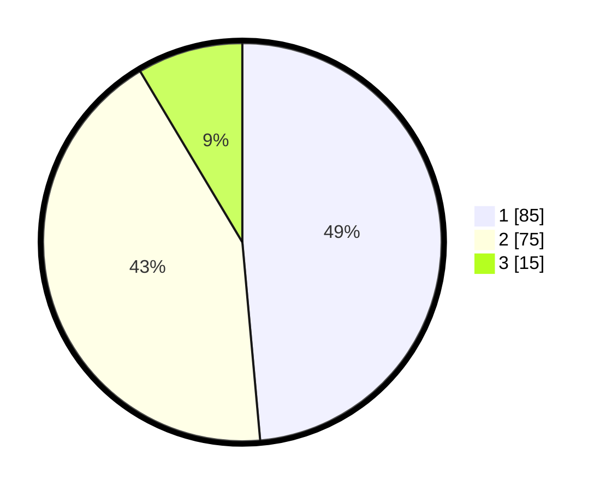

# Hasil

## Grafik

## Tabel

| No.    | Nama Paslon    | Suara | Suara (raw) | Persentase |
|:------ |:-------------- | -----:| -----------:| ----------:|
| 100025 | ANIES MUHAIMIN | 85    | [85][p-1]   | 48,57      |
| 100026 | PRABOWO GIBRAN | 75    | [75][p-2]   | 42,86      |
| 100027 | GANJAR MAHFUD  | 15    | [15][p-3]   | 8,57       |

[p-1]: https://github.com/gigit-pemilu/pemilu-2024/blob/main/pilpres/hitung-suara/sub/31-dki-jakarta/sub/75-jakarta-timur/sub/06-cakung/sub/1001-jatinegara/sub/072-tps/sub/paslon-1.txt
[p-2]: https://github.com/gigit-pemilu/pemilu-2024/blob/main/pilpres/hitung-suara/sub/31-dki-jakarta/sub/75-jakarta-timur/sub/06-cakung/sub/1001-jatinegara/sub/072-tps/sub/paslon-2.txt
[p-3]: https://github.com/gigit-pemilu/pemilu-2024/blob/main/pilpres/hitung-suara/sub/31-dki-jakarta/sub/75-jakarta-timur/sub/06-cakung/sub/1001-jatinegara/sub/072-tps/sub/paslon-3.txt

## Foto C Plano

https://sirekap-obj-formc.kpu.go.id/7639/pemilu/ppwp/31/75/06/10/01/3175061001072-20240215-000235--2531d7b5-bbc7-4d93-a97d-1293ad0a0078.jpg

https://sirekap-obj-formc.kpu.go.id/7639/pemilu/ppwp/31/75/06/10/01/3175061001072-20240215-000253--705e598d-ecbc-404f-8ec2-5e74d428eadf.jpg

https://sirekap-obj-formc.kpu.go.id/7639/pemilu/ppwp/31/75/06/10/01/3175061001072-20240215-000310--38d8b772-6400-4cbd-a6f4-f16f30f9da34.jpg

## Metadata

| Key        | Value               |
| ---------- | ------------------- |
| Time Stamp | 2024-02-24 22:31:28 |

