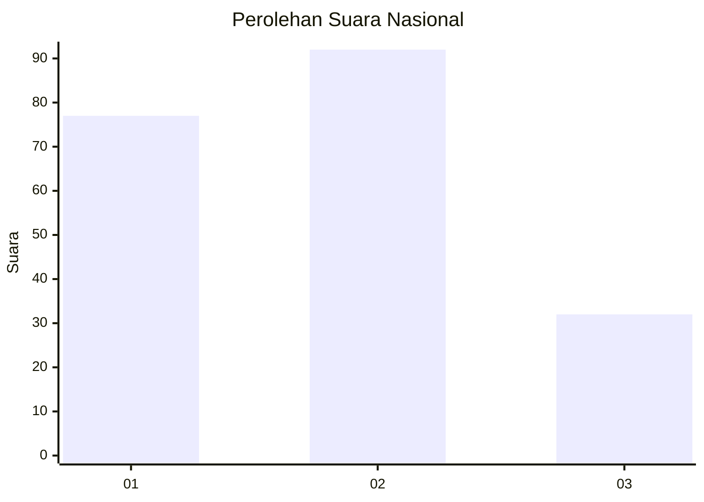
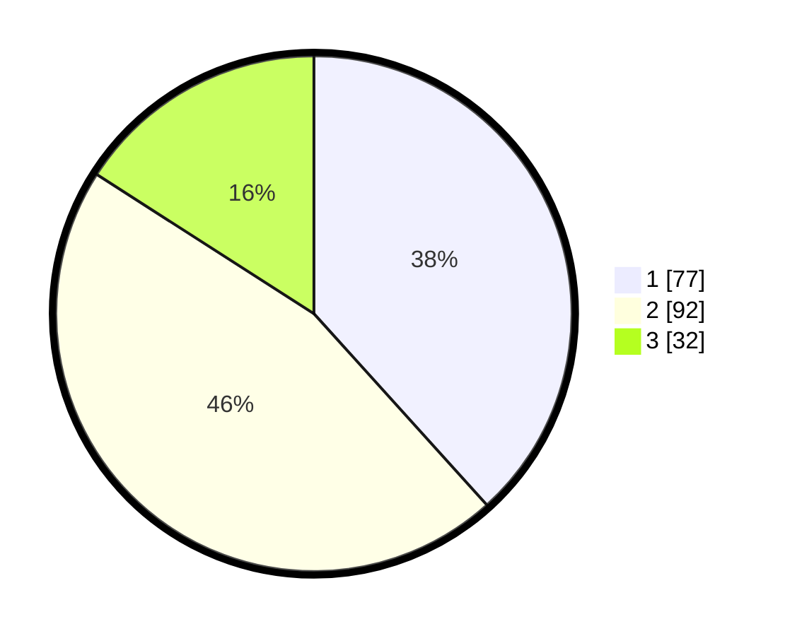

# Hasil

## Grafik

## Tabel

| No.    | Nama Paslon    | Suara | Suara (raw) | Persentase |
|:------ |:-------------- | -----:| -----------:| ----------:|
| 100025 | ANIES MUHAIMIN | 77    | [77][p-1]   | 38,31      |
| 100026 | PRABOWO GIBRAN | 92    | [92][p-2]   | 45,77      |
| 100027 | GANJAR MAHFUD  | 32    | [32][p-3]   | 15,92      |

[p-1]: https://github.com/gigit-pemilu/pemilu-2024/blob/main/pilpres/hitung-suara/sub/31-dki-jakarta/sub/75-jakarta-timur/sub/06-cakung/sub/1001-jatinegara/sub/081-tps/sub/paslon-1.txt
[p-2]: https://github.com/gigit-pemilu/pemilu-2024/blob/main/pilpres/hitung-suara/sub/31-dki-jakarta/sub/75-jakarta-timur/sub/06-cakung/sub/1001-jatinegara/sub/081-tps/sub/paslon-2.txt
[p-3]: https://github.com/gigit-pemilu/pemilu-2024/blob/main/pilpres/hitung-suara/sub/31-dki-jakarta/sub/75-jakarta-timur/sub/06-cakung/sub/1001-jatinegara/sub/081-tps/sub/paslon-3.txt

## Foto C Plano

https://sirekap-obj-formc.kpu.go.id/975c/pemilu/ppwp/31/75/06/10/01/3175061001081-20240214-215214--d46d050f-c057-42a3-9ce0-c142e77eae39.jpg

https://sirekap-obj-formc.kpu.go.id/975c/pemilu/ppwp/31/75/06/10/01/3175061001081-20240214-215130--2c30915b-82b0-4fe8-b462-662a12165699.jpg

https://sirekap-obj-formc.kpu.go.id/975c/pemilu/ppwp/31/75/06/10/01/3175061001081-20240214-215044--2aea82e9-ccd7-4224-abbf-a662878845ed.jpg

## Metadata

| Key        | Value               |
| ---------- | ------------------- |
| Time Stamp | 2024-02-25 18:00:00 |

