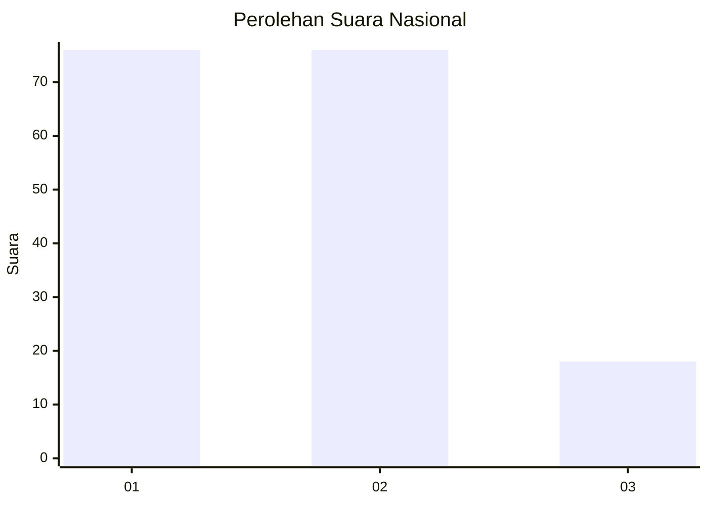
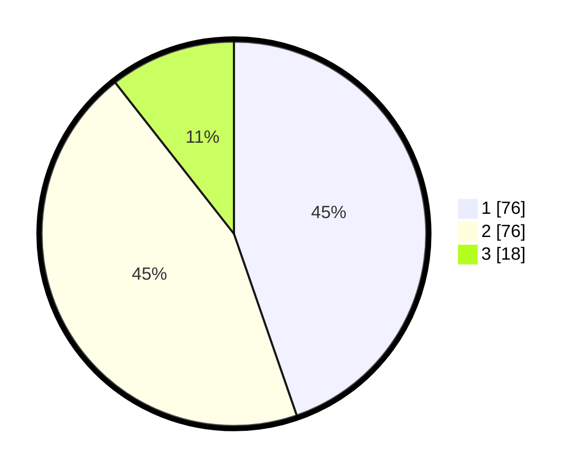

# Hasil

## Grafik

## Tabel

| No.    | Nama Paslon    | Suara | Suara (raw) | Persentase |
|:------ |:-------------- | -----:| -----------:| ----------:|
| 100025 | ANIES MUHAIMIN | 76    | [76][p-1]   | 44,71      |
| 100026 | PRABOWO GIBRAN | 76    | [76][p-2]   | 44,71      |
| 100027 | GANJAR MAHFUD  | 18    | [18][p-3]   | 10,59      |

[p-1]: https://github.com/gigit-pemilu/pemilu-2024/blob/main/pilpres/hitung-suara/sub/31-dki-jakarta/sub/75-jakarta-timur/sub/06-cakung/sub/1001-jatinegara/sub/093-tps/sub/paslon-1.txt
[p-2]: https://github.com/gigit-pemilu/pemilu-2024/blob/main/pilpres/hitung-suara/sub/31-dki-jakarta/sub/75-jakarta-timur/sub/06-cakung/sub/1001-jatinegara/sub/093-tps/sub/paslon-2.txt
[p-3]: https://github.com/gigit-pemilu/pemilu-2024/blob/main/pilpres/hitung-suara/sub/31-dki-jakarta/sub/75-jakarta-timur/sub/06-cakung/sub/1001-jatinegara/sub/093-tps/sub/paslon-3.txt

## Foto C Plano

https://sirekap-obj-formc.kpu.go.id/3265/pemilu/ppwp/31/75/06/10/01/3175061001093-20240214-221531--e0327436-9af8-43de-8764-7f43d4a8cdf4.jpg

https://sirekap-obj-formc.kpu.go.id/3265/pemilu/ppwp/31/75/06/10/01/3175061001093-20240214-221635--e5c9893f-ad6a-4f2b-8b6c-5ef5c701d17b.jpg

https://sirekap-obj-formc.kpu.go.id/3265/pemilu/ppwp/31/75/06/10/01/3175061001093-20240214-221722--023c526d-90d7-4dbe-b183-0ffb9a1571a1.jpg

## Metadata

| Key        | Value               |
| ---------- | ------------------- |
| Time Stamp | 2024-02-24 22:31:28 |

