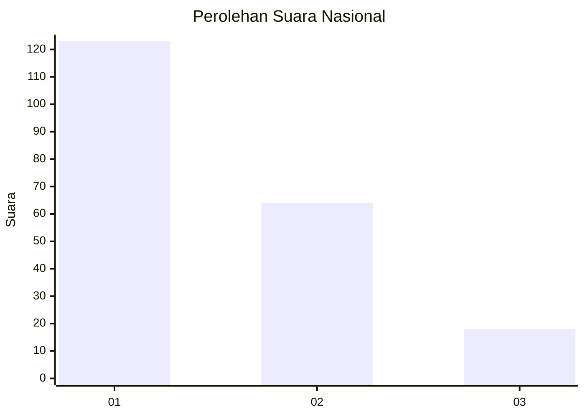
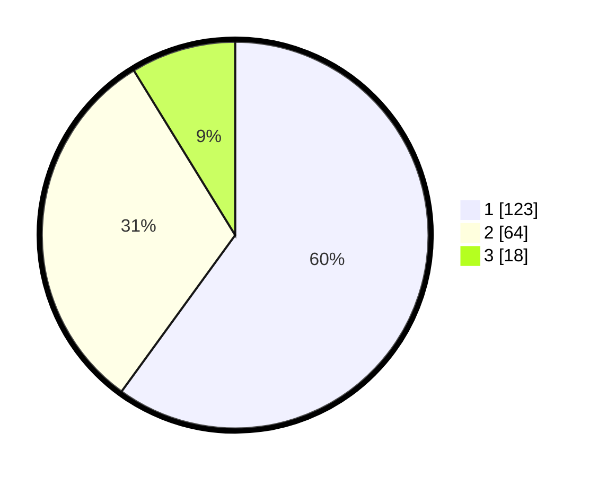

# Hasil

## Grafik

## Tabel

| No.    | Nama Paslon    | Suara | Suara (raw) | Persentase |
|:------ |:-------------- | -----:| -----------:| ----------:|
| 100025 | ANIES MUHAIMIN | 123   | [123][p-1]  | 60,00      |
| 100026 | PRABOWO GIBRAN | 64    | [64][p-2]   | 31,22      |
| 100027 | GANJAR MAHFUD  | 18    | [18][p-3]   | 8,78       |

[p-1]: https://github.com/gigit-pemilu/pemilu-2024/blob/main/pilpres/hitung-suara/sub/31-dki-jakarta/sub/75-jakarta-timur/sub/06-cakung/sub/1001-jatinegara/sub/100-tps/sub/paslon-1.txt
[p-2]: https://github.com/gigit-pemilu/pemilu-2024/blob/main/pilpres/hitung-suara/sub/31-dki-jakarta/sub/75-jakarta-timur/sub/06-cakung/sub/1001-jatinegara/sub/100-tps/sub/paslon-2.txt
[p-3]: https://github.com/gigit-pemilu/pemilu-2024/blob/main/pilpres/hitung-suara/sub/31-dki-jakarta/sub/75-jakarta-timur/sub/06-cakung/sub/1001-jatinegara/sub/100-tps/sub/paslon-3.txt

## Foto C Plano

https://sirekap-obj-formc.kpu.go.id/d430/pemilu/ppwp/31/75/06/10/01/3175061001100-20240219-212904--6e339924-e354-4afe-8e64-211d0a6549aa.jpg

https://sirekap-obj-formc.kpu.go.id/d430/pemilu/ppwp/31/75/06/10/01/3175061001100-20240217-131217--b71954ba-1372-46aa-b723-82720eef9b5d.jpg

https://sirekap-obj-formc.kpu.go.id/d430/pemilu/ppwp/31/75/06/10/01/3175061001100-20240217-132318--80fd4921-3f61-4ee6-b821-05f463d43658.jpg

## Metadata

| Key        | Value               |
| ---------- | ------------------- |
| Time Stamp | 2024-02-19 22:00:00 |

