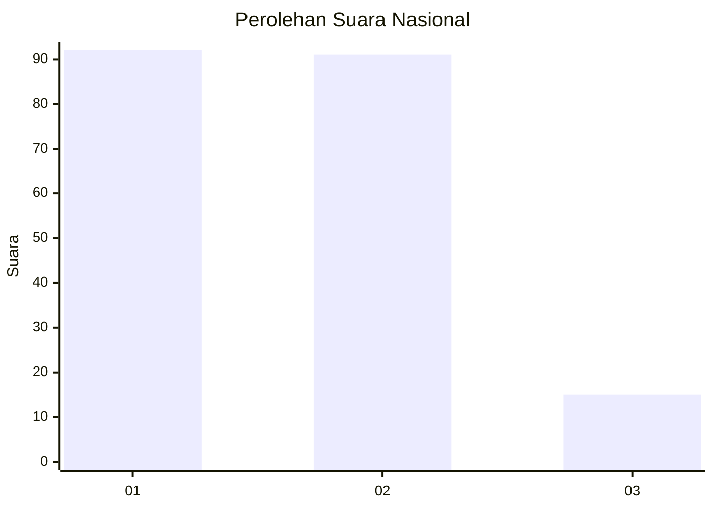
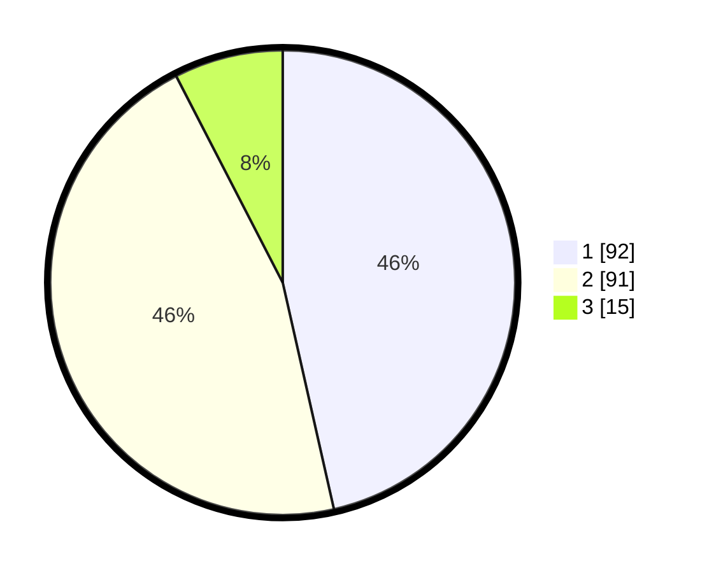

# Hasil

## Grafik

## Tabel

| No.    | Nama Paslon    | Suara | Suara (raw) | Persentase |
|:------ |:-------------- | -----:| -----------:| ----------:|
| 100025 | ANIES MUHAIMIN | 92    | [92][p-1]   | 46,46      |
| 100026 | PRABOWO GIBRAN | 91    | [91][p-2]   | 45,96      |
| 100027 | GANJAR MAHFUD  | 15    | [15][p-3]   | 7,58       |

[p-1]: https://github.com/gigit-pemilu/pemilu-2024/blob/main/pilpres/hitung-suara/sub/31-dki-jakarta/sub/75-jakarta-timur/sub/06-cakung/sub/1001-jatinegara/sub/112-tps/sub/paslon-1.txt
[p-2]: https://github.com/gigit-pemilu/pemilu-2024/blob/main/pilpres/hitung-suara/sub/31-dki-jakarta/sub/75-jakarta-timur/sub/06-cakung/sub/1001-jatinegara/sub/112-tps/sub/paslon-2.txt
[p-3]: https://github.com/gigit-pemilu/pemilu-2024/blob/main/pilpres/hitung-suara/sub/31-dki-jakarta/sub/75-jakarta-timur/sub/06-cakung/sub/1001-jatinegara/sub/112-tps/sub/paslon-3.txt

## Foto C Plano

https://sirekap-obj-formc.kpu.go.id/b602/pemilu/ppwp/31/75/06/10/01/3175061001112-20240214-204928--84f4c778-8614-4986-ba75-2c1b2340a265.jpg

https://sirekap-obj-formc.kpu.go.id/b602/pemilu/ppwp/31/75/06/10/01/3175061001112-20240214-205132--97387e69-217e-499c-bfa3-b9ef7f1082a1.jpg

https://sirekap-obj-formc.kpu.go.id/b602/pemilu/ppwp/31/75/06/10/01/3175061001112-20240214-220510--eab0b2d9-ff04-4f83-b9e2-53af31b571e1.jpg

## Metadata

| Key        | Value               |
| ---------- | ------------------- |
| Time Stamp | 2024-02-15 21:01:18 |

