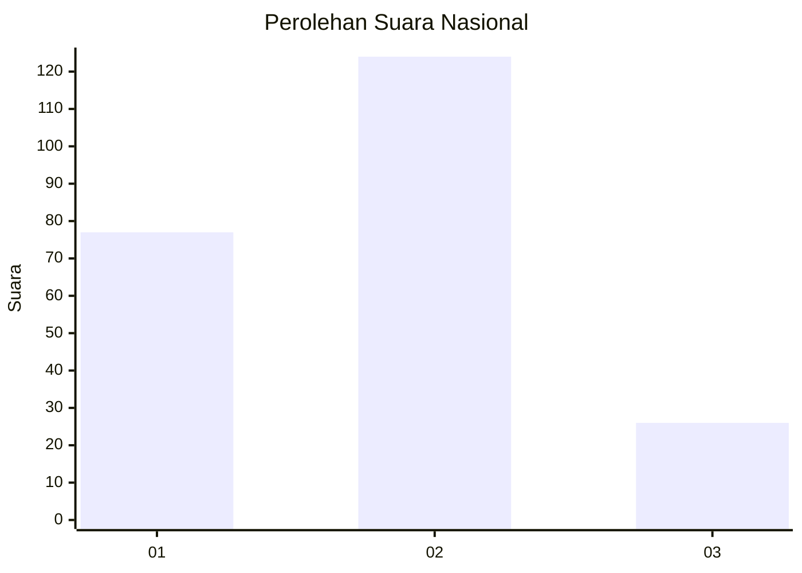
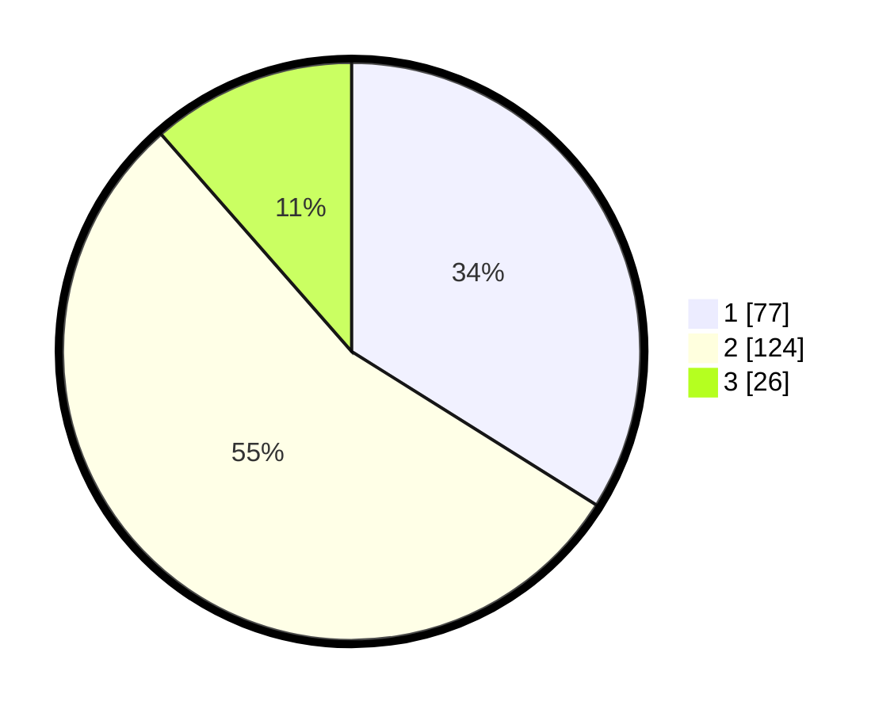

# Hasil

## Grafik

## Tabel

| No.    | Nama Paslon    | Suara | Suara (raw) | Persentase |
|:------ |:-------------- | -----:| -----------:| ----------:|
| 100025 | ANIES MUHAIMIN | 77    | [77][p-1]   | 33,92      |
| 100026 | PRABOWO GIBRAN | 124   | [124][p-2]  | 54,63      |
| 100027 | GANJAR MAHFUD  | 26    | [26][p-3]   | 11,45      |

[p-1]: https://github.com/gigit-pemilu/pemilu-2024/blob/main/pilpres/hitung-suara/sub/31-dki-jakarta/sub/75-jakarta-timur/sub/06-cakung/sub/1001-jatinegara/sub/117-tps/sub/paslon-1.txt
[p-2]: https://github.com/gigit-pemilu/pemilu-2024/blob/main/pilpres/hitung-suara/sub/31-dki-jakarta/sub/75-jakarta-timur/sub/06-cakung/sub/1001-jatinegara/sub/117-tps/sub/paslon-2.txt
[p-3]: https://github.com/gigit-pemilu/pemilu-2024/blob/main/pilpres/hitung-suara/sub/31-dki-jakarta/sub/75-jakarta-timur/sub/06-cakung/sub/1001-jatinegara/sub/117-tps/sub/paslon-3.txt

## Foto C Plano

https://sirekap-obj-formc.kpu.go.id/b1a8/pemilu/ppwp/31/75/06/10/01/3175061001117-20240215-002832--195bb323-0019-47b2-9402-0d2eb51d4253.jpg

https://sirekap-obj-formc.kpu.go.id/b1a8/pemilu/ppwp/31/75/06/10/01/3175061001117-20240215-002955--cfae93ab-66a6-45a2-8a43-85709638d456.jpg

https://sirekap-obj-formc.kpu.go.id/b1a8/pemilu/ppwp/31/75/06/10/01/3175061001117-20240215-002930--1b679f19-af59-44a6-b9f2-6c1c4b886f07.jpg

## Metadata

| Key        | Value               |
| ---------- | ------------------- |
| Time Stamp | 2024-02-24 22:31:28 |

