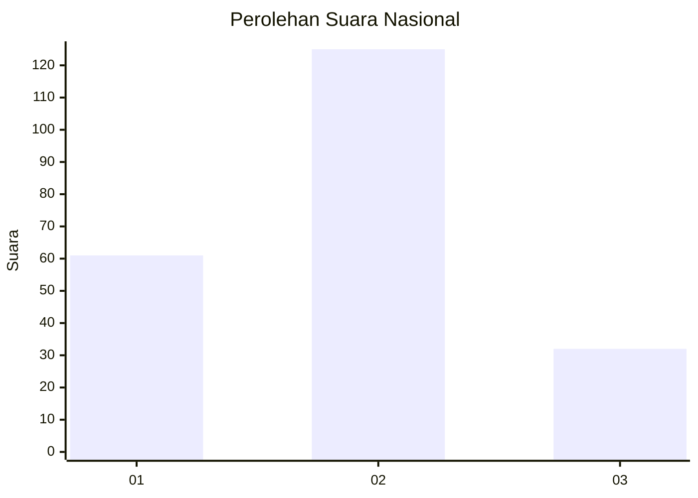
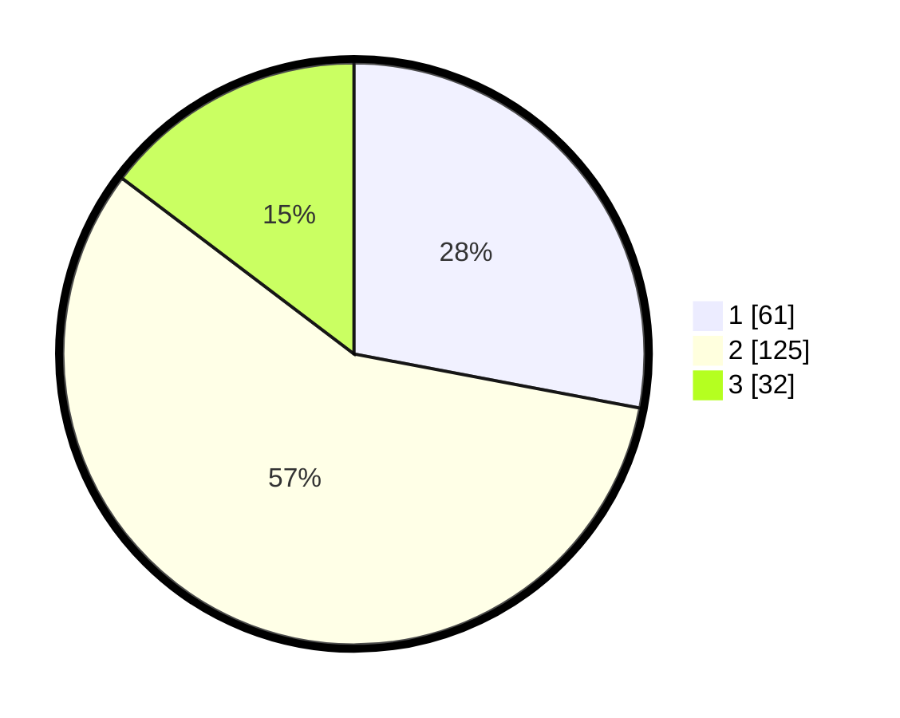

# Hasil

## Grafik

## Tabel

| No.    | Nama Paslon    | Suara | Suara (raw) | Persentase |
|:------ |:-------------- | -----:| -----------:| ----------:|
| 100025 | ANIES MUHAIMIN | 61    | [61][p-1]   | 27,98      |
| 100026 | PRABOWO GIBRAN | 125   | [125][p-2]  | 57,34      |
| 100027 | GANJAR MAHFUD  | 32    | [32][p-3]   | 14,68      |

[p-1]: https://github.com/gigit-pemilu/pemilu-2024/blob/main/pilpres/hitung-suara/sub/31-dki-jakarta/sub/75-jakarta-timur/sub/06-cakung/sub/1001-jatinegara/sub/118-tps/sub/paslon-1.txt
[p-2]: https://github.com/gigit-pemilu/pemilu-2024/blob/main/pilpres/hitung-suara/sub/31-dki-jakarta/sub/75-jakarta-timur/sub/06-cakung/sub/1001-jatinegara/sub/118-tps/sub/paslon-2.txt
[p-3]: https://github.com/gigit-pemilu/pemilu-2024/blob/main/pilpres/hitung-suara/sub/31-dki-jakarta/sub/75-jakarta-timur/sub/06-cakung/sub/1001-jatinegara/sub/118-tps/sub/paslon-3.txt

## Foto C Plano

https://sirekap-obj-formc.kpu.go.id/cef4/pemilu/ppwp/31/75/06/10/01/3175061001118-20240214-221922--4f2e58f5-1613-4899-95ca-9ad1bf1bd529.jpg

https://sirekap-obj-formc.kpu.go.id/cef4/pemilu/ppwp/31/75/06/10/01/3175061001118-20240214-221532--742b828e-00e4-45ab-a69a-43dce0a54f09.jpg

https://sirekap-obj-formc.kpu.go.id/cef4/pemilu/ppwp/31/75/06/10/01/3175061001118-20240214-221722--e5eb10eb-f2b1-48fe-a8fc-9f42405f0102.jpg

## Metadata

| Key        | Value               |
| ---------- | ------------------- |
| Time Stamp | 2024-02-15 21:01:18 |

