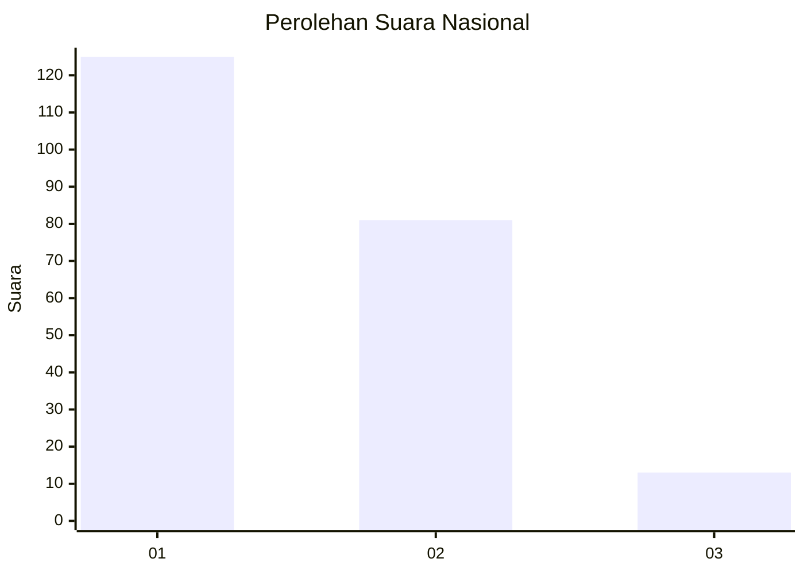
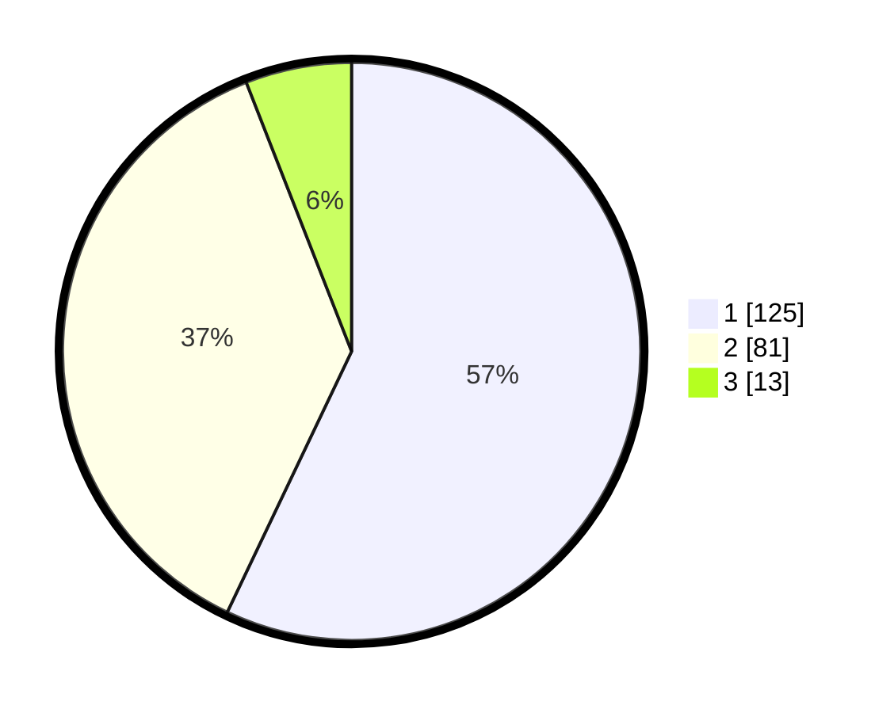

# Hasil

## Grafik

## Tabel

| No.    | Nama Paslon    | Suara | Suara (raw) | Persentase |
|:------ |:-------------- | -----:| -----------:| ----------:|
| 100025 | ANIES MUHAIMIN | 125   | [125][p-1]  | 57,08      |
| 100026 | PRABOWO GIBRAN | 81    | [81][p-2]   | 36,99      |
| 100027 | GANJAR MAHFUD  | 13    | [13][p-3]   | 5,94       |

[p-1]: https://github.com/gigit-pemilu/pemilu-2024/blob/main/pilpres/hitung-suara/sub/31-dki-jakarta/sub/75-jakarta-timur/sub/06-cakung/sub/1001-jatinegara/sub/128-tps/sub/paslon-1.txt
[p-2]: https://github.com/gigit-pemilu/pemilu-2024/blob/main/pilpres/hitung-suara/sub/31-dki-jakarta/sub/75-jakarta-timur/sub/06-cakung/sub/1001-jatinegara/sub/128-tps/sub/paslon-2.txt
[p-3]: https://github.com/gigit-pemilu/pemilu-2024/blob/main/pilpres/hitung-suara/sub/31-dki-jakarta/sub/75-jakarta-timur/sub/06-cakung/sub/1001-jatinegara/sub/128-tps/sub/paslon-3.txt

## Foto C Plano

https://sirekap-obj-formc.kpu.go.id/5f90/pemilu/ppwp/31/75/06/10/01/3175061001128-20240214-215346--94a089ea-fea1-4958-8eaa-69a95631fc99.jpg

https://sirekap-obj-formc.kpu.go.id/5f90/pemilu/ppwp/31/75/06/10/01/3175061001128-20240214-220714--ee69a195-5f02-4dd7-a517-7fb4cad7dec5.jpg

https://sirekap-obj-formc.kpu.go.id/5f90/pemilu/ppwp/31/75/06/10/01/3175061001128-20240214-200841--0146695f-b503-4420-b5c9-d23c8814afe2.jpg

## Metadata

| Key        | Value               |
| ---------- | ------------------- |
| Time Stamp | 2024-02-15 21:01:18 |

